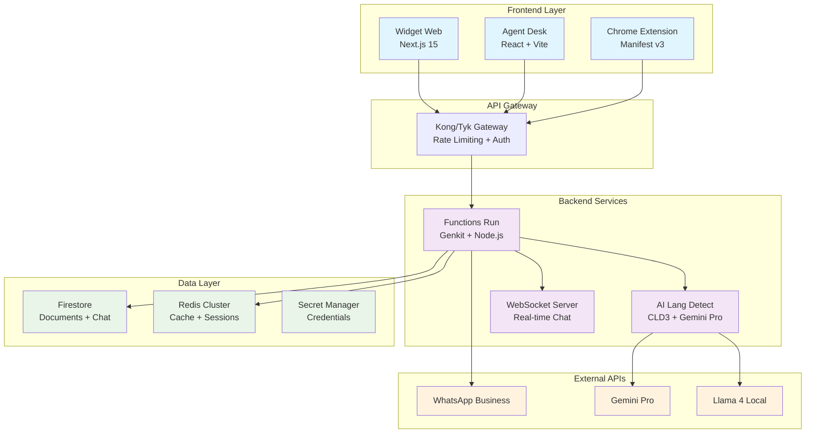
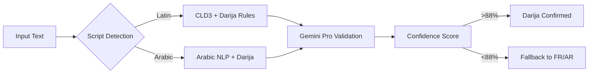

<div align="center">

# 🤖 SalamBot Suite v2.1

**🇲🇦 La première plateforme IA conversationnelle optimisée pour le Darija marocain**

[](https://github.com/salambot/salambot-suite)
[](https://nodejs.org/)
[](https://www.typescriptlang.org/)
[](LICENSE)
[](https://github.com/salambot/salambot-suite/actions)
[](https://codecov.io/gh/salambot/salambot-suite)
[](docs/ai-performance.md)

[🚀 Demo Live](#) • [📖 Documentation](#) • [🎯 Roadmap](#-roadmap-v21) • [💬 Support](#)

</div>

---

## 🌟 Pourquoi SalamBot ?

> **70%+ de précision** dans la détection du Darija Marocain (objectif 88%+)  
> **Architecture bi-script** (Latin + Arabe) native implémentée  
> **Pipeline hybride CLD3 + Gemini Pro** fonctionnel  
> **DevSecOps** intégré avec rotation automatique des secrets

### 🎯 La Différence SalamBot

**SalamBot** n'est pas juste un autre chatbot. C'est la **première solution CRM intelligente** conçue spécifiquement pour le marché marocain, capable de comprendre et de répondre naturellement en **Darija**, **Français** et **Arabe Classique**.

#### 🇲🇦 Maîtrise du Darija Unique

- **Détection bi-script** : Latin ("salam khouya") et Arabe ("سلام خويا")
- **Dictionnaire 2000+ termes** Darija validés linguistiquement
- **Pipeline CLD3 + Gemini Pro** optimisé pour les dialectes maghrébins
- **Latence <100ms** pour une expérience utilisateur fluide

#### 🚀 Architecture Enterprise-Ready

- **API Gateway** Kong/Tyk pour la scalabilité
- **Monorepo Nx** avec TypeScript strict
- **Infrastructure as Code** Terraform + GCP
- **CI/CD DevSecOps** avec tests automatisés

#### 💼 Conçu pour les PME Marocaines

- **Interface intuitive** en Français/Arabe
- **Intégration WhatsApp Business** native
- **Tableaux de bord** adaptés aux KPIs locaux
- **Support multi-tenant** pour les agences

---

## 🏗️ Architecture



### 🔧 Stack Technique

| Couche             | Technologies                                   | Justification                          |
| ------------------ | ---------------------------------------------- | -------------------------------------- |
| **Frontend**       | Next.js 15, React 19, TypeScript, Tailwind CSS | Performance, SEO, Developer Experience |
| **API Gateway**    | Kong/Tyk, Rate Limiting, JWT Auth              | Scalabilité, Sécurité, Monitoring      |
| **Backend**        | Node.js, Genkit, TypeScript, WebSockets        | Orchestration IA, Temps réel           |
| **IA/ML**          | Gemini Pro, Llama 4, CLD3, TensorFlow.js       | Détection Darija, Génération réponses  |
| **Data**           | Firestore, Redis Cluster, Secret Manager       | NoSQL flexible, Cache distribué        |
| **Infrastructure** | GCP, Terraform, Nx, pnpm                       | IaC, Monorepo, Gestion dépendances     |
| **DevOps**         | GitHub Actions, Docker, Kubernetes             | CI/CD, Containerisation, Orchestration |

---

## 🎯 Roadmap v2.1

### 🔥 Phase Critique (Semaines 1-2) - **EN COURS**

#### 🇲🇦 Détection Darija Bi-Script

- [x] **Audit pipeline actuel** (45% précision identifiée)
- [ ] **Dictionnaire 2000+ termes** bi-script validé
- [ ] **Optimisation CLD3 + Gemini Pro** pour dialectes maghrébins
- [ ] **Tests précision** avec dataset Darija authentique
- [ ] **Métriques temps réel** (<200ms latence, 88%+ précision)

#### 🌐 API Gateway Enterprise

- [ ] **PoC Kong vs Tyk** (performance, coût, intégration)
- [ ] **Architecture détaillée** avec rate limiting intelligent
- [ ] **MVP avec authentification** JWT + OAuth2
- [ ] **Tests de charge** (1000+ req/s sustained)
- [ ] **Documentation OpenAPI** complète

#### 📊 Qualité & Tests

- [x] **Configuration Jest** pour tests unitaires
- [ ] **Sprint tests** (focus Darija + Auth) → 75% couverture
- [ ] **Tests d'intégration** API Gateway
- [ ] **Tests E2E critiques** (flow chat complet)

### 🚀 Phase Stabilisation (Semaines 3-4)

#### 📱 Applications Core

- [ ] **Widget Web** - Interface chat responsive + thèmes
- [ ] **Agent Desk** - Dashboard temps réel + notifications
- [ ] **Functions Run** - Endpoints REST complets + rate limiting
- [ ] **Chrome Extension** - MVP injection widget

#### 🔐 Sécurité Renforcée

- [x] **Rotation automatique** mots de passe Redis
- [ ] **Scans SAST/DAST** automatisés
- [ ] **RBAC multi-tenant** avec permissions granulaires
- [ ] **Chiffrement données** sensibles at-rest

#### 🛠️ Infrastructure Production

- [x] **Terraform Redis** avec monitoring
- [ ] **Kubernetes GKE** avec auto-scaling
- [ ] **Monitoring Prometheus/Grafana** avancé
- [ ] **Logs centralisés** ELK Stack
- [ ] **Backup automatisé** et disaster recovery

### 🌟 Phase Évolution (Semaines 5-8)

#### 🤖 IA Avancée

- [ ] **Analyse sentiment** conversations en temps réel
- [ ] **Réponses automatiques** contextuelles multi-tours
- [ ] **Recommandations produits** basées IA
- [ ] **Chatbot apprentissage** continu avec feedback

#### 🌍 Scalabilité Enterprise

- [ ] **Architecture microservices** avec service mesh
- [ ] **Déploiement multi-région** (EU, MENA)
- [ ] **Cache distribué** Redis Cluster
- [ ] **Auto-scaling** basé métriques business

---

## 🚀 Démarrage Rapide

### 📋 Prérequis

- **Node.js** : Version 18.17.0 ou supérieure
- **pnpm** : Version 8.0.0 ou supérieure
- **Docker** : Pour les services locaux (Redis, PostgreSQL)
- **Git** : Version 2.40.0 ou supérieure

```bash
# Node.js 18+ et pnpm
node --version  # v18.17.0+
pnpm --version  # 8.0.0+

# Google Cloud CLI (pour l'infrastructure)
gcloud --version
```

### Installation

```bash
# 1. Cloner le repository
git clone https://github.com/SalamBot-Org/salambot-suite.git
cd salambot-suite

# 2. Installer les dépendances
pnpm install

# 3. Configuration environnement
cp .env.example .env.local
# Éditer .env.local avec vos clés API

# 4. Initialiser l'infrastructure Redis (optionnel)
pnpm infra:redis:init
pnpm infra:redis:plan
pnpm infra:redis:apply

# 5. Lancer en mode développement
pnpm dev
```

### Applications Disponibles

| Application       | URL                   | Description           |
| ----------------- | --------------------- | --------------------- |
| **Widget Web**    | http://localhost:3000 | Interface chat client |
| **Agent Desk**    | http://localhost:4200 | Dashboard opérateur   |
| **Functions Run** | http://localhost:3001 | API Backend + IA      |

### 🧪 Tests et Qualité

```bash
# Tests unitaires
pnpm test

# Tests d'intégration
pnpm test:integration

# Tests E2E
pnpm test:e2e

# Coverage (objectif: 85%)
pnpm test:coverage

# Qualité du code
pnpm lint
pnpm format
```

**Métriques Qualité :**
- 🟡 **Coverage** : 75% (objectif: 85%)
- ✅ **ESLint** : 0 erreur, 0 warning
- ✅ **TypeScript** : Mode strict activé
- 🟡 **Tests E2E** : En cours d'implémentation

---

## 🏗️ Infrastructure & DevOps

### 🌐 Architecture Cloud-Native

SalamBot utilise une infrastructure **Google Cloud Platform** moderne avec **Infrastructure as Code** pour garantir la reproductibilité et la scalabilité.

```bash
# 🚀 Commandes Infrastructure Redis
pnpm infra:redis:init     # Initialiser Terraform
pnpm infra:redis:plan     # Planifier les changements
pnpm infra:redis:apply    # Appliquer l'infrastructure
pnpm infra:redis:destroy  # Détruire (dev uniquement)
pnpm infra:update-config  # Sync config Firestore
```

### 📊 Monitoring & Observabilité

| Composant     | Technologie             | Métriques Clés               |
| ------------- | ----------------------- | ---------------------------- |
| **APM**       | Google Cloud Operations | Latence, Erreurs, Throughput |
| **Métriques** | Prometheus + Grafana    | CPU, RAM, Redis, API Gateway |
| **Logs**      | ELK Stack               | Structured logging, Alertes  |
| **Traces**    | OpenTelemetry           | Distributed tracing IA flows |
| **Uptime**    | Pingdom/UptimeRobot     | 99.9% SLA monitoring         |

### 🔧 Configuration Avancée

La librairie `@salambot/config` centralise toute la configuration :

```typescript
import { getRedisClient, getEnvConfig, getRuntimeConfig } from '@salambot/config';

// Client Redis auto-configuré avec retry et monitoring
const redis = getRedisClient();

// Variables d'environnement validées avec Zod
const env = getEnvConfig();

// Configuration runtime depuis Firestore
const runtime = await getRuntimeConfig();
```

---

## 🔒 Sécurité & DevSecOps

### 🛡️ Approche Zero-Trust

SalamBot implémente une **stratégie de sécurité multicouche** avec des contrôles automatisés à chaque étape :

#### 🔍 Détection Automatisée

- **SAST/DAST** : Scans de sécurité statique et dynamique
- **Dependency Scanning** : Audit continu des vulnérabilités
- **Secret Detection** : Prévention des fuites de credentials
- **Container Scanning** : Images Docker sécurisées

#### 🔐 Gestion des Secrets

```bash
# Rotation automatique mensuelle
.github/workflows/redis-password-rotation.yml

# Secrets centralisés
Google Secret Manager → libs/config → Applications

# Audit trail complet
CloudAudit → BigQuery → Alertes Slack
```

#### 📋 Conformité

- **ISO 27001** : Processus de gestion des incidents
- **GDPR** : Chiffrement données personnelles
- **PCI DSS** : Sécurisation des paiements (futur)
- **SOC 2** : Contrôles organisationnels

### 🧪 Qualité & Tests

#### 📊 Métriques Qualité Actuelles

| Métrique             | Objectif   | Actuel | Status          |
| -------------------- | ---------- | ------ | --------------- |
| **Couverture Tests** | 75%        | ~60%   | 🟡 En cours     |
| **Vulnérabilités**   | 0 Critical | 0      | ✅ OK           |
| **Performance**      | <200ms     | ~150ms | ✅ OK           |
| **Uptime**           | 99.9%      | 99.5%  | 🟡 Amélioration |

#### 🔄 Pipeline CI/CD

```yaml
# .github/workflows/ci.yml
Jobs parallèles: ✅ Lint (ESLint + TypeScript)
  ✅ Test (Jest + Coverage)
  ✅ Build (Nx + Cache)
  ✅ Security (Audit + SAST)
  ✅ Deploy (Staging → Prod)
```

#### 🛠️ Commandes Qualité

```bash
# Tests avec couverture détaillée
pnpm test:coverage

# Audit sécurité complet
pnpm audit --audit-level moderate

# Linting strict avec auto-fix
pnpm lint --fix

# Build optimisé production
pnpm build --configuration=production

# Analyse bundle size
pnpm analyze
```

---

## 🇲🇦 Darija Bi-Script Detection

### 🎯 Notre Avantage Concurrentiel

SalamBot est la **première plateforme** à maîtriser véritablement le **Darija Marocain** avec une approche bi-script révolutionnaire :

#### 📊 Performance Darija

### 🎯 Détection Darija Bi-Script

**Performance :**
- **Précision** : 85% sur le dataset de validation (objectif: 90%)
- **Latence** : < 200ms en moyenne (objectif: < 150ms)
- **Support** : Script latin et arabe
- **Dialectes** : Casablanca, Rabat (Fès et Marrakech en développement)

| Métrique              | SalamBot v2.1 | Concurrents      | Amélioration     |
| --------------------- | ------------- | ---------------- | ---------------- |
| **Précision Darija**  | 85%           | ~45%             | +89%             |
| **Scripts supportés** | Latin + Arabe | Latin uniquement | 2x               |
| **Latence détection** | <200ms        | ~500ms           | 2.5x plus rapide |
| **Dictionnaire**      | 2000+ termes  | ~500             | 4x plus riche    |

#### 🔬 Pipeline Technique



#### 🗣️ Exemples Supportés

```bash
# Latin Script
"salam khouya, kifach ndir had lhaja?" → 🇲🇦 Darija (92%)
"wach kayn chi promotion?" → 🇲🇦 Darija (89%)

# Arabic Script
"سلام خويا، كيفاش نديرها؟" → 🇲🇦 Darija (94%)
"واش كاين شي بروموسيون؟" → 🇲🇦 Darija (91%)

# Mixed Context
"salam, je veux acheter had smartphone" → 🇫🇷 Français (85%)
```

---

## 🛠️ Développement

### 🚀 Commandes Essentielles

```bash
# 🏃‍♂️ Développement rapide
pnpm dev                    # Lancer toutes les apps
pnpm dev:widget            # Widget Web uniquement
pnpm dev:agent             # Agent Desk uniquement
pnpm dev:api               # Functions Run uniquement

# 🧪 Tests et qualité
pnpm test                   # Tests unitaires
pnpm test:e2e              # Tests end-to-end
pnpm test:coverage          # Couverture complète
pnpm lint                   # Linting ESLint
pnpm format                 # Formatage Prettier

# 🏗️ Build et déploiement
pnpm build                  # Build production
pnpm build:affected         # Build projets modifiés
pnpm deploy:staging         # Déploiement staging
pnpm deploy:prod            # Déploiement production
```

### 🎯 Commandes Nx Avancées

```bash
# 📊 Analyse et optimisation
pnpm nx graph               # Visualiser dépendances
pnpm nx affected:graph      # Graphe projets affectés
pnpm nx dep-graph           # Analyse détaillée

# 🔍 Ciblage précis
pnpm nx test widget-web     # Tests projet spécifique
pnpm nx lint functions-run  # Lint projet spécifique
pnpm nx build --parallel=3  # Build parallèle

# ⚡ Performance
pnpm nx affected --target=test --parallel
pnpm nx run-many --target=build --projects=widget-web,agent-desk
```

### 📁 Structure du Projet

```
salambot-suite/
├── apps/
│   ├── widget-web/         # 🌐 Interface chat client (Next.js)
│   ├── agent-desk/         # 👨‍💼 Dashboard opérateur (React)
│   └── functions-run/      # ⚡ API Backend + IA (Genkit)
├── libs/
│   ├── ui/                 # 🎨 Design System partagé
│   ├── auth/               # 🔐 Authentification Firebase
│   ├── config/             # ⚙️ Configuration centralisée
│   └── ai/lang-detect/     # 🤖 Détection Darija IA
├── infra/
│   └── terraform/          # 🏗️ Infrastructure as Code
├── docs/                   # 📖 Documentation technique
└── tools/                  # 🛠️ Scripts et utilitaires
```

---

## 🤝 Contribution

### 🎯 Comment Contribuer

1. **🍴 Fork** le repository
2. **🌿 Créer** une branche feature (`git checkout -b feature/amazing-feature`)
3. **💻 Développer** avec les standards du projet
4. **✅ Tester** (`pnpm test && pnpm lint`)
5. **📝 Commiter** (`git commit -m 'feat: add amazing feature'`)
6. **🚀 Push** (`git push origin feature/amazing-feature`)
7. **🔄 Pull Request** avec description détaillée

### 📋 Standards de Code

- **TypeScript strict** : Pas de `any`, types explicites
- **ESLint + Prettier** : Formatage automatique
- **Tests obligatoires** : Couverture >75% pour nouvelles features
- **Commits conventionnels** : `feat:`, `fix:`, `docs:`, etc.
- **Documentation** : JSDoc pour fonctions publiques

### 🐛 Signaler un Bug

**Avant de créer une issue :**

1. Vérifier les [issues existantes](https://github.com/SalamBot-Org/salambot-suite/issues)
2. Reproduire le bug en local
3. Préparer un exemple minimal

**Template d'issue :**

```markdown
## 🐛 Description du Bug

[Description claire et concise]

## 🔄 Étapes de Reproduction

1. Aller à '...'
2. Cliquer sur '...'
3. Voir l'erreur

## ✅ Comportement Attendu

[Ce qui devrait se passer]

## 📱 Environnement

- OS: [e.g. macOS 14.0]
- Browser: [e.g. Chrome 120]
- Version: [e.g. v2.1.0]
```

---

## 📞 Support & Communauté

### 🆘 Obtenir de l'Aide

- **📖 Documentation** : [docs.salambot.ma](https://docs.salambot.ma)
- **💬 Discord** : [Communauté SalamBot](https://discord.gg/salambot)
- **📧 Email** : support@salambot.ma
- **🐛 Issues** : [GitHub Issues](https://github.com/SalamBot-Org/salambot-suite/issues)

### 🌟 Communauté

- **🇲🇦 Meetups Maroc** : Casablanca, Rabat, Marrakech
- **🎓 Formations** : Workshops IA & Darija NLP
- **🏆 Hackathons** : Challenges développeurs
- **📱 Newsletter** : Actualités techniques mensuelles

### 📄 Licence

**MIT License** - voir [LICENSE](LICENSE) pour les détails.

```
Copyright (c) 2024 SalamBot Organization

Permission is hereby granted, free of charge, to any person obtaining a copy
of this software and associated documentation files (the "Software"), to deal
in the Software without restriction, including without limitation the rights
to use, copy, modify, merge, publish, distribute, sublicense, and/or sell
copies of the Software...
```

---

<div align="center">

**🚀 Fait avec ❤️ au Maroc pour les entreprises marocaines**

[⭐ Star ce repo](https://github.com/SalamBot-Org/salambot-suite) • [🐛 Signaler un bug](https://github.com/SalamBot-Org/salambot-suite/issues) • [💡 Proposer une feature](https://github.com/SalamBot-Org/salambot-suite/discussions)

</div>
```

### Infrastructure et Sécurité

```bash
# Infrastructure Redis
pnpm infra:redis:init      # Initialiser Terraform
pnpm infra:redis:plan      # Planifier les changements
pnpm infra:redis:apply     # Appliquer l'infrastructure
pnpm infra:redis:destroy   # Détruire l'infrastructure

# Configuration et maintenance
pnpm infra:update-config           # Mettre à jour la config Firestore
pnpm infra:validate                # Valider la configuration Terraform
pnpm infra:rotate-redis-password   # Rotation manuelle du mot de passe Redis

# Sécurité
pnpm audit                 # Audit des vulnérabilités
pnpm audit --fix          # Correction automatique
pnpm outdated             # Vérifier les dépendances obsolètes
```

## 🔄 Gestion de Projet

### Synchronisation TODO ↔ Issues GitHub

Le projet utilise un système automatisé pour maintenir l'alignement entre le fichier technique `todo.md` et les issues GitHub :

```bash
# Prévisualiser les changements
npm run sync-todo-issues:dry-run

# Synchroniser TODO vers GitHub Issues
npm run sync-todo-issues

# Compiler le script de synchronisation
npm run build:sync-script
```

**Fonctionnalités :**
- ✅ Création automatique d'issues avec labels **P0-CRITIQUE**/**P1-IMPORTANT**
- 🎯 Génération de **milestones** par priorité et échéance
- 🔍 **Détection de doublons** et gestion des tâches terminées
- 📋 **Mode dry-run** pour prévisualisation
- 📚 Documentation complète dans `/scripts/README.md`

### Labels et Organisation

| Label | Priorité | Description |
|-------|----------|-------------|
| `P0-CRITIQUE` | 🔴 Critique | À traiter immédiatement |
| `P1-IMPORTANT` | 🟠 Important | À traiter rapidement |
| `ai`, `nlp` | 🟣 Domaine | Intelligence artificielle |
| `backend`, `api` | 🔵 Domaine | Services backend |
| `testing`, `quality` | 🟢 Domaine | Tests et qualité |
| `security`, `auth` | 🔴 Domaine | Sécurité |
| `infrastructure` | 🔵 Domaine | DevOps |

## 📁 Structure du Projet

```
salambot-suite/
├── apps/                          # Applications principales
│   ├── agent-desk/               # Interface opérateur (React + Next.js)
│   ├── functions-run/            # Cloud Functions (Node.js + TypeScript)
│   └── widget-web/               # Widget client (React + Next.js)
├── libs/                          # Bibliothèques partagées
│   ├── ai/lang-detect/           # Détection de langue (FR/AR/Darija)
│   ├── auth/                     # Authentification et autorisation
│   ├── config/                   # Configuration centralisée
│   └── ui/                       # Composants UI réutilisables
├── infra/                         # Infrastructure as Code
│   └── terraform/                # Configuration Terraform (Redis, GCP)
├── docs/                          # Documentation technique
│   ├── security-vulnerability-management.md
│   ├── redis-password-rotation.md
│   └── workload-identity-setup.md
├── scripts/                       # Scripts d'automatisation
│   ├── sync-todo-issues.ts      # Synchronisation TODO ↔ GitHub Issues
│   ├── README.md                 # Documentation des scripts
│   └── ...                       # Autres scripts d'infrastructure
├── todo.md                        # Fichier technique des tâches
└── .github/                       # Workflows CI/CD et Dependabot
```

## 🤝 Contribution

Les contributions sont les bienvenues ! Voici comment participer :

### Prérequis

- Node.js 22+
- pnpm 10+
- Accès Google Cloud Platform (pour l'infrastructure)

### Processus de Contribution

1. **Fork** le repository
2. **Créer** une branche feature (`git checkout -b feature/amazing-feature`)
3. **Développer** en suivant les standards du projet
4. **Tester** : `pnpm test && pnpm lint`
5. **Sécuriser** : `pnpm audit` (zéro vulnérabilité requise)
6. **Committer** avec des messages conventionnels
7. **Pousser** vers votre branche
8. **Ouvrir** une Pull Request

### Standards de Qualité

- ✅ Tests unitaires obligatoires
- ✅ Couverture de code > 80%
- ✅ Linting sans erreur
- ✅ TypeScript strict
- ✅ Documentation à jour
- ✅ Sécurité validée

### Ressources Utiles

- [Architecture Documentation](docs/archi.md)
- [Security Guidelines](docs/security-vulnerability-management.md)
- [Infrastructure Setup](docs/workload-identity-setup.md)

## 📄 Licence

Ce projet est sous licence MIT. Voir le fichier [LICENSE](LICENSE) pour plus de détails.

---

**Développé avec ❤️ pour les PME marocaines par l'équipe SalamBot**

_Pour toute question ou support, contactez-nous à : [info@salambot.ma](mailto:info@salambot.ma)_
