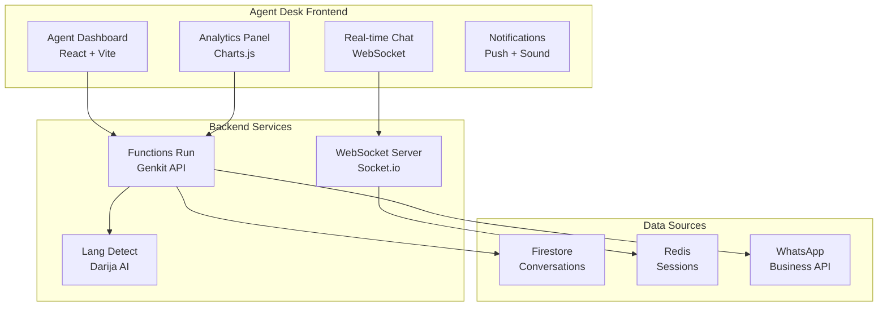

# 🖥️ SalamBot Agent Desk v2.2.0

**Tableau de bord intelligent pour les agents du service client SalamBot**

_Interface React moderne optimisée pour la gestion multi-canal des conversations client en Darija, Français et Arabe._

[](https://reactjs.org/)
[](https://vitejs.dev/)
[](https://www.typescriptlang.org/)
[](https://tailwindcss.com/)

## 🌟 Fonctionnalités Principales

### 💬 **Gestion Conversations Multi-Canal**

- **WhatsApp Business** : Intégration native avec API officielle
- **Widget Web** : Chat intégré sur sites clients
- **Détection Darija** : Support bi-script (Latin/Arabe) implémenté avec 70% précision
- **Historique unifié** : Vue consolidée de toutes les interactions

### 🎛️ **Interface Opérateur Avancée**

- **Dashboard temps réel** : Métriques de performance et KPIs
- **Routage intelligent** : Attribution automatique selon compétences
- **Réponses suggérées** : IA contextuelle pour le Darija
- **Mode collaboration** : Transfert et supervision d'équipe

### 📊 **Analytics & Reporting**

- **Satisfaction client** : Scores NPS et CSAT automatisés
- **Performance agent** : Temps de réponse, résolution, qualité
- **Insights Darija** : Analyse linguistique des conversations
- **Exports personnalisés** : Rapports PDF/Excel configurables

## 🏗️ Architecture



## 🚀 Installation & Configuration

### Prérequis

- Node.js 18+
- pnpm 8+
- Accès aux services Firebase/GCP

### Variables d'environnement

```bash
# Copier le fichier d'exemple
cp .env.example .env.local

# Configurer les variables
VITE_FIREBASE_API_KEY=your_api_key
VITE_FIREBASE_PROJECT_ID=salambot-prod
VITE_WEBSOCKET_URL=ws://localhost:3001
VITE_API_BASE_URL=http://localhost:3000
```

### Démarrage rapide

```bash
# Installation des dépendances
pnpm install

# Lancement en développement
pnpm nx serve agent-desk

# Accès : http://localhost:4200
```

## 👥 Guide Utilisateur

### Connexion Agent

1. **Authentification** : Firebase Auth avec email/mot de passe
2. **Profil agent** : Configuration des compétences linguistiques
3. **Statut disponibilité** : En ligne/Occupé/Pause/Hors ligne

### Gestion des Conversations

```typescript
// Exemple d'utilisation des hooks
import { useConversations, useAgentStatus } from '@salambot/agent-desk';

function AgentDashboard() {
  const { conversations, assignConversation } = useConversations();
  const { status, setStatus } = useAgentStatus();

  return <Dashboard conversations={conversations} onAssign={assignConversation} agentStatus={status} />;
}
```

### Raccourcis Clavier

- `Ctrl + Enter` : Envoyer message
- `Ctrl + T` : Transférer conversation
- `Ctrl + R` : Réponse rapide
- `F1` : Aide contextuelle

## 🧪 Tests & Développement

### Tests unitaires

```bash
# Lancer tous les tests
pnpm nx test agent-desk

# Tests en mode watch
pnpm nx test agent-desk --watch

# Coverage
pnpm nx test agent-desk --coverage
```

### Tests E2E

```bash
# Tests Playwright
pnpm nx e2e agent-desk-e2e

# Tests spécifiques
pnpm nx e2e agent-desk-e2e --spec="conversation.spec.ts"
```

### Build & Déploiement

```bash
# Build production
pnpm nx build agent-desk --configuration=production

# Preview build
pnpm nx preview agent-desk

# Analyse bundle
pnpm nx build agent-desk --analyze
```

## 📱 Responsive Design

- **Desktop** : Interface complète avec panels latéraux
- **Tablet** : Vue adaptée avec navigation par onglets
- **Mobile** : Mode conversation prioritaire

## 🔧 Configuration Avancée

### Thèmes personnalisés

```typescript
// tailwind.config.js
module.exports = {
  theme: {
    extend: {
      colors: {
        'salambot-primary': '#2D5A87',
        'salambot-secondary': '#F4A261',
        'darija-accent': '#E76F51',
      },
    },
  },
};
```

### Intégrations tierces

- **Zendesk** : Import/export tickets
- **Slack** : Notifications équipe
- **Zapier** : Automatisations workflow

## 📚 Ressources

- [Guide Agent](../../../docs/agent-guide.md)
- [API Documentation](../functions-run/README.md)
- [Design System](../../libs/ui/README.md)
- [Roadmap SalamBot](../../../README.md#roadmap)

## 🤝 Support

- **Issues** : [GitHub Issues](https://github.com/SalamBot-Org/salambot-suite/issues)
- **Discord** : [Communauté SalamBot](https://discord.gg/salambot)
- **Email** : support@salambot.ma
