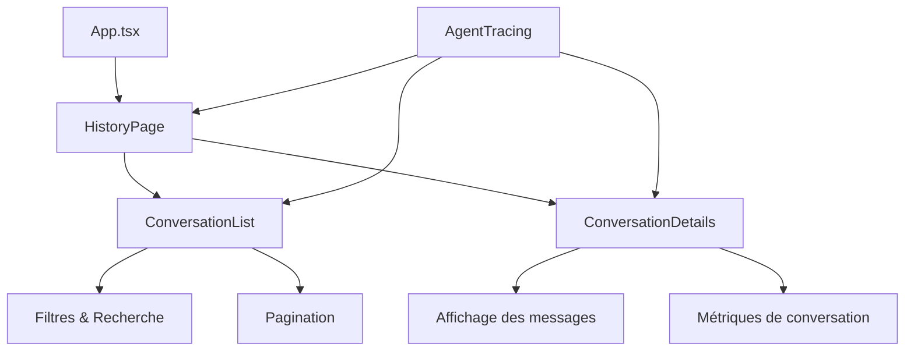

# Documentation des composants d'historique de l'Agent Desk

Ce document décrit les composants d'historique des conversations implémentés dans l'Agent Desk SalamBot.

## Architecture



## Composants principaux

### ConversationList

Affiche une liste paginée des conversations avec filtres et recherche.

**Fonctionnalités :**
- Affichage des conversations avec informations clés (langue, canal, dernier message, durée, statut)
- Filtrage par statut, langue et canal
- Recherche textuelle dans les messages et noms de clients
- Pagination avec contrôle de page
- Instrumentation OpenTelemetry pour le suivi des actions

**Exemple d'utilisation :**
```tsx
import ConversationList from '../components/ConversationList';

const MyComponent = () => {
  const handleSelectConversation = (conversationId: string) => {
    // Logique de sélection
  };
  
  return (
    <ConversationList 
      onSelectConversation={handleSelectConversation}
      pageSize={10} // Optionnel, défaut: 10
    />
  );
};
```

### ConversationDetails

Affiche les détails d'une conversation sélectionnée, avec l'historique complet des messages.

**Fonctionnalités :**
- Affichage des informations de la conversation (client, langue, canal, statut)
- Affichage des métriques (nombre de messages, durée, temps de réponse, satisfaction)
- Affichage chronologique des messages avec distinction visuelle par rôle (utilisateur, bot, agent)
- Bouton de retour pour revenir à la liste
- Instrumentation OpenTelemetry pour le suivi des actions

**Exemple d'utilisation :**
```tsx
import ConversationDetails from '../components/ConversationDetails';

const MyComponent = () => {
  const handleBack = () => {
    // Logique de retour
  };
  
  return (
    <ConversationDetails 
      conversationId="conv-123" // null si aucune conversation sélectionnée
      onBack={handleBack} // Optionnel
    />
  );
};
```

### HistoryPage

Page complète intégrant la liste et les détails des conversations.

**Fonctionnalités :**
- Layout responsive (liste à gauche, détails à droite sur desktop)
- Gestion de la sélection de conversation
- Adaptation mobile (affichage alterné liste/détails)
- Instrumentation OpenTelemetry pour le suivi des actions

**Exemple d'utilisation :**
```tsx
import HistoryPage from '../pages/HistoryPage';

// Dans le routeur
<Route path="/history" element={<HistoryPage />} />
```

## Instrumentation OpenTelemetry

Les composants d'historique utilisent l'utilitaire `AgentTracing` pour générer des traces OpenTelemetry.

### Traces générées

- `agent.history.load` : Chargement de l'historique des conversations
  - Attributs : `conversation.id`, `filter.*`
  
- `agent.history.view` : Visualisation d'une conversation spécifique
  - Attributs : `conversation.id`, `conversation.message_count`, `conversation.language`, `conversation.channel`, `conversation.status`
  
- `agent.history.filter` : Application de filtres sur l'historique
  - Attributs : `filter.*`, `result.count`

### Exemple d'utilisation

```tsx
import { AgentTracing } from '../utils/tracing';

// Tracer le chargement de l'historique
AgentTracing.historyLoad('conv-123', { status: 'resolved', language: 'fr' });

// Tracer la visualisation d'une conversation
AgentTracing.historyView('conv-123', 10);

// Tracer l'application de filtres
AgentTracing.historyFilter({ status: 'resolved', language: 'fr' }, 5);

// Tracer une action générique avec gestion d'erreur
await AgentTracing.traceAction(
  'agent.custom.action',
  { key: 'value' },
  async () => {
    // Code à exécuter dans le contexte de la trace
    return result;
  }
);
```

## Tests

Les composants d'historique sont testés avec Vitest et React Testing Library.

### Tests implémentés

- **ConversationList**
  - Affichage correct des conversations
  - Filtrage par statut, langue et canal
  - Recherche textuelle
  - Sélection de conversation
  
- **ConversationDetails**
  - Affichage du message d'absence de sélection
  - Affichage des détails d'une conversation
  - Fonctionnement du bouton de retour
  
- **HistoryPage**
  - Affichage initial
  - Sélection de conversation

### Exécution des tests

```bash
nx test apps/agent-desk
```

## Intégration dans l'application

L'historique des conversations est accessible via l'onglet "Historique" dans la navigation principale de l'Agent Desk.

## Prochaines évolutions

- Ajout de filtres avancés (date, durée, satisfaction)
- Export des conversations au format PDF ou CSV
- Visualisation des métriques agrégées
- Intégration avec le système de rapports
