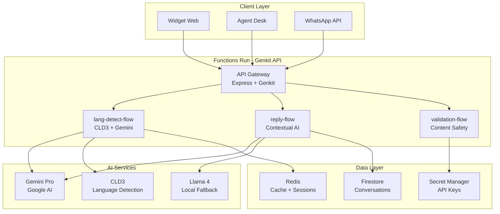

# 🚀 Functions Run - API Genkit SalamBot

**Backend intelligent pour l'IA conversationnelle et la détection de langue Darija**

_API Node.js haute performance utilisant Google Genkit pour l'orchestration des flows d'intelligence artificielle multilingues._

[](https://nodejs.org/)
[](https://firebase.google.com/docs/genkit)
[](https://www.typescriptlang.org/)
[](https://firebase.google.com/)
[](https://ai.google.dev/)

## 🌟 Fonctionnalités Principales

### 🧠 **Intelligence Artificielle Avancée**

- **Détection Darija** : Pipeline CLD3 + Gemini Pro optimisé
- **Génération de réponses** : Contextuelle et culturellement adaptée
- **Support tri-lingue** : Français, Arabe Classique, Darija Marocain
- **Fallback intelligent** : Basculement automatique entre modèles

### ⚡ **Performance & Scalabilité**

- **Latence <200ms** : Optimisations spécifiques pour le Darija
- **Cache Redis** : Mise en cache des détections fréquentes
- **Rate limiting** : Protection contre les abus
- **Monitoring** : Métriques temps réel avec OpenTelemetry

### 🔒 **Sécurité Enterprise**

- **Authentification Firebase** : JWT tokens sécurisés
- **Validation stricte** : Schémas Zod pour tous les inputs
- **Secrets rotation** : Rotation automatique des clés API
- **Audit logs** : Traçabilité complète des requêtes

## 🏗️ Architecture



## 🔄 Flows Disponibles

### 1. **lang-detect-flow** - Détection de Langue

**Endpoint** : `POST /api/detect-language`

```typescript
// Request
{
  "text": "salam khouya, kifach nta?",
  "context": {
    "previousLanguage": "darija-latin",
    "userLocation": "MA"
  }
}

// Response
{
  "language": "darija-latin",
  "confidence": 0.92,
  "script": "latin",
  "alternatives": [
    { "language": "french", "confidence": 0.05 },
    { "language": "arabic", "confidence": 0.03 }
  ],
  "processingTime": 45,
  "model": "cld3+gemini"
}
```

**Pipeline de détection :**

1. **Script Detection** : Identification Latin/Arabe/Mixte
2. **CLD3 Analysis** : Détection rapide pour langues courantes
3. **Darija Patterns** : Règles spécifiques pour le dialecte marocain
4. **Gemini Fallback** : IA pour cas complexes (confidence < 80%)
5. **Context Enhancement** : Amélioration avec historique utilisateur

### 2. **reply-flow** - Génération de Réponses

**Endpoint** : `POST /api/generate-reply`

```typescript
// Request
{
  "message": "salam, bghit n3ref 3la les prix dyalkom",
  "language": "darija-latin",
  "context": {
    "conversationId": "conv_123",
    "userProfile": {
      "preferredLanguage": "darija",
      "location": "Casablanca"
    },
    "businessContext": {
      "industry": "ecommerce",
      "products": ["electronics", "fashion"]
    }
  }
}

// Response
{
  "reply": "Salam! Ahlan wa sahlan. Bghiti t3ref 3la les prix dyal ay produit b dbt? 3andna des offres zwin f electronics w fashion. Goul liya ach katbghi w ghadi n3tik les détails kamlin! 😊",
  "language": "darija-latin",
  "tone": "friendly",
  "suggestions": [
    "Wach bghiti tchouf catalogue dyalna?",
    "3andi des promotions jdad, bghiti n3tik les infos?"
  ],
  "confidence": 0.89,
  "model": "gemini-pro"
}
```

### 3. **validation-flow** - Validation de Contenu

**Endpoint** : `POST /api/validate-content`

```typescript
// Request
{
  "text": "Message à valider",
  "language": "darija-latin",
  "validationType": "safety" // "safety" | "business" | "cultural"
}

// Response
{
  "isValid": true,
  "score": 0.95,
  "issues": [],
  "suggestions": [
    "Considérer l'ajout d'une formule de politesse"
  ]
}
```

## 🚀 Installation & Configuration

### Prérequis

- Node.js 18+
- pnpm 8+
- Compte Google Cloud avec Gemini API
- Firebase Project configuré

### Variables d'environnement

```bash
# Copier le fichier d'exemple
cp .env.example .env

# Configuration requise
GOOGLE_GENAI_API_KEY=your_gemini_api_key
FIREBASE_PROJECT_ID=salambot-prod
REDIS_URL=redis://localhost:6379
PORT=3000
NODE_ENV=development

# Configuration optionnelle
LLAMA_API_URL=http://localhost:8080
OPENTELEMETRY_ENDPOINT=http://localhost:4317
RATE_LIMIT_MAX=100
RATE_LIMIT_WINDOW=900000
```

### Démarrage rapide

```bash
# Installation
pnpm install

# Démarrage en développement
pnpm nx serve functions-run

# API disponible sur http://localhost:3000
```

## 📡 API Reference

### Authentification

Toutes les requêtes nécessitent un token Firebase valide :

```bash
curl -H "Authorization: Bearer $FIREBASE_TOKEN" \
     -H "Content-Type: application/json" \
     -d '{"text":"salam khouya"}' \
     http://localhost:3000/api/detect-language
```

### Endpoints Disponibles

| Endpoint                | Méthode | Description           | Rate Limit |
| ----------------------- | ------- | --------------------- | ---------- |
| `/api/detect-language`  | POST    | Détection de langue   | 100/15min  |
| `/api/generate-reply`   | POST    | Génération de réponse | 50/15min   |
| `/api/validate-content` | POST    | Validation de contenu | 200/15min  |
| `/api/health`           | GET     | Status de l'API       | Illimité   |
| `/api/metrics`          | GET     | Métriques Prometheus  | Illimité   |

### Codes d'erreur

```typescript
// Erreurs communes
{
  "error": {
    "code": "INVALID_LANGUAGE",
    "message": "Langue non supportée",
    "details": {
      "supportedLanguages": ["french", "arabic", "darija-latin", "darija-arabic"]
    }
  }
}
```

| Code               | Description                | Status HTTP |
| ------------------ | -------------------------- | ----------- |
| `INVALID_INPUT`    | Données d'entrée invalides | 400         |
| `UNAUTHORIZED`     | Token manquant/invalide    | 401         |
| `RATE_LIMITED`     | Limite de taux dépassée    | 429         |
| `AI_SERVICE_ERROR` | Erreur service IA          | 503         |
| `INTERNAL_ERROR`   | Erreur interne             | 500         |

## 🧪 Tests & Développement

### Tests unitaires

```bash
# Tous les tests
pnpm nx test functions-run

# Tests spécifiques
pnpm nx test functions-run --testNamePattern="lang-detect"

# Coverage
pnpm nx test functions-run --coverage

# Tests en mode watch
pnpm nx test functions-run --watch
```

### Tests d'intégration

```bash
# Tests E2E avec vraies APIs
pnpm nx e2e functions-run-e2e

# Tests de performance
pnpm nx test:perf functions-run

# Tests de charge
pnpm nx test:load functions-run
```

### Développement local

```bash
# Mode développement avec hot reload
pnpm nx serve functions-run --watch

# Debug avec inspection
pnpm nx serve functions-run --inspect

# Profiling de performance
pnpm nx serve functions-run --prof
```

## 📊 Monitoring & Observabilité

### Métriques Prometheus

```bash
# Endpoint métriques
curl http://localhost:3000/api/metrics
```

**Métriques disponibles :**

- `salambot_requests_total` : Nombre total de requêtes
- `salambot_request_duration_seconds` : Latence des requêtes
- `salambot_language_detection_accuracy` : Précision de détection
- `salambot_ai_model_usage` : Utilisation des modèles IA
- `salambot_cache_hit_ratio` : Taux de cache hit Redis

### Logs structurés

```json
{
  "timestamp": "2024-01-15T10:30:00Z",
  "level": "info",
  "service": "functions-run",
  "flow": "lang-detect-flow",
  "requestId": "req_abc123",
  "userId": "user_456",
  "language": "darija-latin",
  "confidence": 0.92,
  "processingTime": 45,
  "model": "cld3+gemini"
}
```

### Health Checks

```bash
# Status général
curl http://localhost:3000/api/health

# Status détaillé
curl http://localhost:3000/api/health/detailed
```

## 🔧 Configuration Avancée

### Optimisation des modèles

```typescript
// genkit.config.ts
export default {
  models: {
    gemini: {
      temperature: 0.3,
      maxTokens: 1000,
      topP: 0.8,
    },
    llama: {
      endpoint: process.env.LLAMA_API_URL,
      timeout: 5000,
    },
  },
  cache: {
    ttl: 3600, // 1 heure
    maxSize: 10000,
  },
};
```

### Personnalisation des flows

```typescript
// Créer un flow personnalisé
import { defineFlow } from '@genkit-ai/flow';

export const customFlow = defineFlow(
  {
    name: 'custom-flow',
    inputSchema: z.object({
      text: z.string(),
      context: z.object({}).optional(),
    }),
    outputSchema: z.object({
      result: z.string(),
      confidence: z.number(),
    }),
  },
  async (input) => {
    // Logique personnalisée
    return {
      result: 'Résultat personnalisé',
      confidence: 0.95,
    };
  }
);
```

## 🚀 Déploiement

### Build production

```bash
# Build optimisé
pnpm nx build functions-run --configuration=production

# Vérification du build
pnpm nx preview functions-run
```

### Docker

```dockerfile
# Dockerfile optimisé
FROM node:18-alpine
WORKDIR /app
COPY dist/apps/functions-run .
RUN npm ci --only=production
EXPOSE 3000
CMD ["node", "main.js"]
```

### Google Cloud Run

```bash
# Déploiement Cloud Run
gcloud run deploy salambot-functions \
  --source . \
  --platform managed \
  --region europe-west1 \
  --allow-unauthenticated
```

## 📚 Ressources

- **Genkit Docs** : [Firebase Genkit](https://firebase.google.com/docs/genkit)
- **Gemini API** : [Google AI Studio](https://ai.google.dev/)
- **Architecture** : [SalamBot Architecture](../../../docs/archi.md)
- **Monitoring** : [Observability Guide](../../../docs/monitoring.md)

## 🤝 Support

- **Issues** : [GitHub Issues](https://github.com/SalamBot-Org/salambot-suite/issues)
- **Discord** : [#backend-api](https://discord.gg/salambot)
- **Email** : api@salambot.ma
