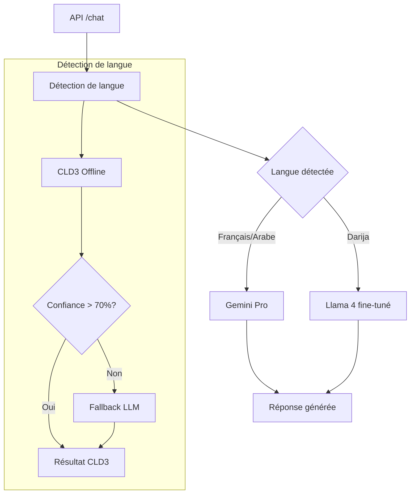

/\*\*

- @file Documentation du module Genkit pour SalamBot
- @author SalamBot Team (contact: info@salambot.ma)
- @created 2025-05-26
- @updated 2025-05-26
- @project SalamBot - AI CRM for Moroccan SMEs
  \*/

# Module Genkit pour SalamBot

Ce module contient les flows Genkit utilisés par SalamBot pour la détection de langue et la génération de réponses.

## Architecture



## Flows disponibles

### 1. Détection de langue (`lang-detect-flow.ts`)

Ce flow permet de détecter automatiquement la langue d'un texte parmi les langues supportées par SalamBot :

- Français (fr)
- Arabe classique (ar)
- Darija marocain (darija)

#### Fonctionnement

1. Utilise CLD3 (Compact Language Detector v3) en mode offline pour une détection rapide
2. Si la confiance est faible ou si le Darija est suspecté, utilise un LLM (Gemini Pro) comme fallback
3. Retourne la langue détectée, le niveau de confiance, la source de détection et la latence

#### Exemple d'utilisation

```typescript
import { detectLanguage } from './genkit/lang-detect-flow';

const result = await detectLanguage('مرحبا كيف حالك');
console.log(result);
// {
//   detectedLanguage: 'ar',
//   confidence: 0.92,
//   source: 'cld3',
//   latency: 5
// }
```

### 2. Génération de réponse (`reply-flow.ts`) - À implémenter

Ce flow permettra de générer des réponses adaptées à la langue détectée :

- Utilisation de Gemini Pro pour le français et l'arabe classique
- Utilisation de Llama 4 fine-tuné pour le Darija

## Tests

Les tests unitaires sont disponibles dans le dossier `__tests__` et peuvent être exécutés avec :

```bash
pnpm test apps/functions-run
```

## Dépendances

- `genkit`: Framework d'orchestration pour les modèles d'IA
- `genkit-vertexai`: Connecteur Genkit pour Google Vertex AI (Gemini)
- `cld3`: Détecteur de langue compact pour la détection offline
