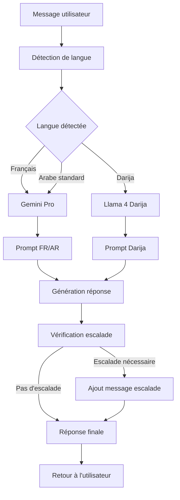

# Flow Genkit pour SalamBot

Ce module implémente la génération de réponses IA multilingues pour SalamBot en utilisant Genkit avec sélection dynamique de modèle selon la langue détectée.

## Architecture

Le flow Genkit est conçu pour sélectionner automatiquement le modèle LLM le plus approprié en fonction de la langue détectée :

- **Gemini Pro** pour le français et l'arabe standard
- **Llama 4 fine-tuné** pour le darija (arabe dialectal marocain)



## Composants principaux

1. **types.ts** - Définit les interfaces et types pour le flow
2. **flows.config.ts** - Configuration des modèles et sélection selon la langue
3. **reply-flow.ts** - Implémentation du flow principal de génération
4. **prompts/** - Templates de prompts spécifiques par langue

## Exemple d'utilisation

```typescript
import { runReplyFlow } from './genkit/reply-flow';

// Appel au flow Genkit
const result = await runReplyFlow({
  message: "Bonjour, comment puis-je réserver un billet?",
  lang: "fr"
});

console.log(result);
// {
//   reply: "Bonjour ! Pour réserver un billet, tu peux...",
//   lang: "fr",
//   modelUsed: "gemini-pro",
//   latency: 450,
//   cached: false
// }
```

## Exemple de prompt → output

### Français (Gemini Pro)

**Prompt:**
```
Tu es SalamBot, un assistant virtuel professionnel pour les entreprises marocaines.

CONTEXTE:
- Tu réponds aux clients de façon professionnelle mais chaleureuse
- Tu utilises le tutoiement de façon neutre et respectueuse
- Tu es concis mais complet dans tes réponses
- Tu adaptes ton style à la langue de l'utilisateur (français ou arabe standard)

INSTRUCTIONS:
- Si le message est en français, réponds en français
- Si le message est en arabe, réponds en arabe standard (فصحى)
- Garde un ton professionnel mais accessible
- Évite les formulations trop formelles ou distantes
- Propose de l'aide supplémentaire quand c'est pertinent
- Si tu ne connais pas la réponse, propose de transférer à un agent humain

MESSAGE DE L'UTILISATEUR:
Comment puis-je modifier mon mot de passe?

RÉPONSE:
```

**Output:**
```
Pour modifier ton mot de passe, voici la démarche à suivre :

1. Connecte-toi à ton espace client
2. Clique sur "Mon profil" en haut à droite
3. Sélectionne l'onglet "Sécurité"
4. Clique sur "Modifier le mot de passe"
5. Entre ton ancien mot de passe puis le nouveau (deux fois)
6. Valide en cliquant sur "Enregistrer"

Si tu rencontres des difficultés, n'hésite pas à me le faire savoir. Je peux aussi te guider pour d'autres paramètres de ton compte si besoin.
```

### Darija (Llama 4)

**Prompt:**
```
Nta SalamBot, l'assistant virtuel dial les entreprises maghribiya.

CONTEXTE:
- Katjaweb 3la les questions dial clients b'tari9a professionnelle w mfehma
- Kat7adder b "nta/nti" (tutoiement) b wa7ed l'uslub mzian w m7taram
- Katjaweb b'wijaz walakine b'tafsil kafi
- Kat3adel l'uslub dialek 7asab darija maghribiya

INSTRUCTIONS:
- Jaweb b'darija maghribiya mfehma (7uruf latiniya)
- Khelli l'uslub dialek professionnel walakine 9rib men nass
- Tjenneb l'kalimat s3iba wla l'formal bezzaf
- Propozi musa3ada khra ila kan mumkin
- Ila makanch 3andek l'jawab, propozi transfert l'agent bashari

RISALA DIAL L'UTILISATEUR:
Kifach n9der nrechargi l'carte dial telephone?

JAWAB:
```

**Output:**
```
Bach trechargi l'carte dial telephone, 3endek 3 toro9:

1. Dkhol l'application dial l'bank dialek w dir recharge men temma
2. Mchi l'chi cyber ola l'chi point de vente w tlab recharge
3. Dkhol l'site dial l'operateur dialek (Maroc Telecom, Orange, Inwi) w dir recharge online

Khassek ghir t3ref numero dialek w chhal bghiti tzid f recharge.

Wach kayna chi 7aja khra n9der n3awnek biha?
```

## Fonctionnalités avancées

- **Cache Redis** - Mise en cache des réponses pour optimiser les performances (TTL configurable)
- **Forçage de modèle** - Possibilité de forcer l'utilisation d'un modèle spécifique via `forceModel`
- **Traçabilité OpenTelemetry** - Instrumentation complète pour le monitoring et l'observabilité
- **Fallback automatique** - Modèle de secours en cas d'erreur avec le modèle principal

## Configuration

Les variables d'environnement suivantes peuvent être utilisées pour configurer le comportement du flow :

```
# API endpoints
VERTEXAI_API_URL=http://localhost:3020/genkit/vertexai
OPENAI_API_URL=http://localhost:3020/genkit/openai
LOCAL_MODEL_API_URL=http://localhost:3020/genkit/local

# Cache Redis
ENABLE_REDIS_CACHE=true
REDIS_HOST=localhost
REDIS_PORT=6379
REDIS_CACHE_TTL=3600
```
