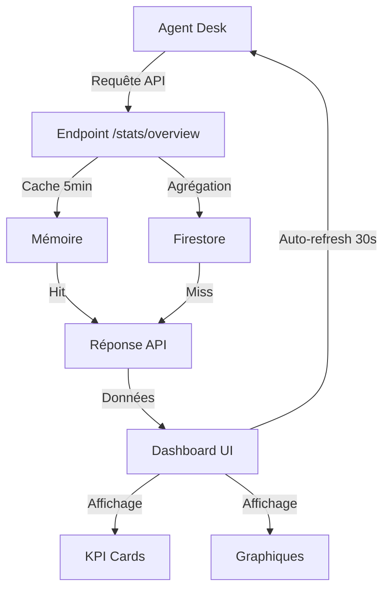

# Documentation du Dashboard Analytique SalamBot

## Vue d'ensemble

Le dashboard analytique SalamBot offre une visualisation en temps réel des métriques clés du système de conversation. Il permet aux agents et administrateurs de suivre les performances, d'analyser les tendances et d'optimiser le service client.



## Fonctionnalités principales

- **Vue d'ensemble des conversations** : totaux, par langue, par canal, taux d'escalade
- **Métriques SLA** : temps de réponse (p50, p90), temps de résolution
- **Visualisations** : histogrammes, camemberts, graphiques à barres
- **Filtres temporels** : 24h, 7 jours, 30 jours
- **Auto-refresh** : actualisation automatique toutes les 30 secondes
- **Mode sombre/clair** : adaptation automatique aux préférences système
- **Animations fluides** : transitions et interactions améliorées

## Architecture technique

### Backend (API)

L'API de statistiques est exposée via l'endpoint `/stats/overview` dans le service `functions-run`. Elle agrège les données de conversation stockées dans Firestore et les met en cache pendant 5 minutes pour optimiser les performances.

#### Paramètres de requête

| Paramètre | Type | Description | Valeurs possibles |
|-----------|------|-------------|-------------------|
| `period` | string | Période d'agrégation | `last_24h`, `last_7d`, `last_30d`, `custom` |
| `granularity` | string | Granularité des séries temporelles | `hourly`, `daily`, `weekly`, `monthly` |
| `startDate` | string | Date de début (format ISO) pour période personnalisée | `2025-05-15T00:00:00Z` |
| `endDate` | string | Date de fin (format ISO) pour période personnalisée | `2025-05-22T00:00:00Z` |
| `channels` | string | Filtrer par canaux (séparés par virgule) | `web,whatsapp` |
| `languages` | string | Filtrer par langues (séparées par virgule) | `fr,ar,ar-ma` |

#### Exemple de réponse

```json
{
  "stats": {
    "totalConversations": 123,
    "totalMessages": 567,
    "byStatus": {
      "open": 20,
      "resolved": 90,
      "escalated": 13
    },
    "byLanguage": {
      "fr": 60,
      "ar": 40,
      "ar-ma": 23
    },
    "byChannel": {
      "web": 80,
      "whatsapp": 43
    },
    "sla": {
      "firstResponseTimeP50": 15000,
      "firstResponseTimeP90": 45000,
      "resolutionTimeP50": 180000,
      "resolutionTimeP90": 600000
    },
    "escalationRate": 0.1057,
    "timeSeries": {
      "conversations": [
        { "timestamp": "2025-05-21T00:00:00Z", "count": 15 },
        { "timestamp": "2025-05-22T00:00:00Z", "count": 25 }
      ],
      "messages": [
        { "timestamp": "2025-05-21T00:00:00Z", "count": 70 },
        { "timestamp": "2025-05-22T00:00:00Z", "count": 110 }
      ]
    }
  },
  "metadata": {
    "period": "last_7d",
    "granularity": "daily",
    "startDate": "2025-05-15T00:00:00Z",
    "endDate": "2025-05-22T00:00:00Z",
    "generatedAt": "2025-05-22T14:30:00Z",
    "cacheHit": false,
    "computationTimeMs": 123
  }
}
```

### Frontend (Agent Desk)

Le dashboard est accessible via la route `/dashboard` dans l'Agent Desk. Il est protégé par le système RBAC et n'est accessible qu'aux utilisateurs ayant les rôles `admin` ou `agent`.

#### Composants principaux

- **KpiCard** : Affiche une métrique clé avec titre, valeur, sous-titre et icône
- **ChartCard** : Conteneur pour les graphiques avec titre et gestion des états de chargement
- **DashboardPage** : Page principale intégrant tous les composants et la logique de chargement

#### Bibliothèques utilisées

- **Recharts** : Visualisation de données
- **Framer Motion** : Animations et transitions
- **TailwindCSS** : Styles et thèmes (dark/light)

## Instrumentation OpenTelemetry

Le dashboard est instrumenté avec OpenTelemetry pour suivre les performances et les erreurs :

| Trace | Description |
|-------|-------------|
| `analytics.query.start` | Début d'une requête d'agrégation |
| `analytics.query.success` | Succès d'une requête d'agrégation |
| `analytics.query.fail` | Échec d'une requête d'agrégation |
| `analytics.fetch.start` | Début d'une requête API côté client |
| `analytics.fetch.success` | Succès d'une requête API côté client |
| `analytics.fetch.fail` | Échec d'une requête API côté client |
| `analytics.dashboard.refresh` | Actualisation du dashboard |

## Tests

Le dashboard est couvert par des tests unitaires et d'intégration :

- **Backend** : Tests de l'API, validation des paramètres, gestion des erreurs
- **Frontend** : Tests des composants, affichage des données, gestion des états

## Exemples d'utilisation

### Accès au dashboard

```tsx
// Accès via la navigation
<Link to="/dashboard">Dashboard</Link>

// Protection par rôle
<Route path="/dashboard" element={
  <ProtectedRoute roles={[Role.ADMIN, Role.AGENT]}>
    <DashboardPage />
  </ProtectedRoute>
} />
```

### Appel à l'API

```typescript
// Appel simple
const stats = await StatsService.getOverviewStats();

// Appel avec paramètres
const stats = await StatsService.getOverviewStats(
  StatsPeriod.LAST_24H,
  StatsGranularity.HOURLY
);
```

## Évolutions futures

- Filtres par période personnalisée avec sélecteur de dates
- Export des données en CSV/PDF
- Tableaux de données détaillées
- Métriques avancées (CSAT, NPS, temps moyen de traitement)
- Alertes et notifications sur seuils
