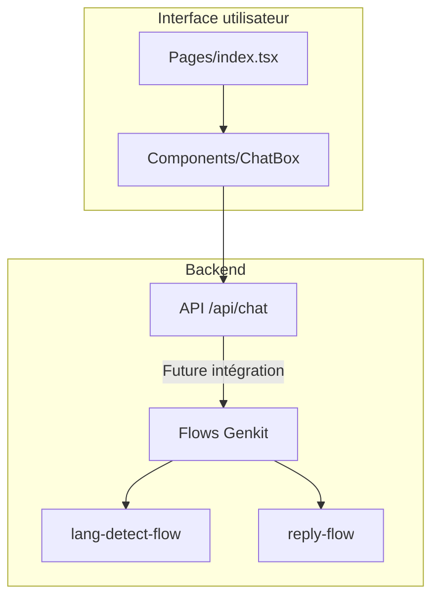

# Widget Web SalamBot

Ce module contient le widget web de SalamBot, une interface de chat légère et responsive qui peut être intégrée dans n'importe quel site web.

## Architecture



## Fonctionnalités

### Version 0.1

- Interface de chat responsive avec design moderne
- Support des messages utilisateur et réponses bot
- Indicateur de chargement pendant le traitement
- API mock pour simuler les réponses en français, arabe et darija
- Intégration prête pour la détection Darija bi-script (70% précision)
- Tests unitaires complets

### Futures versions

- Intégration avec les flows Genkit pour la détection de langue et la génération de réponses
- Support complet du français, de l'arabe classique et du darija (pipeline implémenté)
- Personnalisation des couleurs et du style
- Mode d'intégration iframe pour les sites tiers

## Utilisation

### Développement local

```bash
# Lancer le serveur de développement
pnpm dev

# Exécuter les tests
pnpm test apps/widget-web
```

### Intégration

Le widget sera disponible pour intégration via un script ou un iframe dans les futures versions.

## Structure des fichiers

- `src/components/ChatBox.tsx` - Composant principal de l'interface de chat
- `src/pages/index.tsx` - Page de démonstration du widget
- `src/pages/api/chat.ts` - API mock pour simuler les réponses (sera remplacée par l'intégration Genkit)

## Tests

Les tests unitaires sont disponibles dans le dossier `__tests__` et peuvent être exécutés avec :

```bash
pnpm test apps/widget-web
```
