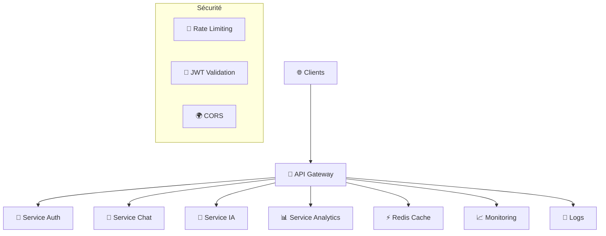

# 🌐 API Gateway - SalamBot Suite v2.1

## 📋 Vue d'ensemble

L'API Gateway de SalamBot Suite centralise et sécurise l'accès à tous les services backend. Elle fournit une interface unifiée pour les applications frontend et les intégrations tierces.

## 🏗️ Architecture



## 🔧 Configuration

### Variables d'environnement

```bash
# Configuration Gateway
GATEWAY_PORT=3000
GATEWAY_HOST=0.0.0.0
GATEWAY_ENV=production

# Services Backend
AUTH_SERVICE_URL=http://auth-service:3001
CHAT_SERVICE_URL=http://chat-service:3002
AI_SERVICE_URL=http://ai-service:3003
ANALYTICS_SERVICE_URL=http://analytics-service:3004

# Sécurité
JWT_SECRET=your-jwt-secret
RATE_LIMIT_WINDOW=900000  # 15 minutes
RATE_LIMIT_MAX=100        # 100 requêtes par fenêtre

# Cache
REDIS_URL=redis://redis:6379
CACHE_TTL=300             # 5 minutes

# Monitoring
MONITORING_ENABLED=true
LOGS_LEVEL=info
```

## 🛣️ Routes et Services

### 🔐 Authentication

| Méthode | Route | Service | Description |
|---------|-------|---------|-------------|
| POST | `/api/auth/login` | auth-service | Connexion utilisateur |
| POST | `/api/auth/logout` | auth-service | Déconnexion |
| POST | `/api/auth/refresh` | auth-service | Renouvellement token |
| GET | `/api/auth/profile` | auth-service | Profil utilisateur |

### 💬 Chat

| Méthode | Route | Service | Description |
|---------|-------|---------|-------------|
| POST | `/api/chat/messages` | chat-service | Envoyer message |
| GET | `/api/chat/conversations` | chat-service | Liste conversations |
| GET | `/api/chat/conversations/:id` | chat-service | Détails conversation |
| POST | `/api/chat/escalate` | chat-service | Escalade vers agent |

### 🧠 Intelligence Artificielle

| Méthode | Route | Service | Description |
|---------|-------|---------|-------------|
| POST | `/api/ai/detect-language` | ai-service | Détection langue/dialecte |
| POST | `/api/ai/translate` | ai-service | Traduction Darija |
| POST | `/api/ai/sentiment` | ai-service | Analyse sentiment |
| GET | `/api/ai/models` | ai-service | Modèles disponibles |

### 📊 Analytics

| Méthode | Route | Service | Description |
|---------|-------|---------|-------------|
| POST | `/api/analytics/events` | analytics-service | Enregistrer événement |
| GET | `/api/analytics/metrics` | analytics-service | Métriques temps réel |
| GET | `/api/analytics/reports` | analytics-service | Rapports détaillés |

## 🔒 Sécurité

### Authentification JWT

```typescript
// Header requis pour les routes protégées
Authorization: Bearer <jwt-token>

// Structure du token JWT
{
  "sub": "user-id",
  "email": "user@example.com",
  "role": "agent|admin|user",
  "iat": 1640995200,
  "exp": 1641081600
}
```

### Rate Limiting

- **Limite par défaut** : 100 requêtes / 15 minutes
- **Limite authentifiée** : 1000 requêtes / 15 minutes
- **Limite admin** : 5000 requêtes / 15 minutes

### CORS

```typescript
// Domaines autorisés
const allowedOrigins = [
  'https://salambot.ma',
  'https://app.salambot.ma',
  'https://admin.salambot.ma',
  'http://localhost:3000', // Dev uniquement
];
```

## ⚡ Performance

### Cache Redis

- **TTL par défaut** : 5 minutes
- **Cache des réponses** : GET requests uniquement
- **Invalidation** : Automatique sur mutations

### Load Balancing

```yaml
# Configuration Nginx (exemple)
upstream api_gateway {
    server gateway-1:3000 weight=3;
    server gateway-2:3000 weight=2;
    server gateway-3:3000 weight=1;
}
```

## 📊 Monitoring

### Métriques collectées

- **Latence** : Temps de réponse par route
- **Throughput** : Requêtes par seconde
- **Erreurs** : Taux d'erreur par service
- **Cache** : Hit/Miss ratio

### Health Checks

```bash
# Vérification santé gateway
GET /health

# Réponse
{
  "status": "healthy",
  "timestamp": "2024-01-15T10:30:00Z",
  "services": {
    "auth": "healthy",
    "chat": "healthy",
    "ai": "degraded",
    "analytics": "healthy"
  },
  "cache": "connected",
  "database": "connected"
}
```

## 🚀 Déploiement

### Docker

```dockerfile
# Dockerfile
FROM node:18-alpine

WORKDIR /app
COPY package*.json ./
RUN npm ci --only=production

COPY . .
EXPOSE 3000

CMD ["npm", "start"]
```

### Kubernetes

```yaml
apiVersion: apps/v1
kind: Deployment
metadata:
  name: api-gateway
spec:
  replicas: 3
  selector:
    matchLabels:
      app: api-gateway
  template:
    metadata:
      labels:
        app: api-gateway
    spec:
      containers:
      - name: gateway
        image: salambot/api-gateway:v2.1.0
        ports:
        - containerPort: 3000
        env:
        - name: NODE_ENV
          value: "production"
        resources:
          requests:
            memory: "256Mi"
            cpu: "250m"
          limits:
            memory: "512Mi"
            cpu: "500m"
```

## 🔧 Développement

### Installation locale

```bash
# Cloner le repository
git clone https://github.com/salambot/salambot-suite.git
cd salambot-suite

# Installer les dépendances
pnpm install

# Démarrer les services
docker-compose up -d redis postgres

# Démarrer l'API Gateway
pnpm nx serve api-gateway
```

### Tests

```bash
# Tests unitaires
pnpm nx test api-gateway

# Tests d'intégration
pnpm nx test:integration api-gateway

# Tests de charge
pnpm nx test:load api-gateway
```

## 📚 Ressources

- [Documentation API complète](./api-reference.md)
- [Guide de déploiement](./deployment-guide.md)
- [Troubleshooting](./troubleshooting-guide.md)
- [Monitoring Dashboard](https://monitoring.salambot.ma)

## 🆘 Support

- **Documentation** : [docs.salambot.ma](https://docs.salambot.ma)
- **Issues** : [GitHub Issues](https://github.com/salambot/salambot-suite/issues)
- **Discord** : [Communauté SalamBot](https://discord.gg/salambot)
- **Email** : support@salambot.ma