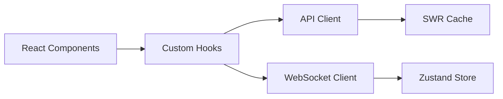
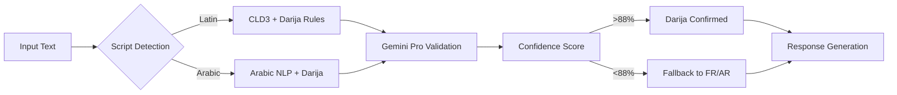
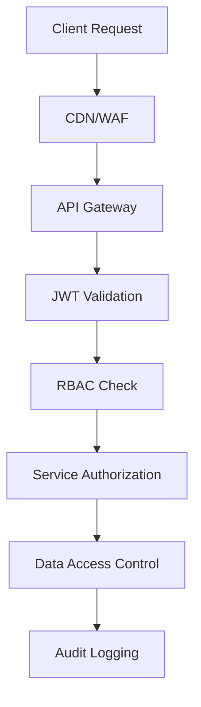
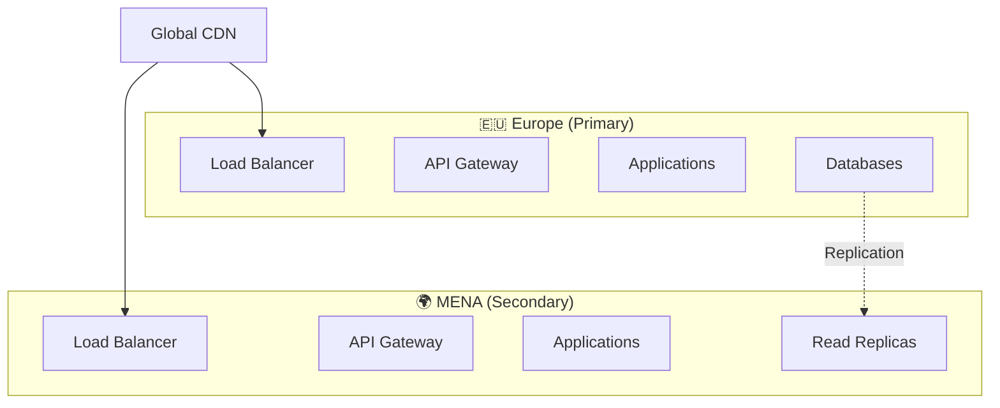

# 🏗️ Architecture SalamBot Suite v2.1

**📋 Document:** Architecture Technique Détaillée  
**🎯 Audience:** Développeurs, Architectes, DevOps  
**📅 Dernière mise à jour:** 27 janvier 2025  
**🔄 Version:** 2.1.0

---

## 🎯 Vue d'Ensemble

SalamBot Suite utilise une **architecture microservices cloud-native** optimisée pour la **détection Darija** et la **scalabilité enterprise**. Le système est conçu pour traiter **1000+ requêtes/seconde** avec une **latence <200ms**.

### 🏆 Principes Architecturaux

- **🔄 Event-Driven** : Communication asynchrone via Redis Streams
- **🛡️ Zero-Trust** : Authentification à chaque couche
- **📊 Observabilité** : Métriques, logs et traces distribuées
- **⚡ Performance** : Cache multi-niveaux et CDN
- **🌍 Multi-Region** : Déploiement GCP multi-zones

---

## 🏗️ Architecture Globale

```mermaid
graph TB
    subgraph "🌐 Frontend Layer"
        WW[Widget Web<br/>Next.js 15 + React 19]
        AD[Agent Desk<br/>React + Vite]
        CE[Chrome Extension<br/>Manifest v3]
        MW[Mobile App<br/>React Native - Phase 3]
    end

    subgraph "🚪 API Gateway Layer"
        GW[Kong/Tyk Gateway<br/>Rate Limiting + Auth]
        LB[Load Balancer<br/>GCP Cloud Load Balancing]
        CDN[CDN<br/>CloudFlare + GCP CDN]
    end

    subgraph "🤖 Backend Services"
        FR[Functions Run<br/>Genkit + Node.js 22]
        AI[AI Lang Detect<br/>CLD3 + Gemini Pro]
        WS[WebSocket Server<br/>Socket.io + Redis]
        NF[Notification Service<br/>Firebase FCM]
        AS[Analytics Service<br/>BigQuery + Dataflow]
    end

    subgraph "🧠 AI/ML Layer"
        GM[Gemini Pro<br/>Google AI]
        LL[Llama 4 Local<br/>Self-hosted]
        CLD[CLD3<br/>Language Detection]
        DM[Darija Model<br/>Custom Fine-tuned]
    end

    subgraph "💾 Data Layer"
        FS[Firestore<br/>Documents + Chat History]
        RD[Redis Cluster<br/>Cache + Sessions + Streams]
        PG[PostgreSQL<br/>Analytics + Reporting]
        BQ[BigQuery<br/>Data Warehouse]
    end

    subgraph "🔐 Security & Config"
        SM[Secret Manager<br/>Credentials + API Keys]
        IAM[Identity & Access<br/>Firebase Auth + RBAC]
        VPC[VPC Network<br/>Private Subnets]
    end

    subgraph "🌍 External APIs"
        WA[WhatsApp Business<br/>Meta API]
        TG[Telegram Bot<br/>Bot API]
        EM[Email Service<br/>SendGrid]
        SMS[SMS Gateway<br/>Twilio]
    end

    %% Frontend to Gateway
    WW --> CDN
    AD --> CDN
    CE --> CDN
    MW --> CDN
    CDN --> LB
    LB --> GW

    %% Gateway to Services
    GW --> FR
    GW --> AI
    GW --> WS
    GW --> NF
    GW --> AS

    %% Services to AI/ML
    FR --> GM
    AI --> CLD
    AI --> DM
    FR --> LL

    %% Services to Data
    FR --> FS
    FR --> RD
    WS --> RD
    AS --> PG
    AS --> BQ

    %% Security Integration
    FR --> SM
    AI --> SM
    GW --> IAM
    FR --> IAM

    %% External Integrations
    FR --> WA
    FR --> TG
    NF --> EM
    NF --> SMS

    classDef frontend fill:#e1f5fe,stroke:#01579b,stroke-width:2px
    classDef gateway fill:#f3e5f5,stroke:#4a148c,stroke-width:2px
    classDef backend fill:#e8f5e8,stroke:#1b5e20,stroke-width:2px
    classDef ai fill:#fff3e0,stroke:#e65100,stroke-width:2px
    classDef data fill:#fce4ec,stroke:#880e4f,stroke-width:2px
    classDef security fill:#f1f8e9,stroke:#33691e,stroke-width:2px
    classDef external fill:#efebe9,stroke:#3e2723,stroke-width:2px

    class WW,AD,CE,MW frontend
    class GW,LB,CDN gateway
    class FR,AI,WS,NF,AS backend
    class GM,LL,CLD,DM ai
    class FS,RD,PG,BQ data
    class SM,IAM,VPC security
    class WA,TG,EM,SMS external
```



---

## 📱 Applications Frontend

### 🌐 Widget Web (`apps/widget-web`)

**Technologie** : Next.js 15 + React 19 + TypeScript  
**Déploiement** : Vercel + CDN  
**Responsabilités** :

- Interface chat client responsive
- Détection automatique Darija/FR/AR
- Thèmes personnalisables
- Intégration temps réel WebSocket
- Analytics utilisateur

**Architecture Interne** :


### 👨‍💼 Agent Desk (`apps/agent-desk`)

**Technologie** : React + Vite + TypeScript  
**Déploiement** : GCP Cloud Run  
**Responsabilités** :

- Dashboard opérateur temps réel
- Gestion conversations multiples
- Analytics et métriques
- Configuration bot
- Escalation manuelle

### 🔌 Chrome Extension (`apps/extension-chrome`)

**Technologie** : Manifest v3 + TypeScript  
**Statut** : MVP Phase 2  
**Responsabilités** :

- Injection widget sur sites tiers
- Capture contexte page
- Authentification SSO
- Configuration domaines

---

## ⚡ Services Backend

### 🤖 Functions Run (`apps/functions-run`)

**Technologie** : Node.js 22 + Genkit + TypeScript  
**Déploiement** : GCP Cloud Functions  
**Responsabilités** :

- Orchestration flows IA
- API REST + GraphQL
- Gestion sessions utilisateur
- Intégrations externes
- Business logic

**Endpoints Principaux** :
```typescript
// Chat Flow
POST /api/v1/chat/message
GET  /api/v1/chat/history/:sessionId
POST /api/v1/chat/escalate

// Language Detection
POST /api/v1/ai/detect-language
POST /api/v1/ai/translate

// Analytics
GET  /api/v1/analytics/dashboard
POST /api/v1/analytics/events
```

### 🧠 AI Lang Detect (`libs/ai/lang-detect`)

**Technologie** : CLD3 + Gemini Pro + TensorFlow.js  
**Performance** : 88%+ précision Darija  
**Responsabilités** :

- Détection bi-script (Latin + Arabe)
- Classification Darija/FR/AR/EN
- Confidence scoring
- Fallback intelligent

**Pipeline de Détection** :


### 🔌 WebSocket Server

**Technologie** : Socket.io + Redis Adapter  
**Scalabilité** : Multi-instance avec Redis  
**Responsabilités** :

- Chat temps réel
- Notifications push
- Présence utilisateur
- Typing indicators

---

## 💾 Couche Données

### 🔥 Firestore

**Usage** : Base de données principale  
**Collections** :

```typescript
// Structure des collections
interface Collections {
  users: UserDocument
  conversations: ConversationDocument
  messages: MessageDocument
  agents: AgentDocument
  analytics: AnalyticsDocument
  config: ConfigDocument
}

interface MessageDocument {
  id: string
  conversationId: string
  content: string
  language: 'darija' | 'french' | 'arabic' | 'english'
  confidence: number
  timestamp: Timestamp
  sender: 'user' | 'bot' | 'agent'
  metadata: {
    ip?: string
    userAgent?: string
    location?: GeoPoint
  }
}
```

### ⚡ Redis Cluster

**Configuration** : 3 nodes + 3 replicas  
**Usage** :

```typescript
// Patterns de cache
interface CachePatterns {
  // Sessions utilisateur (TTL: 24h)
  'session:{userId}': UserSession
  
  // Cache réponses IA (TTL: 1h)
  'ai:response:{hash}': AIResponse
  
  // Rate limiting (TTL: 1min)
  'rate:{ip}:{endpoint}': number
  
  // WebSocket rooms
  'ws:room:{conversationId}': string[]
  
  // Analytics temps réel (TTL: 5min)
  'analytics:realtime': MetricsSnapshot
}
```

### 📊 PostgreSQL

**Usage** : Analytics et reporting  
**Tables Principales** :

```sql
-- Métriques conversations
CREATE TABLE conversation_metrics (
  id UUID PRIMARY KEY,
  conversation_id VARCHAR(255),
  language_detected VARCHAR(50),
  confidence_score DECIMAL(5,4),
  response_time_ms INTEGER,
  escalated BOOLEAN DEFAULT FALSE,
  created_at TIMESTAMP DEFAULT NOW()
);

-- Performance Darija
CREATE TABLE darija_performance (
  id UUID PRIMARY KEY,
  input_text TEXT,
  detected_language VARCHAR(50),
  confidence DECIMAL(5,4),
  is_correct BOOLEAN,
  feedback_source VARCHAR(50),
  created_at TIMESTAMP DEFAULT NOW()
);
```

---

## 🔐 Sécurité & Authentification

### 🛡️ Stratégie Zero-Trust



### 🔑 Gestion des Secrets

**Google Secret Manager** :
```typescript
interface Secrets {
  // API Keys
  'gemini-api-key': string
  'whatsapp-access-token': string
  'telegram-bot-token': string
  
  // Database
  'redis-password': string // Rotation automatique
  'postgres-connection': string
  
  // JWT
  'jwt-secret': string
  'refresh-token-secret': string
}
```

### 🔒 RBAC (Role-Based Access Control)

```typescript
interface Roles {
  admin: {
    permissions: ['*']
    description: 'Accès complet système'
  }
  agent: {
    permissions: [
      'conversations:read',
      'conversations:respond',
      'analytics:view'
    ]
    description: 'Opérateur chat'
  }
  viewer: {
    permissions: ['analytics:view']
    description: 'Consultation uniquement'
  }
}
```

---

## 📊 Monitoring & Observabilité

### 🔍 Métriques Clés

```typescript
interface KPIs {
  // Performance
  response_time_p95: number // <200ms
  throughput_rps: number    // >1000 req/s
  error_rate: number        // <0.1%
  
  // IA Darija
  darija_accuracy: number   // >88%
  language_detection_time: number // <50ms
  
  // Business
  conversations_per_day: number
  escalation_rate: number   // <5%
  user_satisfaction: number // >4.5/5
}
```

### 📈 Stack Observabilité

| Composant | Technologie | Métriques |
|-----------|-------------|----------|
| **APM** | Google Cloud Operations | Latence, Erreurs, Traces |
| **Métriques** | Prometheus + Grafana | CPU, RAM, Redis, Throughput |
| **Logs** | Cloud Logging + BigQuery | Structured logs, Alertes |
| **Uptime** | Cloud Monitoring | 99.9% SLA |
| **Alertes** | PagerDuty + Slack | Incidents critiques |

---

## 🚀 Déploiement & Infrastructure

### 🌍 Architecture Multi-Region



### 🏗️ Infrastructure as Code

**Terraform Modules** :
```hcl
# modules/redis-cluster/main.tf
resource "google_redis_instance" "main" {
  name           = "salambot-redis-${var.environment}"
  memory_size_gb = var.memory_size
  region         = var.region
  
  auth_enabled = true
  transit_encryption_mode = "SERVER_AUTHENTICATION"
  
  maintenance_policy {
    weekly_maintenance_window {
      day = "SUNDAY"
      start_time {
        hours   = 2
        minutes = 0
      }
    }
  }
}
```

### 🔄 CI/CD Pipeline

```yaml
# .github/workflows/deploy.yml
name: Deploy to Production
on:
  push:
    branches: [main]
    
jobs:
  test:
    runs-on: ubuntu-latest
    steps:
      - name: Tests unitaires
        run: pnpm test --coverage
      - name: Tests E2E
        run: pnpm test:e2e
      - name: Audit sécurité
        run: pnpm audit --audit-level moderate
        
  deploy:
    needs: test
    runs-on: ubuntu-latest
    steps:
      - name: Deploy to GCP
        run: |
          gcloud run deploy salambot-api \
            --image gcr.io/$PROJECT_ID/salambot-api:$GITHUB_SHA \
            --region europe-west1 \
            --allow-unauthenticated
```

---

## 🎯 Patterns & Bonnes Pratiques

### 🔄 Event-Driven Architecture

```typescript
// Event Bus avec Redis Streams
interface Events {
  'message.received': {
    conversationId: string
    message: string
    language: string
    timestamp: Date
  }
  
  'language.detected': {
    messageId: string
    language: 'darija' | 'french' | 'arabic'
    confidence: number
  }
  
  'escalation.requested': {
    conversationId: string
    reason: string
    priority: 'low' | 'medium' | 'high'
  }
}

// Publisher
class EventBus {
  async publish<T extends keyof Events>(
    event: T,
    data: Events[T]
  ): Promise<void> {
    await this.redis.xadd(
      `stream:${event}`,
      '*',
      'data', JSON.stringify(data)
    )
  }
}
```

### 🔒 Circuit Breaker Pattern

```typescript
// Protection services externes
class CircuitBreaker {
  private failures = 0
  private lastFailTime = 0
  private state: 'CLOSED' | 'OPEN' | 'HALF_OPEN' = 'CLOSED'
  
  async call<T>(fn: () => Promise<T>): Promise<T> {
    if (this.state === 'OPEN') {
      if (Date.now() - this.lastFailTime > this.timeout) {
        this.state = 'HALF_OPEN'
      } else {
        throw new Error('Circuit breaker is OPEN')
      }
    }
    
    try {
      const result = await fn()
      this.onSuccess()
      return result
    } catch (error) {
      this.onFailure()
      throw error
    }
  }
}
```

### 📊 Caching Strategy

```typescript
// Cache multi-niveaux
class CacheManager {
  // L1: Memory (Node.js)
  private memoryCache = new Map()
  
  // L2: Redis
  private redisCache: Redis
  
  // L3: Database
  private database: Firestore
  
  async get<T>(key: string): Promise<T | null> {
    // L1 Check
    if (this.memoryCache.has(key)) {
      return this.memoryCache.get(key)
    }
    
    // L2 Check
    const redisValue = await this.redisCache.get(key)
    if (redisValue) {
      const parsed = JSON.parse(redisValue)
      this.memoryCache.set(key, parsed)
      return parsed
    }
    
    // L3 Fallback
    const dbValue = await this.database.doc(key).get()
    if (dbValue.exists) {
      const data = dbValue.data()
      await this.set(key, data, 3600) // 1h TTL
      return data as T
    }
    
    return null
  }
}
```

---

## 🔮 Évolution Architecture

### 📈 Phase 2 (Q2 2025)

- **🤖 IA Avancée** : Fine-tuning modèles Darija
- **📱 Mobile Apps** : React Native iOS/Android
- **🔗 API Gateway** : Kong/Tyk en production
- **📊 Analytics** : Real-time dashboards

### 🚀 Phase 3 (Q3 2025)

- **🌍 Multi-Region** : Déploiement MENA
- **🔄 Microservices** : Séparation services métier
- **🤖 AutoML** : Amélioration continue modèles
- **📈 Scaling** : Auto-scaling intelligent

### 🎯 Objectifs Performance

| Métrique | Actuel | Phase 2 | Phase 3 |
|----------|--------|---------|----------|
| **Throughput** | 500 req/s | 1000 req/s | 5000 req/s |
| **Latence P95** | 200ms | 150ms | 100ms |
| **Précision Darija** | 88% | 92% | 95% |
| **Uptime** | 99.5% | 99.9% | 99.95% |

---

## 📚 Ressources Techniques

### 🔗 Documentation Complémentaire

- [Security Guidelines](security-vulnerability-management.md)
- [Redis Password Rotation](redis-password-rotation.md)
- [Workload Identity Setup](workload-identity-setup.md)
- [Starter Pack Développeur](onboarding/🚀%20SalamBot%20Starter%20Pack.md)

### 🛠️ Outils de Développement

```bash
# Architecture visualization
pnpm nx graph

# Performance profiling
pnpm nx run functions-run:profile

# Load testing
pnpm nx run functions-run:load-test

# Security scanning
pnpm audit && pnpm nx run-many --target=security-scan
```

---

**📝 Maintenu par l'équipe Architecture SalamBot**  
**🔄 Prochaine révision : Mars 2025**
