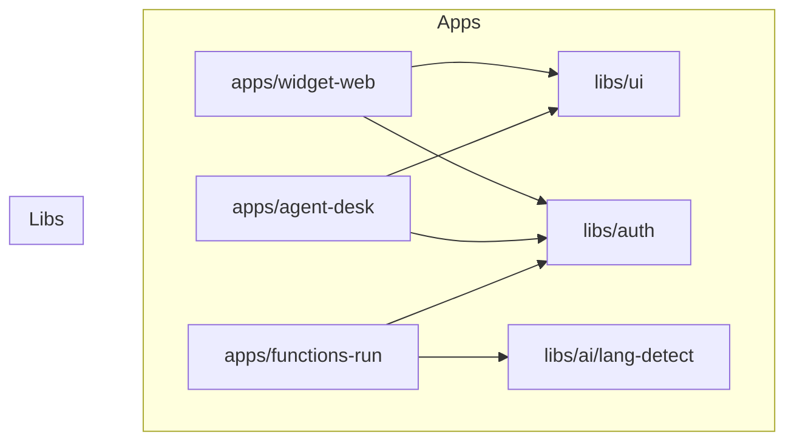

# Architecture du Monorepo SalamBot

Ce diagramme illustre la structure générale et les dépendances entre les différentes applications et librairies du monorepo SalamBot.

```mermaid
graph TD
    subgraph "Apps"
        A[apps/widget-web] --> D(libs/ui)
        A --> E(libs/auth)
        B[apps/agent-desk] --> D
        B --> E
        C[apps/functions-run] --> F(libs/ai/lang-detect)
        C --> E
    end
    subgraph "Libs"
        D[libs/ui]
        E[libs/auth]
        F[libs/ai/lang-detect]
    end
```

