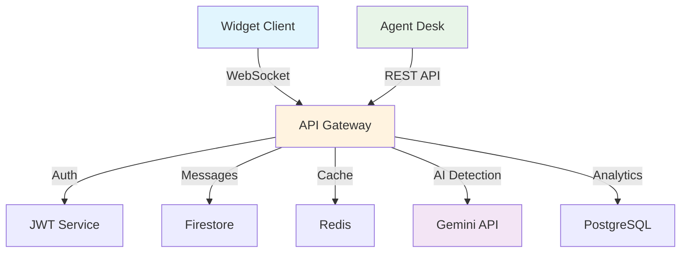

# 🤝 Guide de Contribution - SalamBot Suite v2.1

**📋 Document:** Guide de Contribution Développeur  
**🎯 Audience:** Développeurs, Contributeurs Open Source  
**📅 Dernière mise à jour:** 27 janvier 2025  
**🔄 Version:** 2.1.0

---

## 🎯 Bienvenue dans l'Écosystème SalamBot

Merci de votre intérêt pour **SalamBot Suite** ! Ce guide vous accompagne dans votre première contribution, de l'installation à la soumission de votre Pull Request.

### 🌟 Pourquoi Contribuer ?

- **🇲🇦 Impact Social** : Démocratiser l'IA conversationnelle en Darija
- **🚀 Innovation** : Travailler sur des technologies de pointe (Gemini, Cloud Run, Nx)
- **🌍 Communauté** : Rejoindre une communauté de développeurs passionnés
- **📈 Apprentissage** : Monter en compétences sur l'architecture cloud-native

---

## 🚀 Démarrage Rapide (15 minutes)

### ✅ Prérequis

**Obligatoires :**
```bash
# Vérifier les versions
node --version    # >= 18.17.0
pnpm --version    # >= 8.0.0
git --version     # >= 2.40.0
docker --version  # >= 24.0.0
```

**Recommandés :**
- **IDE** : VS Code avec extensions SalamBot
- **Terminal** : PowerShell 7+ ou Windows Terminal
- **Cloud** : Compte Google Cloud (pour les tests d'intégration)

### 🔧 Installation Express

```bash
# 1. Fork et clone
git clone https://github.com/VOTRE_USERNAME/salambot-suite.git
cd salambot-suite

# 2. Installation des dépendances
pnpm install

# 3. Configuration de l'environnement
cp .env.example .env.local
# Éditer .env.local avec vos clés API

# 4. Démarrage du mode développement
pnpm dev

# 5. Vérification
curl https://api.salambot.ma/v1/health -H "Authorization: Bearer YOUR_TOKEN"
# Réponse attendue: {"status":"ok","version":"2.1.0"}
```

### 🎯 Premier Test

```bash
# Lancer les tests unitaires
pnpm test

# Lancer un test spécifique
pnpm nx test ai-lang-detect

# Vérifier la qualité du code
pnpm lint
pnpm format
```

**✅ Si tout fonctionne, vous êtes prêt à contribuer !**

---

## 🏗️ Architecture pour Contributeurs

### 📁 Structure du Monorepo

```
salambot-suite/
├── apps/                    # Applications déployables
│   ├── widget-web/         # Widget client (React + Vite)
│   ├── agent-desk/         # Interface agent (Next.js)
│   └── functions-run/      # API Backend (simplifié via Kong)
├── libs/                    # Bibliothèques partagées
│   ├── ui/                 # Composants UI réutilisables
│   ├── auth/               # Authentification JWT
│   └── ai/                 # Intelligence Artificielle
│       └── lang-detect/    # Détection de langue Darija
├── infra/                   # Infrastructure as Code
│   ├── terraform/          # Configuration GCP
│   └── docker/             # Images Docker
├── docs/                    # Documentation
└── scripts/                 # Scripts d'automatisation
```

### 🔄 Flux de Données



### 🎯 Points d'Entrée par Domaine

| Domaine | Fichiers Clés | Technologies |
|---------|---------------|-------------|
| **Frontend** | `apps/widget-web/src/main.tsx`<br>`apps/agent-desk/pages/index.tsx` | React, Next.js, TailwindCSS |
| **Backend** | `apps/functions-run/src/main.ts`<br>`libs/auth/src/jwt.service.ts` | Kong Gateway, TypeScript, JWT |
| **IA** | `libs/ai/lang-detect/src/detector.ts`<br>`libs/ai/lang-detect/src/gemini.client.ts` | Gemini API, TensorFlow.js |
| **Infrastructure** | `infra/terraform/main.tf`<br>`infra/docker/Dockerfile.functions` | Terraform, Docker, GCP |

---

## 🎨 Types de Contributions

### 🐛 Correction de Bugs

**Processus :**
1. **Identifier** le bug dans [Issues](https://github.com/salambot/salambot-suite/issues)
2. **Reproduire** localement avec des tests
3. **Corriger** en suivant les patterns existants
4. **Tester** avec les cas de régression
5. **Documenter** la correction

**Template de commit :**
```
fix(scope): description courte du bug corrigé

- Reproduit le problème avec un test
- Corrigé la logique dans [fichier]
- Ajouté des tests de régression

Fixes #123
```

### ✨ Nouvelles Fonctionnalités

**Processus :**
1. **Proposer** via une [Discussion](https://github.com/salambot/salambot-suite/discussions)
2. **Concevoir** l'architecture avec l'équipe
3. **Implémenter** par petites itérations
4. **Tester** avec des cas d'usage réels
5. **Documenter** l'API et l'usage

**Template de commit :**
```
feat(scope): ajout de [fonctionnalité]

- Implémente [description détaillée]
- Ajoute les tests unitaires et d'intégration
- Met à jour la documentation API
- Compatible avec l'architecture existante

Closes #456
```

### 📚 Amélioration Documentation

**Processus :**
1. **Identifier** les lacunes documentaires
2. **Rédiger** en suivant le style existant
3. **Valider** avec des exemples pratiques
4. **Réviser** avec l'équipe

**Template de commit :**
```
docs(scope): amélioration de [section]

- Ajoute des exemples pratiques
- Clarifie les instructions d'installation
- Corrige les liens brisés
- Améliore la lisibilité
```

### 🚀 Optimisations Performance

**Processus :**
1. **Mesurer** les performances actuelles
2. **Identifier** les goulots d'étranglement
3. **Optimiser** avec des benchmarks
4. **Valider** l'amélioration

**Template de commit :**
```
perf(scope): optimisation de [composant]

- Réduit la latence de X ms à Y ms
- Améliore le throughput de Z%
- Optimise l'utilisation mémoire
- Maintient la compatibilité

Benchmarks inclus dans les tests
```

---

## 🛠️ Environnement de Développement

### 🔧 Configuration VS Code

**Extensions Recommandées :**
```json
{
  "recommendations": [
    "ms-vscode.vscode-typescript-next",
    "bradlc.vscode-tailwindcss",
    "esbenp.prettier-vscode",
    "ms-vscode.vscode-eslint",
    "nrwl.angular-console",
    "ms-vscode.vscode-json",
    "redhat.vscode-yaml",
    "ms-azuretools.vscode-docker"
  ]
}
```

**Configuration Workspace :**
```json
{
  "typescript.preferences.includePackageJsonAutoImports": "auto",
  "editor.formatOnSave": true,
  "editor.codeActionsOnSave": {
    "source.fixAll.eslint": true,
    "source.organizeImports": true
  },
  "tailwindCSS.experimental.classRegex": [
    ["cva\\(([^)]*)\\)", "[\"'`]([^\"'`]*).*?[\"'`]"],
    ["cx\\(([^)]*)\\)", "(?:'|\"|`)([^']*)(?:'|\"|`)"],
    ["cn\\(([^)]*)\\)", "(?:'|\"|`)([^']*)(?:'|\"|`)"]
  ]
}
```

### 🐳 Développement avec Docker

**Services Locaux :**
```yaml
# docker-compose.dev.yml
version: '3.8'
services:
  redis:
    image: redis:7-alpine
    ports:
      - "6379:6379"
    command: redis-server --appendonly yes
    
  postgres:
    image: postgres:15-alpine
    environment:
      POSTGRES_DB: salambot_dev
      POSTGRES_USER: dev
      POSTGRES_PASSWORD: dev123
    ports:
      - "5432:5432"
    volumes:
      - postgres_data:/var/lib/postgresql/data
      
  firestore-emulator:
    image: gcr.io/google.com/cloudsdktool/cloud-sdk:emulators
    command: gcloud emulators firestore start --host-port=0.0.0.0:8080
    ports:
      - "8080:8080"
      
volumes:
  postgres_data:
```

**Démarrage :**
```bash
# Démarrer les services
docker-compose -f docker-compose.dev.yml up -d

# Vérifier l'état
docker-compose -f docker-compose.dev.yml ps

# Logs en temps réel
docker-compose -f docker-compose.dev.yml logs -f
```

### 🧪 Tests et Qualité

**Commandes Essentielles :**
```bash
# Tests unitaires
pnpm test                    # Tous les tests
pnpm nx test widget-web      # Tests d'une app spécifique
pnpm nx test ai-lang-detect  # Tests d'une lib spécifique

# Tests d'intégration
pnpm test:integration

# Tests E2E
pnpm test:e2e

# Coverage
pnpm test:coverage

# Qualité du code
pnpm lint                    # ESLint
pnpm lint:fix               # Auto-correction
pnpm format                  # Prettier
pnpm type-check             # TypeScript

# Audit de sécurité
pnpm audit
pnpm audit:fix
```

**Configuration Jest :**
```typescript
// jest.config.ts
export default {
  preset: 'ts-jest',
  testEnvironment: 'node',
  roots: ['<rootDir>/src'],
  testMatch: ['**/__tests__/**/*.ts', '**/?(*.)+(spec|test).ts'],
  transform: {
    '^.+\.ts$': 'ts-jest',
  },
  collectCoverageFrom: [
    'src/**/*.ts',
    '!src/**/*.d.ts',
    '!src/**/*.spec.ts',
    '!src/**/*.test.ts',
  ],
  coverageThreshold: {
    global: {
      branches: 80,
      functions: 80,
      lines: 80,
      statements: 80,
    },
  },
  setupFilesAfterEnv: ['<rootDir>/src/test-setup.ts'],
};
```

---

## 🔄 Workflow de Contribution

### 🌿 Stratégie de Branches

```
main                 # Production stable
├── develop         # Intégration continue
├── feature/xxx     # Nouvelles fonctionnalités
├── fix/xxx         # Corrections de bugs
├── docs/xxx        # Améliorations documentation
└── perf/xxx        # Optimisations performance
```

**Conventions de Nommage :**
```bash
# Fonctionnalités
feature/darija-detection-improvement
feature/websocket-reconnection
feature/agent-desk-analytics

# Corrections
fix/redis-connection-timeout
fix/gemini-api-rate-limiting
fix/ui-responsive-mobile

# Documentation
docs/api-reference-update
docs/deployment-guide-gcp
docs/troubleshooting-redis

# Performance
perf/firestore-query-optimization
perf/websocket-memory-usage
perf/frontend-bundle-size
```

### 📝 Processus Pull Request

**1. Préparation :**
```bash
# Créer une branche
git checkout -b feature/ma-nouvelle-fonctionnalite

# Développer avec commits atomiques
git add .
git commit -m "feat(ai): améliore la détection Darija"

# Synchroniser avec develop
git fetch origin
git rebase origin/develop

# Pousser la branche
git push origin feature/ma-nouvelle-fonctionnalite
```

**2. Template Pull Request :**
```markdown
## 🎯 Description

### Problème Résolu
[Décrivez le problème ou la fonctionnalité]

### Solution Implémentée
[Décrivez votre approche]

### Impact
- [ ] Frontend (Widget/Agent Desk)
- [ ] Backend (API/Functions)
- [ ] IA (Détection Darija)
- [ ] Infrastructure (Terraform/Docker)
- [ ] Documentation

## 🧪 Tests

### Tests Ajoutés
- [ ] Tests unitaires
- [ ] Tests d'intégration
- [ ] Tests E2E
- [ ] Tests de performance

### Validation Manuelle
- [ ] Testé localement
- [ ] Testé sur l'environnement de staging
- [ ] Testé avec des données réelles

## 📊 Métriques

### Performance
- **Avant** : [métriques]
- **Après** : [métriques]
- **Amélioration** : [pourcentage]

### Coverage
- **Lignes** : XX%
- **Branches** : XX%
- **Fonctions** : XX%

## 🔗 Liens

- Fixes #[numéro]
- Related to #[numéro]
- Documentation: [lien]

## ✅ Checklist

- [ ] Code respecte les standards ESLint/Prettier
- [ ] Tests passent (unit + integration)
- [ ] Documentation mise à jour
- [ ] Pas de breaking changes
- [ ] Performance validée
- [ ] Sécurité vérifiée
```

**3. Review Process :**
- **Auto-checks** : CI/CD valide automatiquement
- **Code Review** : 2 approbations requises
- **QA Review** : Tests manuels si nécessaire
- **Merge** : Squash and merge vers develop

### 🚀 Déploiement

**Environnements :**
```
develop → staging → production
   ↓         ↓         ↓
 Auto     Manual    Manual
```

**Commandes de Déploiement :**
```bash
# Staging (automatique depuis develop)
git push origin develop

# Production (manuel depuis main)
git checkout main
git merge develop
git tag v2.1.1
git push origin main --tags

# Rollback si nécessaire
./scripts/rollback.sh production v2.1.0
```

---

## 📏 Standards de Qualité

### 🎨 Style de Code

**TypeScript/JavaScript :**
```typescript
// ✅ Bon
export interface DarijaDetectionResult {
  language: 'darija' | 'arabic' | 'french' | 'english';
  confidence: number;
  script: 'latin' | 'arabic';
  metadata?: {
    model: string;
    processingTime: number;
  };
}

export class DarijaDetector {
  private readonly geminiClient: GeminiClient;
  private readonly cache: RedisCache;

  constructor(
    geminiClient: GeminiClient,
    cache: RedisCache
  ) {
    this.geminiClient = geminiClient;
    this.cache = cache;
  }

  async detectLanguage(text: string): Promise<DarijaDetectionResult> {
    // Validation d'entrée
    if (!text?.trim()) {
      throw new ValidationError('Text cannot be empty');
    }

    // Cache lookup
    const cacheKey = `darija:${hashText(text)}`;
    const cached = await this.cache.get<DarijaDetectionResult>(cacheKey);
    if (cached) {
      return cached;
    }

    // Détection IA
    const result = await this.geminiClient.detectLanguage(text);
    
    // Cache storage
    await this.cache.set(cacheKey, result, { ttl: 3600 });
    
    return result;
  }
}

// ❌ Mauvais
function detect(txt) {
  if(!txt) return null;
  let res = ai.detect(txt);
  return res;
}
```

**React/JSX :**
```tsx
// ✅ Bon
interface ChatMessageProps {
  message: {
    id: string;
    content: string;
    sender: 'user' | 'agent' | 'bot';
    timestamp: Date;
    language?: 'darija' | 'arabic' | 'french';
  };
  onReply?: (messageId: string) => void;
  className?: string;
}

export const ChatMessage: React.FC<ChatMessageProps> = ({
  message,
  onReply,
  className
}) => {
  const { content, sender, timestamp, language } = message;
  
  const handleReplyClick = useCallback(() => {
    onReply?.(message.id);
  }, [message.id, onReply]);

  return (
    <div 
      className={cn(
        'flex gap-3 p-4 rounded-lg',
        sender === 'user' ? 'bg-blue-50 ml-8' : 'bg-gray-50 mr-8',
        className
      )}
    >
      <Avatar sender={sender} />
      
      <div className="flex-1 space-y-2">
        <div className="flex items-center gap-2">
          <span className="font-medium text-gray-900">
            {getSenderName(sender)}
          </span>
          <time className="text-xs text-gray-500">
            {formatTimestamp(timestamp)}
          </time>
          {language && (
            <LanguageBadge language={language} />
          )}
        </div>
        
        <p className="text-gray-800 whitespace-pre-wrap">
          {content}
        </p>
        
        {onReply && (
          <Button
            variant="ghost"
            size="sm"
            onClick={handleReplyClick}
            className="text-blue-600 hover:text-blue-800"
          >
            Répondre
          </Button>
        )}
      </div>
    </div>
  );
};

// ❌ Mauvais
function Message(props) {
  return (
    <div style={{padding: '10px'}}>
      <span>{props.sender}</span>
      <p>{props.content}</p>
      <button onClick={() => props.onReply(props.id)}>Reply</button>
    </div>
  );
}
```

### 🧪 Standards de Tests

**Tests Unitaires :**
```typescript
// ✅ Bon
describe('DarijaDetector', () => {
  let detector: DarijaDetector;
  let mockGeminiClient: jest.Mocked<GeminiClient>;
  let mockCache: jest.Mocked<RedisCache>;

  beforeEach(() => {
    mockGeminiClient = createMockGeminiClient();
    mockCache = createMockRedisCache();
    detector = new DarijaDetector(mockGeminiClient, mockCache);
  });

  describe('detectLanguage', () => {
    it('should detect Darija with high confidence', async () => {
      // Arrange
      const text = 'Salam, kifach ndir?';
      const expectedResult: DarijaDetectionResult = {
        language: 'darija',
        confidence: 0.95,
        script: 'latin',
        metadata: {
          model: 'gemini-pro',
          processingTime: 150
        }
      };
      
      mockCache.get.mockResolvedValue(null);
      mockGeminiClient.detectLanguage.mockResolvedValue(expectedResult);

      // Act
      const result = await detector.detectLanguage(text);

      // Assert
      expect(result).toEqual(expectedResult);
      expect(mockGeminiClient.detectLanguage).toHaveBeenCalledWith(text);
      expect(mockCache.set).toHaveBeenCalledWith(
        expect.stringContaining('darija:'),
        expectedResult,
        { ttl: 3600 }
      );
    });

    it('should return cached result when available', async () => {
      // Arrange
      const text = 'Salam';
      const cachedResult: DarijaDetectionResult = {
        language: 'darija',
        confidence: 0.90,
        script: 'latin'
      };
      
      mockCache.get.mockResolvedValue(cachedResult);

      // Act
      const result = await detector.detectLanguage(text);

      // Assert
      expect(result).toEqual(cachedResult);
      expect(mockGeminiClient.detectLanguage).not.toHaveBeenCalled();
    });

    it('should throw ValidationError for empty text', async () => {
      // Act & Assert
      await expect(detector.detectLanguage('')).rejects.toThrow(ValidationError);
      await expect(detector.detectLanguage('   ')).rejects.toThrow(ValidationError);
    });
  });
});
```

**Tests d'Intégration :**
```typescript
// ✅ Bon
describe('Chat API Integration', () => {
  let app: Express;
  let testDb: TestDatabase;
  let testRedis: TestRedis;

  beforeAll(async () => {
    testDb = await createTestDatabase();
    testRedis = await createTestRedis();
    app = createTestApp({ db: testDb, redis: testRedis });
  });

  afterAll(async () => {
    await testDb.cleanup();
    await testRedis.cleanup();
  });

  describe('POST /api/v1/chat/send', () => {
    it('should process Darija message and return bot response', async () => {
      // Arrange
      const authToken = await createTestUser();
      const message = {
        content: 'Salam, kifach ndir?',
        conversationId: 'test-conv-123'
      };

      // Act
      const response = await request(app)
        .post('/api/v1/chat/send')
        .set('Authorization', `Bearer ${authToken}`)
        .send(message)
        .expect(200);

      // Assert
      expect(response.body).toMatchObject({
        success: true,
        data: {
          messageId: expect.any(String),
          botResponse: {
            content: expect.any(String),
            language: 'darija',
            confidence: expect.any(Number)
          },
          detectedLanguage: {
            language: 'darija',
            confidence: expect.numberMatching(n => n > 0.8)
          }
        }
      });

      // Vérifier la persistance
      const savedMessage = await testDb.findMessage(response.body.data.messageId);
      expect(savedMessage).toBeDefined();
      expect(savedMessage.content).toBe(message.content);
    });
  });
});
```

### 📚 Standards Documentation

**JSDoc :**
```typescript
/**
 * Détecte la langue d'un texte avec un focus sur le Darija marocain.
 * 
 * Cette classe utilise l'API Gemini pour la détection de langue et implémente
 * un système de cache Redis pour optimiser les performances.
 * 
 * @example
 * ```typescript
 * const detector = new DarijaDetector(geminiClient, redisCache);
 * const result = await detector.detectLanguage('Salam, kifach ndir?');
 * console.log(result.language); // 'darija'
 * console.log(result.confidence); // 0.95
 * ```
 * 
 * @see {@link https://docs.salambot.ma/ai/language-detection} Documentation complète
 * @since 2.1.0
 */
export class DarijaDetector {
  /**
   * Détecte la langue d'un texte donné.
   * 
   * @param text - Le texte à analyser (ne peut pas être vide)
   * @returns Une promesse qui résout vers le résultat de détection
   * 
   * @throws {ValidationError} Si le texte est vide ou invalide
   * @throws {GeminiAPIError} Si l'API Gemini retourne une erreur
   * @throws {CacheError} Si le cache Redis est inaccessible
   * 
   * @example
   * ```typescript
   * // Détection de Darija en script latin
   * const result1 = await detector.detectLanguage('Salam, kifach ndir?');
   * // { language: 'darija', confidence: 0.95, script: 'latin' }
   * 
   * // Détection de Darija en script arabe
   * const result2 = await detector.detectLanguage('السلام، كيفاش نديرو؟');
   * // { language: 'darija', confidence: 0.92, script: 'arabic' }
   * ```
   */
  async detectLanguage(text: string): Promise<DarijaDetectionResult> {
    // Implementation...
  }
}
```

---

## 🎯 Domaines de Contribution Prioritaires

### 🔥 P0 - Critique (Besoin Urgent)

1. **🧠 Amélioration Détection Darija**
   - **Objectif** : Passer de 75% à 90% de précision
   - **Fichiers** : `libs/ai/lang-detect/src/`
   - **Technologies** : Gemini API, TensorFlow.js
   - **Difficulté** : ⭐⭐⭐⭐

2. **🚪 Migration Kong Gateway**
   - **Objectif** : Remplacer API Gateway custom par Kong
   - **Fichiers** : Configuration déclarative Kong
   - **Technologies** : Kong Enterprise, Plugins
   - **Difficulté** : ⭐⭐⭐

3. **🧪 Augmentation Coverage Tests**
   - **Objectif** : Passer de 60% à 85% de couverture
   - **Fichiers** : `**/*.spec.ts`, `**/*.test.ts`
   - **Technologies** : Jest, Testing Library
   - **Difficulté** : ⭐⭐

### 🟠 P1 - Important (Prochaines Semaines)

4. **📱 Optimisation Mobile Widget**
   - **Objectif** : Interface responsive parfaite
   - **Fichiers** : `apps/widget-web/src/components/`
   - **Technologies** : React, TailwindCSS
   - **Difficulté** : ⭐⭐

5. **📊 Dashboard Analytics Agent**
   - **Objectif** : Métriques temps réel pour agents
   - **Fichiers** : `apps/agent-desk/pages/analytics/`
   - **Technologies** : Next.js, Chart.js
   - **Difficulté** : ⭐⭐⭐

6. **🔒 Renforcement Sécurité**
   - **Objectif** : Audit sécurité complet
   - **Fichiers** : `libs/auth/`, `infra/terraform/`
   - **Technologies** : JWT, Cloud IAM
   - **Difficulté** : ⭐⭐⭐⭐

### 🟡 P2 - Amélioration (Moyen Terme)

7. **⚡ Optimisation Performance**
   - **Objectif** : Réduire latence API < 200ms
   - **Fichiers** : `apps/functions-run/src/`
   - **Technologies** : Node.js, Redis
   - **Difficulté** : ⭐⭐⭐

8. **🌐 Internationalisation**
   - **Objectif** : Support multi-langues complet
   - **Fichiers** : `libs/ui/src/i18n/`
   - **Technologies** : i18next, React
   - **Difficulté** : ⭐⭐

9. **📖 Documentation Interactive**
   - **Objectif** : Guides interactifs et tutoriels
   - **Fichiers** : `docs/`, `apps/docs/`
   - **Technologies** : Docusaurus, MDX
   - **Difficulté** : ⭐⭐

---

## 🏆 Programme de Reconnaissance

### 🎖️ Niveaux de Contributeurs

**🌱 Contributeur Débutant**
- 1-3 PRs mergées
- Focus : Documentation, tests, petits bugs
- **Récompenses** : Badge GitHub, mention newsletter

**🚀 Contributeur Actif**
- 4-10 PRs mergées
- Focus : Fonctionnalités, optimisations
- **Récompenses** : Accès early access, swag SalamBot

**⭐ Contributeur Expert**
- 10+ PRs mergées
- Focus : Architecture, mentoring
- **Récompenses** : Invitation événements, consultation payée

**👑 Core Maintainer**
- Contributeur régulier depuis 6+ mois
- Responsabilité : Review, roadmap
- **Récompenses** : Equity, conférences, formation

### 🎁 Récompenses Spéciales

**🏅 Contribution du Mois**
- PR la plus impactante du mois
- **Récompense** : 500€ + feature dans la newsletter

**🌟 Innovation Award**
- Contribution technique exceptionnelle
- **Récompense** : 1000€ + présentation à la conférence

**🤝 Community Champion**
- Aide exceptionnelle à la communauté
- **Récompense** : Voyage + conférence tech au choix

---

## 📞 Support et Communauté

### 💬 Canaux de Communication

**Discord SalamBot** : [discord.gg/salambot](https://discord.gg/salambot)
- `#general` : Discussions générales
- `#dev-help` : Aide technique
- `#contributions` : Coordination des contributions
- `#showcase` : Partage de réalisations

**GitHub Discussions** : [github.com/salambot/salambot-suite/discussions](https://github.com/salambot/salambot-suite/discussions)
- Propositions de fonctionnalités
- Questions architecture
- Retours d'expérience

**Email** : [contributors@salambot.ma](mailto:contributors@salambot.ma)
- Questions privées
- Propositions de partenariat
- Signalement de problèmes sensibles

### 🎓 Ressources d'Apprentissage

**Tutoriels Vidéo** :
- [🎥 Setup Environnement Dev](https://youtube.com/salambot-dev-setup)
- [🎥 Première Contribution](https://youtube.com/salambot-first-contribution)
- [🎥 Architecture Deep Dive](https://youtube.com/salambot-architecture)

**Documentation Technique** :
- [📖 Guide Architecture](archi.md)
- [📖 API Reference](api-reference.md)
- [📖 Deployment Guide](deployment-guide.md)

**Formations** :
- **Webinar Mensuel** : "Contribuer à SalamBot" (1er mardi du mois)
- **Workshop Trimestriel** : "Architecture Cloud-Native" (Casablanca/Rabat)
- **Hackathon Annuel** : "SalamBot Innovation Challenge"

### 👥 Mentoring

**Programme Buddy** :
- Chaque nouveau contributeur est assigné à un mentor
- Sessions 1-on-1 hebdomadaires pendant 1 mois
- Suivi personnalisé de la progression

**Office Hours** :
- **Mardi 14h-16h** : Questions techniques (Discord)
- **Jeudi 10h-12h** : Review de code (Discord)
- **Samedi 9h-11h** : Contribution planning (Discord)

---

## 📋 Checklist du Contributeur

### ✅ Avant de Commencer

- [ ] **Fork** du repository
- [ ] **Clone** en local
- [ ] **Installation** des dépendances (`pnpm install`)
- [ ] **Configuration** de l'environnement (`.env.local`)
- [ ] **Test** de l'installation (`pnpm dev`)
- [ ] **Lecture** de la documentation
- [ ] **Rejoindre** Discord SalamBot

### ✅ Pendant le Développement

- [ ] **Branche** créée depuis `develop`
- [ ] **Commits** atomiques et descriptifs
- [ ] **Tests** ajoutés/mis à jour
- [ ] **Linting** passé (`pnpm lint`)
- [ ] **Formatting** appliqué (`pnpm format`)
- [ ] **Type checking** validé (`pnpm type-check`)
- [ ] **Documentation** mise à jour si nécessaire

### ✅ Avant la Pull Request

- [ ] **Rebase** sur `develop` récent
- [ ] **Tests** passent (`pnpm test`)
- [ ] **Build** réussit (`pnpm build`)
- [ ] **Coverage** maintenue/améliorée
- [ ] **Performance** validée
- [ ] **Sécurité** vérifiée
- [ ] **Breaking changes** documentés

### ✅ Pull Request

- [ ] **Titre** descriptif
- [ ] **Description** complète avec template
- [ ] **Labels** appropriés
- [ ] **Reviewers** assignés
- [ ] **Tests** manuels documentés
- [ ] **Screenshots** si changements UI
- [ ] **Liens** vers issues/discussions

---

**🚀 Prêt à contribuer ? Commencez par [créer votre première issue](https://github.com/salambot/salambot-suite/issues/new/choose) !**

**📞 Besoin d'aide ? Rejoignez notre [Discord](https://discord.gg/salambot) ou contactez [contributors@salambot.ma](mailto:contributors@salambot.ma)**

---

**📝 Maintenu par l'équipe Core SalamBot**  
**🔄 Prochaine révision : Février 2025**  
**💬 Feedback : [GitHub Discussions](https://github.com/salambot/salambot-suite/discussions)**