# 🚀 Guide de Déploiement - SalamBot Suite v2.1

**📋 Document:** Guide de Déploiement Complet  
**🎯 Audience:** DevOps, SRE, Administrateurs Système  
**📅 Dernière mise à jour:** 27 janvier 2025  
**🔄 Version:** 2.1.0

---

## 🎯 Vue d'Ensemble

Ce guide détaille le **déploiement complet** de SalamBot Suite sur **Google Cloud Platform** avec une approche **Infrastructure as Code** et **CI/CD automatisé**.

### 🏆 Objectifs de Déploiement

- **🔄 Zero-Downtime** : Déploiements sans interruption
- **📈 Auto-Scaling** : Adaptation automatique à la charge
- **🛡️ Sécurité** : Zero-Trust et chiffrement end-to-end
- **📊 Observabilité** : Monitoring et alertes complètes
- **🌍 Multi-Region** : Haute disponibilité géographique

---

## 🏗️ Architecture de Déploiement

```mermaid
graph TB
    subgraph "🌐 Internet"
        CF[CloudFlare CDN]
        DNS[DNS Management]
    end

    subgraph "🇪🇺 GCP Europe-West1 (Primary)"
        subgraph "🚪 Edge Layer"
            LB[Cloud Load Balancer]
            CDN[Cloud CDN]
            WAF[Cloud Armor WAF]
        end

        subgraph "🔐 Security Layer"
            IAP[Identity-Aware Proxy]
            SM[Secret Manager]
            KMS[Cloud KMS]
        end

        subgraph "🤖 Compute Layer"
            CR[Cloud Run Services]
            CF_FUNC[Cloud Functions]
            GKE[GKE Autopilot]
        end

        subgraph "💾 Data Layer"
            FS[Firestore]
            REDIS[Memorystore Redis]
            PG[Cloud SQL PostgreSQL]
            BQ[BigQuery]
        end

        subgraph "🔍 Observability"
            MON[Cloud Monitoring]
            LOG[Cloud Logging]
            TRACE[Cloud Trace]
            ERR[Error Reporting]
        end
    end

    subgraph "🌍 GCP MENA (Secondary)"
        LB_MENA[Load Balancer]
        CR_MENA[Cloud Run Replicas]
        FS_MENA[Firestore Replicas]
    end

    CF --> LB
    DNS --> CF
    LB --> WAF
    WAF --> CDN
    CDN --> IAP
    IAP --> CR
    IAP --> CF_FUNC
    CR --> FS
    CR --> REDIS
    CF_FUNC --> SM
    
    %% Cross-region replication
    FS -.->|Replication| FS_MENA
    CR -.->|Failover| CR_MENA

    classDef primary fill:#e8f5e8,stroke:#1b5e20,stroke-width:2px
    classDef secondary fill:#fff3e0,stroke:#e65100,stroke-width:2px
    classDef security fill:#f1f8e9,stroke:#33691e,stroke-width:2px
    classDef data fill:#fce4ec,stroke:#880e4f,stroke-width:2px
```



---

## 🛠️ Prérequis

### 🔧 Outils Requis

```bash
# Installation des outils essentiels

# Google Cloud SDK
curl https://sdk.cloud.google.com | bash
exec -l $SHELL
gcloud init

# Terraform
wget https://releases.hashicorp.com/terraform/1.6.6/terraform_1.6.6_linux_amd64.zip
unzip terraform_1.6.6_linux_amd64.zip
sudo mv terraform /usr/local/bin/

# Docker
curl -fsSL https://get.docker.com -o get-docker.sh
sh get-docker.sh

# Node.js et pnpm
curl -fsSL https://fnm.vercel.app/install | bash
fnm install 22
npm install -g pnpm@latest

# Kubernetes CLI
curl -LO "https://dl.k8s.io/release/$(curl -L -s https://dl.k8s.io/release/stable.txt)/bin/linux/amd64/kubectl"
sudo install -o root -g root -m 0755 kubectl /usr/local/bin/kubectl
```

### 🔑 Permissions GCP

```bash
# Rôles IAM requis pour le déploiement
gcloud projects add-iam-policy-binding $PROJECT_ID \
  --member="user:deployer@salambot.ma" \
  --role="roles/owner"

# Ou permissions granulaires
ROLES=(
  "roles/run.admin"
  "roles/cloudsql.admin"
  "roles/redis.admin"
  "roles/secretmanager.admin"
  "roles/storage.admin"
  "roles/cloudbuild.builds.editor"
  "roles/container.admin"
  "roles/iam.serviceAccountAdmin"
)

for role in "${ROLES[@]}"; do
  gcloud projects add-iam-policy-binding $PROJECT_ID \
    --member="user:deployer@salambot.ma" \
    --role="$role"
done
```

### 🌍 Variables d'Environnement

```bash
# Configuration de base
export PROJECT_ID="salambot-suite-prod"
export REGION="europe-west1"
export ZONE="europe-west1-b"
export ENVIRONMENT="production"
export DOMAIN="salambot.ma"

# Authentification
export GOOGLE_APPLICATION_CREDENTIALS="/path/to/service-account.json"
export GITHUB_TOKEN="ghp_xxxxxxxxxxxx"

# Secrets
export REDIS_PASSWORD=$(openssl rand -base64 32)
export JWT_SECRET=$(openssl rand -base64 64)
export GEMINI_API_KEY="your-gemini-api-key"
```

---

## 🏗️ Infrastructure as Code

### 📁 Structure Terraform

```
infra/
├── environments/
│   ├── production/
│   │   ├── main.tf
│   │   ├── variables.tf
│   │   └── terraform.tfvars
│   ├── staging/
│   └── development/
├── modules/
│   ├── networking/
│   ├── compute/
│   ├── database/
│   ├── security/
│   └── monitoring/
└── shared/
    ├── backend.tf
    └── providers.tf
```

### 🔧 Configuration Terraform Principal

```hcl
# infra/environments/production/main.tf
terraform {
  required_version = ">= 1.6"
  
  backend "gcs" {
    bucket = "salambot-terraform-state"
    prefix = "production"
  }
  
  required_providers {
    google = {
      source  = "hashicorp/google"
      version = "~> 5.0"
    }
    google-beta = {
      source  = "hashicorp/google-beta"
      version = "~> 5.0"
    }
  }
}

provider "google" {
  project = var.project_id
  region  = var.region
}

provider "google-beta" {
  project = var.project_id
  region  = var.region
}

# Networking
module "networking" {
  source = "../../modules/networking"
  
  project_id   = var.project_id
  region       = var.region
  environment  = var.environment
}

# Security
module "security" {
  source = "../../modules/security"
  
  project_id = var.project_id
  secrets = {
    redis_password    = var.redis_password
    jwt_secret       = var.jwt_secret
    gemini_api_key   = var.gemini_api_key
  }
}

# Database
module "database" {
  source = "../../modules/database"
  
  project_id     = var.project_id
  region         = var.region
  environment    = var.environment
  network_id     = module.networking.network_id
  redis_password = module.security.redis_password
}

# Compute
module "compute" {
  source = "../../modules/compute"
  
  project_id    = var.project_id
  region        = var.region
  environment   = var.environment
  network_id    = module.networking.network_id
  database_urls = module.database.connection_urls
}

# Monitoring
module "monitoring" {
  source = "../../modules/monitoring"
  
  project_id  = var.project_id
  environment = var.environment
  services    = module.compute.service_urls
}
```

### 🗄️ Module Base de Données

```hcl
# infra/modules/database/main.tf

# Firestore
resource "google_firestore_database" "main" {
  project     = var.project_id
  name        = "salambot-${var.environment}"
  location_id = var.region
  type        = "FIRESTORE_NATIVE"
  
  concurrency_mode = "OPTIMISTIC"
  app_engine_integration_mode = "DISABLED"
}

# Redis Cluster
resource "google_redis_instance" "main" {
  name           = "salambot-redis-${var.environment}"
  memory_size_gb = var.redis_memory_size
  region         = var.region
  
  tier                    = "STANDARD_HA"
  replica_count          = 2
  read_replicas_mode     = "READ_REPLICAS_ENABLED"
  
  auth_enabled           = true
  transit_encryption_mode = "SERVER_AUTHENTICATION"
  
  authorized_network = var.network_id
  
  redis_configs = {
    maxmemory-policy = "allkeys-lru"
    notify-keyspace-events = "Ex"
  }
  
  maintenance_policy {
    weekly_maintenance_window {
      day = "SUNDAY"
      start_time {
        hours   = 2
        minutes = 0
      }
    }
  }
  
  labels = {
    environment = var.environment
    service     = "salambot"
  }
}

# PostgreSQL pour Analytics
resource "google_sql_database_instance" "analytics" {
  name             = "salambot-analytics-${var.environment}"
  database_version = "POSTGRES_15"
  region           = var.region
  
  settings {
    tier              = "db-custom-2-8192"
    availability_type = "REGIONAL"
    disk_type         = "PD_SSD"
    disk_size         = 100
    disk_autoresize   = true
    
    backup_configuration {
      enabled                        = true
      start_time                     = "03:00"
      point_in_time_recovery_enabled = true
      backup_retention_settings {
        retained_backups = 30
      }
    }
    
    ip_configuration {
      ipv4_enabled    = false
      private_network = var.network_id
      require_ssl     = true
    }
    
    database_flags {
      name  = "log_statement"
      value = "all"
    }
    
    insights_config {
      query_insights_enabled  = true
      record_application_tags = true
      record_client_address   = true
    }
  }
  
  deletion_protection = true
}

resource "google_sql_database" "analytics_db" {
  name     = "analytics"
  instance = google_sql_database_instance.analytics.name
}

resource "google_sql_user" "analytics_user" {
  name     = "salambot"
  instance = google_sql_database_instance.analytics.name
  password = var.postgres_password
}
```

### ⚡ Module Compute

```hcl
# infra/modules/compute/main.tf

# Service Account pour les applications
resource "google_service_account" "app_service_account" {
  account_id   = "salambot-app-${var.environment}"
  display_name = "SalamBot Application Service Account"
  description  = "Service account for SalamBot applications"
}

resource "google_project_iam_member" "app_permissions" {
  for_each = toset([
    "roles/secretmanager.secretAccessor",
    "roles/datastore.user",
    "roles/redis.editor",
    "roles/cloudsql.client",
    "roles/bigquery.dataEditor",
    "roles/monitoring.metricWriter",
    "roles/logging.logWriter",
    "roles/cloudtrace.agent"
  ])
  
  project = var.project_id
  role    = each.value
  member  = "serviceAccount:${google_service_account.app_service_account.email}"
}

# Cloud Run - Functions Run API
resource "google_cloud_run_v2_service" "functions_run" {
  name     = "salambot-functions-run-${var.environment}"
  location = var.region
  
  template {
    service_account = google_service_account.app_service_account.email
    
    scaling {
      min_instance_count = var.environment == "production" ? 2 : 0
      max_instance_count = 100
    }
    
    containers {
      image = "gcr.io/${var.project_id}/salambot-functions-run:latest"
      
      ports {
        container_port = 8080
      }
      
      resources {
        limits = {
          cpu    = "2"
          memory = "4Gi"
        }
        cpu_idle = true
      }
      
      env {
        name  = "NODE_ENV"
        value = var.environment
      }
      
      env {
        name = "REDIS_URL"
        value_source {
          secret_key_ref {
            secret  = "redis-connection-url"
            version = "latest"
          }
        }
      }
      
      env {
        name = "GEMINI_API_KEY"
        value_source {
          secret_key_ref {
            secret  = "gemini-api-key"
            version = "latest"
          }
        }
      }
      
      startup_probe {
        http_get {
          path = "/health"
          port = 8080
        }
        initial_delay_seconds = 10
        timeout_seconds       = 5
        period_seconds        = 10
        failure_threshold     = 3
      }
      
      liveness_probe {
        http_get {
          path = "/health"
          port = 8080
        }
        initial_delay_seconds = 30
        timeout_seconds       = 5
        period_seconds        = 30
        failure_threshold     = 3
      }
    }
  }
  
  traffic {
    percent = 100
    type    = "TRAFFIC_TARGET_ALLOCATION_TYPE_LATEST"
  }
}

# Cloud Run - Widget Web
resource "google_cloud_run_v2_service" "widget_web" {
  name     = "salambot-widget-web-${var.environment}"
  location = var.region
  
  template {
    service_account = google_service_account.app_service_account.email
    
    scaling {
      min_instance_count = var.environment == "production" ? 1 : 0
      max_instance_count = 50
    }
    
    containers {
      image = "gcr.io/${var.project_id}/salambot-widget-web:latest"
      
      ports {
        container_port = 3000
      }
      
      resources {
        limits = {
          cpu    = "1"
          memory = "2Gi"
        }
      }
      
      env {
        name  = "NEXT_PUBLIC_API_URL"
        value = google_cloud_run_v2_service.functions_run.uri
      }
    }
  }
}

# Cloud Run - Agent Desk
resource "google_cloud_run_v2_service" "agent_desk" {
  name     = "salambot-agent-desk-${var.environment}"
  location = var.region
  
  template {
    service_account = google_service_account.app_service_account.email
    
    scaling {
      min_instance_count = var.environment == "production" ? 1 : 0
      max_instance_count = 10
    }
    
    containers {
      image = "gcr.io/${var.project_id}/salambot-agent-desk:latest"
      
      ports {
        container_port = 3000
      }
      
      resources {
        limits = {
          cpu    = "1"
          memory = "2Gi"
        }
      }
    }
  }
}

# IAM pour accès public
resource "google_cloud_run_service_iam_member" "public_access" {
  for_each = {
    functions_run = google_cloud_run_v2_service.functions_run.name
    widget_web    = google_cloud_run_v2_service.widget_web.name
    agent_desk    = google_cloud_run_v2_service.agent_desk.name
  }
  
  location = var.region
  service  = each.value
  role     = "roles/run.invoker"
  member   = "allUsers"
}
```

---

## 🔄 CI/CD Pipeline

### 🚀 GitHub Actions Workflow

```yaml
# .github/workflows/deploy-production.yml
name: 🚀 Deploy to Production

on:
  push:
    branches: [main]
  workflow_dispatch:
    inputs:
      force_deploy:
        description: 'Force deployment even if tests fail'
        required: false
        default: false
        type: boolean

env:
  PROJECT_ID: salambot-suite-prod
  REGION: europe-west1
  REGISTRY: gcr.io

jobs:
  # Tests et Qualité
  quality-checks:
    name: 🧪 Quality Checks
    runs-on: ubuntu-latest
    outputs:
      should_deploy: ${{ steps.check.outputs.should_deploy }}
    
    steps:
      - name: 📥 Checkout
        uses: actions/checkout@v4
        with:
          fetch-depth: 0
      
      - name: 📦 Setup Node.js
        uses: actions/setup-node@v4
        with:
          node-version: '22'
          cache: 'pnpm'
      
      - name: 📥 Install dependencies
        run: pnpm install --frozen-lockfile
      
      - name: 🔍 Lint
        run: pnpm nx run-many --target=lint --all
      
      - name: 🧪 Unit Tests
        run: pnpm nx run-many --target=test --all --coverage
      
      - name: 🔒 Security Audit
        run: |
          pnpm audit --audit-level moderate
          pnpm nx run-many --target=security-scan --all
      
      - name: 📊 Upload Coverage
        uses: codecov/codecov-action@v3
        with:
          token: ${{ secrets.CODECOV_TOKEN }}
      
      - name: ✅ Check Deployment Conditions
        id: check
        run: |
          if [[ "${{ github.event.inputs.force_deploy }}" == "true" ]]; then
            echo "should_deploy=true" >> $GITHUB_OUTPUT
          elif [[ $(pnpm nx run-many --target=test --all --passWithNoTests | grep -c "FAIL") -eq 0 ]]; then
            echo "should_deploy=true" >> $GITHUB_OUTPUT
          else
            echo "should_deploy=false" >> $GITHUB_OUTPUT
          fi

  # Build et Push Images
  build-images:
    name: 🏗️ Build Images
    runs-on: ubuntu-latest
    needs: quality-checks
    if: needs.quality-checks.outputs.should_deploy == 'true'
    
    strategy:
      matrix:
        app: [functions-run, widget-web, agent-desk]
    
    steps:
      - name: 📥 Checkout
        uses: actions/checkout@v4
      
      - name: 🔐 Auth to GCP
        uses: google-github-actions/auth@v2
        with:
          credentials_json: ${{ secrets.GCP_SA_KEY }}
      
      - name: 🐳 Setup Docker Buildx
        uses: docker/setup-buildx-action@v3
      
      - name: 🔐 Configure Docker for GCR
        run: gcloud auth configure-docker
      
      - name: 🏗️ Build and Push
        uses: docker/build-push-action@v5
        with:
          context: .
          file: apps/${{ matrix.app }}/Dockerfile
          push: true
          tags: |
            ${{ env.REGISTRY }}/${{ env.PROJECT_ID }}/salambot-${{ matrix.app }}:latest
            ${{ env.REGISTRY }}/${{ env.PROJECT_ID }}/salambot-${{ matrix.app }}:${{ github.sha }}
          cache-from: type=gha
          cache-to: type=gha,mode=max
          build-args: |
            NODE_ENV=production
            BUILD_DATE=$(date -u +'%Y-%m-%dT%H:%M:%SZ')
            VCS_REF=${{ github.sha }}

  # Déploiement Infrastructure
  deploy-infrastructure:
    name: 🏗️ Deploy Infrastructure
    runs-on: ubuntu-latest
    needs: [quality-checks, build-images]
    if: needs.quality-checks.outputs.should_deploy == 'true'
    
    steps:
      - name: 📥 Checkout
        uses: actions/checkout@v4
      
      - name: 🔐 Auth to GCP
        uses: google-github-actions/auth@v2
        with:
          credentials_json: ${{ secrets.GCP_SA_KEY }}
      
      - name: 🏗️ Setup Terraform
        uses: hashicorp/setup-terraform@v3
        with:
          terraform_version: 1.6.6
      
      - name: 🔧 Terraform Init
        working-directory: infra/environments/production
        run: terraform init
      
      - name: 📋 Terraform Plan
        working-directory: infra/environments/production
        run: |
          terraform plan \
            -var="project_id=${{ env.PROJECT_ID }}" \
            -var="region=${{ env.REGION }}" \
            -var="environment=production" \
            -var="image_tag=${{ github.sha }}" \
            -out=tfplan
      
      - name: 🚀 Terraform Apply
        working-directory: infra/environments/production
        run: terraform apply -auto-approve tfplan

  # Tests E2E Post-Déploiement
  e2e-tests:
    name: 🧪 E2E Tests
    runs-on: ubuntu-latest
    needs: deploy-infrastructure
    
    steps:
      - name: 📥 Checkout
        uses: actions/checkout@v4
      
      - name: 📦 Setup Node.js
        uses: actions/setup-node@v4
        with:
          node-version: '22'
          cache: 'pnpm'
      
      - name: 📥 Install dependencies
        run: pnpm install --frozen-lockfile
      
      - name: 🧪 Run E2E Tests
        run: |
          export API_BASE_URL="https://api.salambot.app"
          pnpm nx run functions-run:test:e2e
        env:
          E2E_API_KEY: ${{ secrets.E2E_API_KEY }}
      
      - name: 📊 Upload E2E Results
        uses: actions/upload-artifact@v4
        if: always()
        with:
          name: e2e-results
          path: |
            apps/functions-run/test-results/
            apps/functions-run/playwright-report/

  # Notification et Rollback
  notify-deployment:
    name: 📢 Notify Deployment
    runs-on: ubuntu-latest
    needs: [deploy-infrastructure, e2e-tests]
    if: always()
    
    steps:
      - name: 📢 Slack Notification - Success
        if: needs.e2e-tests.result == 'success'
        uses: 8398a7/action-slack@v3
        with:
          status: success
          text: |
            🚀 **Déploiement Production Réussi**
            
            **Commit:** `${{ github.sha }}`
            **Auteur:** ${{ github.actor }}
            **Durée:** ${{ job.duration }}
            
            **Services déployés:**
            • Functions Run API
            • Widget Web
            • Agent Desk
            
            **Tests E2E:** ✅ Passés
        env:
          SLACK_WEBHOOK_URL: ${{ secrets.SLACK_WEBHOOK_URL }}
      
      - name: 🚨 Slack Notification - Failure
        if: needs.e2e-tests.result == 'failure'
        uses: 8398a7/action-slack@v3
        with:
          status: failure
          text: |
            🚨 **Échec Déploiement Production**
            
            **Commit:** `${{ github.sha }}`
            **Auteur:** ${{ github.actor }}
            **Erreur:** Tests E2E échoués
            
            **Action requise:** Vérification manuelle nécessaire
        env:
          SLACK_WEBHOOK_URL: ${{ secrets.SLACK_WEBHOOK_URL }}
      
      - name: 🔄 Auto Rollback
        if: needs.e2e-tests.result == 'failure'
        run: |
          echo "🔄 Déclenchement du rollback automatique..."
          # Logique de rollback à implémenter
```

---

## 🐳 Configuration Docker

### 📦 Dockerfile Functions Run

```dockerfile
# apps/functions-run/Dockerfile
FROM node:22-alpine AS base

# Métadonnées
LABEL maintainer="SalamBot Team <dev@salambot.ma>"
LABEL version="2.1.0"
LABEL description="SalamBot Functions Run API"

# Arguments de build
ARG NODE_ENV=production
ARG BUILD_DATE
ARG VCS_REF

# Variables d'environnement
ENV NODE_ENV=$NODE_ENV
ENV PNPM_HOME="/pnpm"
ENV PATH="$PNPM_HOME:$PATH"
ENV PORT=8080

# Installation pnpm
RUN corepack enable

# Étape de dépendances
FROM base AS deps
WORKDIR /app

# Copie des fichiers de dépendances
COPY package.json pnpm-lock.yaml pnpm-workspace.yaml ./
COPY apps/functions-run/package.json ./apps/functions-run/
COPY libs/*/package.json ./libs/*/

# Installation des dépendances
RUN --mount=type=cache,id=pnpm,target=/pnpm/store \
    pnpm install --frozen-lockfile --prod

# Étape de build
FROM base AS builder
WORKDIR /app

# Copie des sources
COPY . .
COPY --from=deps /app/node_modules ./node_modules

# Build de l'application
RUN pnpm nx build functions-run --prod

# Étape de production
FROM base AS runner
WORKDIR /app

# Création utilisateur non-root
RUN addgroup --system --gid 1001 nodejs
RUN adduser --system --uid 1001 salambot

# Copie des fichiers de production
COPY --from=builder --chown=salambot:nodejs /app/dist/apps/functions-run ./
COPY --from=deps --chown=salambot:nodejs /app/node_modules ./node_modules

# Configuration sécurité
USER salambot
EXPOSE 8080

# Health check
HEALTHCHECK --interval=30s --timeout=3s --start-period=5s --retries=3 \
    CMD node healthcheck.js

# Commande de démarrage
CMD ["node", "main.js"]
```

### 🌐 Dockerfile Widget Web

```dockerfile
# apps/widget-web/Dockerfile
FROM node:22-alpine AS base

# Installation pnpm
RUN corepack enable

# Étape de dépendances
FROM base AS deps
WORKDIR /app

COPY package.json pnpm-lock.yaml pnpm-workspace.yaml ./
COPY apps/widget-web/package.json ./apps/widget-web/
COPY libs/*/package.json ./libs/*/

RUN --mount=type=cache,id=pnpm,target=/pnpm/store \
    pnpm install --frozen-lockfile

# Étape de build
FROM base AS builder
WORKDIR /app

COPY . .
COPY --from=deps /app/node_modules ./node_modules

# Variables d'environnement pour le build
ENV NEXT_TELEMETRY_DISABLED=1
ENV NODE_ENV=production

# Build Next.js
RUN pnpm nx build widget-web

# Étape de production
FROM base AS runner
WORKDIR /app

ENV NODE_ENV=production
ENV NEXT_TELEMETRY_DISABLED=1
ENV PORT=3000

# Création utilisateur
RUN addgroup --system --gid 1001 nodejs
RUN adduser --system --uid 1001 nextjs

# Copie des fichiers Next.js
COPY --from=builder /app/dist/apps/widget-web/public ./public
COPY --from=builder --chown=nextjs:nodejs /app/dist/apps/widget-web/.next/standalone ./
COPY --from=builder --chown=nextjs:nodejs /app/dist/apps/widget-web/.next/static ./.next/static

USER nextjs
EXPOSE 3000

# Health check
HEALTHCHECK --interval=30s --timeout=3s --start-period=5s --retries=3 \
    CMD curl -f http://localhost:3000/api/health || exit 1

CMD ["node", "server.js"]
```

---

## 🔍 Monitoring et Observabilité

### 📊 Configuration Monitoring

```hcl
# infra/modules/monitoring/main.tf

# Dashboard principal
resource "google_monitoring_dashboard" "main" {
  dashboard_json = jsonencode({
    displayName = "SalamBot Suite - Production"
    
    gridLayout = {
      widgets = [
        {
          title = "API Latency (P95)"
          xyChart = {
            dataSets = [{
              timeSeriesQuery = {
                timeSeriesFilter = {
                  filter = "resource.type=\"cloud_run_revision\" AND metric.type=\"run.googleapis.com/request_latencies\""
                  aggregation = {
                    alignmentPeriod = "60s"
                    perSeriesAligner = "ALIGN_DELTA"
                    crossSeriesReducer = "REDUCE_PERCENTILE_95"
                  }
                }
              }
            }]
            yAxis = {
              label = "Latency (ms)"
              scale = "LINEAR"
            }
          }
        },
        {
          title = "Darija Detection Accuracy"
          scorecard = {
            timeSeriesQuery = {
              timeSeriesFilter = {
                filter = "resource.type=\"global\" AND metric.type=\"custom.googleapis.com/darija_accuracy\""
                aggregation = {
                  alignmentPeriod = "300s"
                  perSeriesAligner = "ALIGN_MEAN"
                }
              }
            }
            sparkChartView = {
              sparkChartType = "SPARK_LINE"
            }
          }
        }
      ]
    }
  })
}

# Alertes critiques
resource "google_monitoring_alert_policy" "high_latency" {
  display_name = "High API Latency"
  combiner     = "OR"
  
  conditions {
    display_name = "API Latency > 500ms"
    
    condition_threshold {
      filter         = "resource.type=\"cloud_run_revision\" AND metric.type=\"run.googleapis.com/request_latencies\""
      duration       = "300s"
      comparison     = "COMPARISON_GREATER_THAN"
      threshold_value = 500
      
      aggregations {
        alignment_period   = "60s"
        per_series_aligner = "ALIGN_DELTA"
        cross_series_reducer = "REDUCE_PERCENTILE_95"
      }
    }
  }
  
  notification_channels = [google_monitoring_notification_channel.slack.name]
  
  alert_strategy {
    auto_close = "1800s"
  }
}

resource "google_monitoring_alert_policy" "darija_accuracy_drop" {
  display_name = "Darija Accuracy Drop"
  combiner     = "OR"
  
  conditions {
    display_name = "Darija Accuracy < 85%"
    
    condition_threshold {
      filter         = "resource.type=\"global\" AND metric.type=\"custom.googleapis.com/darija_accuracy\""
      duration       = "600s"
      comparison     = "COMPARISON_LESS_THAN"
      threshold_value = 0.85
      
      aggregations {
        alignment_period   = "300s"
        per_series_aligner = "ALIGN_MEAN"
      }
    }
  }
  
  notification_channels = [google_monitoring_notification_channel.slack.name]
}

# Canal de notification Slack
resource "google_monitoring_notification_channel" "slack" {
  display_name = "SalamBot Alerts"
  type         = "slack"
  
  labels = {
    url = var.slack_webhook_url
  }
}
```

### 📈 Métriques Personnalisées

```typescript
// libs/monitoring/src/metrics.ts
import { Monitoring } from '@google-cloud/monitoring';

const monitoring = new Monitoring.MetricServiceClient();

export class CustomMetrics {
  private projectPath: string;

  constructor(projectId: string) {
    this.projectPath = monitoring.projectPath(projectId);
  }

  async recordDarijaAccuracy(accuracy: number): Promise<void> {
    const request = {
      name: this.projectPath,
      timeSeries: [{
        metric: {
          type: 'custom.googleapis.com/darija_accuracy',
          labels: {
            environment: process.env.NODE_ENV || 'development'
          }
        },
        resource: {
          type: 'global',
          labels: {
            project_id: process.env.GOOGLE_CLOUD_PROJECT
          }
        },
        points: [{
          interval: {
            endTime: {
              seconds: Math.floor(Date.now() / 1000)
            }
          },
          value: {
            doubleValue: accuracy
          }
        }]
      }]
    };

    await monitoring.createTimeSeries(request);
  }

  async recordResponseTime(endpoint: string, duration: number): Promise<void> {
    const request = {
      name: this.projectPath,
      timeSeries: [{
        metric: {
          type: 'custom.googleapis.com/api_response_time',
          labels: {
            endpoint,
            environment: process.env.NODE_ENV || 'development'
          }
        },
        resource: {
          type: 'cloud_run_revision',
          labels: {
            project_id: process.env.GOOGLE_CLOUD_PROJECT,
            service_name: process.env.K_SERVICE || 'unknown',
            revision_name: process.env.K_REVISION || 'unknown',
            location: process.env.GOOGLE_CLOUD_REGION || 'unknown'
          }
        },
        points: [{
          interval: {
            endTime: {
              seconds: Math.floor(Date.now() / 1000)
            }
          },
          value: {
            doubleValue: duration
          }
        }]
      }]
    };

    await monitoring.createTimeSeries(request);
  }
}
```

---

## 🚀 Procédures de Déploiement

### 🔄 Déploiement Standard

```bash
#!/bin/bash
# scripts/deploy.sh

set -euo pipefail

# Configuration
ENVIRONMENT=${1:-staging}
FORCE_DEPLOY=${2:-false}

echo "🚀 Déploiement SalamBot Suite - $ENVIRONMENT"

# Vérifications préalables
echo "🔍 Vérifications préalables..."
if ! command -v gcloud &> /dev/null; then
    echo "❌ gcloud CLI non installé"
    exit 1
fi

if ! command -v terraform &> /dev/null; then
    echo "❌ Terraform non installé"
    exit 1
fi

# Authentification
echo "🔐 Authentification GCP..."
gcloud auth application-default login
gcloud config set project $PROJECT_ID

# Tests de qualité
if [[ "$FORCE_DEPLOY" != "true" ]]; then
    echo "🧪 Exécution des tests..."
    pnpm install
    pnpm nx run-many --target=lint --all
    pnpm nx run-many --target=test --all --coverage
    pnpm audit --audit-level moderate
fi

# Build des images
echo "🏗️ Build des images Docker..."
APPS=("functions-run" "widget-web" "agent-desk")
for app in "${APPS[@]}"; do
    echo "📦 Build $app..."
    docker build -t gcr.io/$PROJECT_ID/salambot-$app:latest \
        -f apps/$app/Dockerfile .
    docker push gcr.io/$PROJECT_ID/salambot-$app:latest
done

# Déploiement infrastructure
echo "🏗️ Déploiement infrastructure..."
cd infra/environments/$ENVIRONMENT
terraform init
terraform plan -out=tfplan
terraform apply -auto-approve tfplan

# Tests post-déploiement
echo "🧪 Tests post-déploiement..."
sleep 30  # Attente stabilisation
pnpm nx run functions-run:test:e2e

echo "✅ Déploiement terminé avec succès!"
```

### 🔄 Rollback

```bash
#!/bin/bash
# scripts/rollback.sh

set -euo pipefail

ENVIRONMENT=${1:-staging}
TARGET_VERSION=${2:-previous}

echo "🔄 Rollback SalamBot Suite - $ENVIRONMENT vers $TARGET_VERSION"

# Récupération de la version précédente
if [[ "$TARGET_VERSION" == "previous" ]]; then
    PREVIOUS_VERSION=$(gcloud run revisions list \
        --service=salambot-functions-run-$ENVIRONMENT \
        --region=$REGION \
        --limit=2 \
        --format="value(metadata.name)" | tail -n 1)
    echo "📋 Version précédente détectée: $PREVIOUS_VERSION"
else
    PREVIOUS_VERSION=$TARGET_VERSION
fi

# Rollback des services Cloud Run
SERVICES=("functions-run" "widget-web" "agent-desk")
for service in "${SERVICES[@]}"; do
    echo "🔄 Rollback $service..."
    gcloud run services update-traffic salambot-$service-$ENVIRONMENT \
        --to-revisions=$PREVIOUS_VERSION=100 \
        --region=$REGION
done

# Vérification santé
echo "🏥 Vérification santé des services..."
sleep 30
for service in "${SERVICES[@]}"; do
    URL=$(gcloud run services describe salambot-$service-$ENVIRONMENT \
        --region=$REGION --format="value(status.url)")
    
    if curl -f "$URL/health" > /dev/null 2>&1; then
        echo "✅ $service: OK"
    else
        echo "❌ $service: ERREUR"
        exit 1
    fi
done

echo "✅ Rollback terminé avec succès!"
```

---

## 🔐 Sécurité et Conformité

### 🛡️ Configuration Sécurité

```hcl
# infra/modules/security/main.tf

# VPC sécurisé
resource "google_compute_network" "vpc" {
  name                    = "salambot-vpc-${var.environment}"
  auto_create_subnetworks = false
  routing_mode           = "REGIONAL"
}

resource "google_compute_subnetwork" "private" {
  name          = "salambot-private-${var.environment}"
  ip_cidr_range = "10.0.0.0/24"
  region        = var.region
  network       = google_compute_network.vpc.id
  
  private_ip_google_access = true
  
  secondary_ip_range {
    range_name    = "pods"
    ip_cidr_range = "10.1.0.0/16"
  }
  
  secondary_ip_range {
    range_name    = "services"
    ip_cidr_range = "10.2.0.0/16"
  }
}

# Cloud Armor WAF
resource "google_compute_security_policy" "waf" {
  name = "salambot-waf-${var.environment}"
  
  # Règle anti-DDoS
  rule {
    action   = "rate_based_ban"
    priority = "1000"
    
    match {
      versioned_expr = "SRC_IPS_V1"
      config {
        src_ip_ranges = ["*"]
      }
    }
    
    rate_limit_options {
      conform_action = "allow"
      exceed_action  = "deny(429)"
      enforce_on_key = "IP"
      
      rate_limit_threshold {
        count        = 100
        interval_sec = 60
      }
      
      ban_duration_sec = 600
    }
  }
  
  # Règle géo-blocking (optionnel)
  rule {
    action   = "deny(403)"
    priority = "2000"
    
    match {
      expr {
        expression = "origin.region_code == 'CN' || origin.region_code == 'RU'"
      }
    }
  }
  
  # Règle par défaut
  rule {
    action   = "allow"
    priority = "2147483647"
    
    match {
      versioned_expr = "SRC_IPS_V1"
      config {
        src_ip_ranges = ["*"]
      }
    }
  }
}

# Secrets Manager
resource "google_secret_manager_secret" "secrets" {
  for_each = var.secrets
  
  secret_id = each.key
  
  replication {
    user_managed {
      replicas {
        location = var.region
      }
    }
  }
  
  labels = {
    environment = var.environment
    managed_by  = "terraform"
  }
}

resource "google_secret_manager_secret_version" "secret_versions" {
  for_each = var.secrets
  
  secret      = google_secret_manager_secret.secrets[each.key].id
  secret_data = each.value
}

# Audit Logging
resource "google_project_iam_audit_config" "audit" {
  project = var.project_id
  service = "allServices"
  
  audit_log_config {
    log_type = "ADMIN_READ"
  }
  
  audit_log_config {
    log_type = "DATA_READ"
  }
  
  audit_log_config {
    log_type = "DATA_WRITE"
  }
}
```

### 🔒 Rotation Automatique des Secrets

```yaml
# .github/workflows/rotate-secrets.yml
name: 🔄 Rotate Secrets

on:
  schedule:
    - cron: '0 2 * * 0'  # Chaque dimanche à 2h
  workflow_dispatch:

jobs:
  rotate-redis-password:
    name: 🔄 Rotate Redis Password
    runs-on: ubuntu-latest
    
    steps:
      - name: 📥 Checkout
        uses: actions/checkout@v4
      
      - name: 🔐 Auth to GCP
        uses: google-github-actions/auth@v2
        with:
          credentials_json: ${{ secrets.GCP_SA_KEY }}
      
      - name: 🔄 Generate New Password
        id: password
        run: |
          NEW_PASSWORD=$(openssl rand -base64 32)
          echo "::add-mask::$NEW_PASSWORD"
          echo "password=$NEW_PASSWORD" >> $GITHUB_OUTPUT
      
      - name: 💾 Update Secret Manager
        run: |
          echo "${{ steps.password.outputs.password }}" | \
          gcloud secrets versions add redis-password --data-file=-
      
      - name: 🔄 Update Redis Instance
        run: |
          gcloud redis instances update salambot-redis-production \
            --auth-string="${{ steps.password.outputs.password }}" \
            --region=europe-west1
      
      - name: ⏱️ Wait for Propagation
        run: sleep 60
      
      - name: 🧪 Test New Password
        run: |
          # Test de connexion avec le nouveau mot de passe
          # Logique de test à implémenter
          echo "✅ Test de connexion réussi"
      
      - name: 📢 Notify Success
        uses: 8398a7/action-slack@v3
        with:
          status: success
          text: "🔄 Rotation du mot de passe Redis terminée avec succès"
        env:
          SLACK_WEBHOOK_URL: ${{ secrets.SLACK_WEBHOOK_URL }}
```

---

## 📚 Ressources et Support

### 🔗 Liens Utiles

- **📖 Documentation GCP** : [Cloud Run](https://cloud.google.com/run/docs)
- **🏗️ Terraform GCP Provider** : [Documentation](https://registry.terraform.io/providers/hashicorp/google/latest/docs)
- **🐳 Docker Best Practices** : [Guide](https://docs.docker.com/develop/dev-best-practices/)
- **🔐 GCP Security** : [Best Practices](https://cloud.google.com/security/best-practices)

### 🆘 Support et Dépannage

```bash
# Commandes de diagnostic

# Vérifier l'état des services
gcloud run services list --region=europe-west1

# Logs en temps réel
gcloud logs tail "resource.type=cloud_run_revision" --format=json

# Métriques de performance
gcloud monitoring metrics list --filter="metric.type:run.googleapis.com"

# Test de connectivité
curl -H "Authorization: Bearer $(gcloud auth print-access-token)" \
  https://api.salambot.app/health

# Vérification des secrets
gcloud secrets versions list redis-password
```

### 📞 Contacts

- **🚨 Urgences Production** : +212-XXX-XXXX
- **💬 Slack DevOps** : #salambot-devops
- **📧 Email Support** : devops@salambot.ma
- **🎫 Tickets** : [Jira](https://salambot.atlassian.net)

---

**📝 Maintenu par l'équipe DevOps SalamBot**  
**🔄 Prochaine révision : Février 2025**  
**📞 Support 24/7 : devops@salambot.ma**