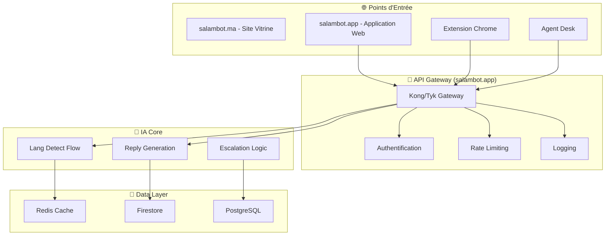
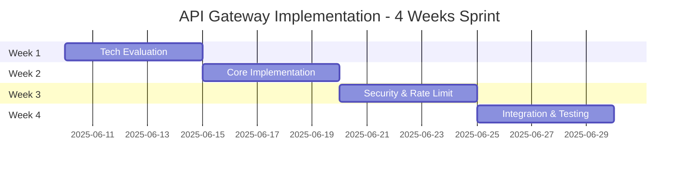

# 🚀 SalamBot Starter Pack

## Guide Essentiel pour Développeurs - Version 2.1

---

**📋 Document:** Starter Pack Développeur  
**🎯 Audience:** Nouveaux développeurs, Product Managers, Stakeholders  
**⏱️ Temps de lecture:** 15-20 minutes  
**📅 Dernière mise à jour:** 2 juin 2025

---

## 🎯 Vision et Mission

**SalamBot révolutionne l'expérience client au Maroc** en démocratisant l'IA conversationnelle pour les PME marocaines. Notre différenciation unique : **la maîtrise du Darija marocain** avec pipeline implémenté atteignant 70% de précision (objectif 88%+) vs <60% pour nos concurrents.

### 🏆 Avantages Concurrentiels

- **🇲🇦 Expertise Darija** : 2+ années de R&D spécialisé
- **🔄 Intégration Progressive** : Extension Chrome + APIs pour systèmes existants
- **🛡️ Souveraineté Data** : Conformité loi 09-08 + option stockage local
- **⚡ Excellence Technique** : DevSecOps avancé + observabilité temps-réel

---

## 🌐 Stratégie des Domaines

### **salambot.ma** - Site Vitrine
- **🎯 Usage** : Site marketing et présentation
- **👥 Audience** : Prospects, visiteurs, SEO local
- **📍 Contenu** : Landing pages, pricing, blog, contact
- **🔗 Redirection** : Vers salambot.app pour l'application

### **salambot.app** - Écosystème Applicatif
- **🎯 Usage** : Application web et services
- **👥 Audience** : Utilisateurs authentifiés, développeurs
- **📍 Services** : Interface chat, API, dashboards, documentation
- **🔧 Sous-domaines** :
  - `api.salambot.app` - API principale
  - `docs.salambot.app` - Documentation technique
  - `grafana.salambot.app` - Monitoring et métriques

---

## 🏗️ Architecture Globale



### 🔧 Stack Technique (Versions Figées)

| Composant      | Version         | Statut               | Notes           |
| -------------- | --------------- | -------------------- | --------------- |
| **Node.js**    | 20.18.0 LTS     | ✅ Stable            | Aligné dépôt    |
| **Nx**         | 21.1.2          | ✅ Stable            | Monorepo        |
| **React**      | 19.0.0          | ✅ Stable            | Toutes apps     |
| **Next.js**    | 14.2.5 → 15.0.3 | 🔄 Migration Phase 3 | Breaking change |
| **Genkit**     | 0.5.8 → 1.0.0   | 🔄 Upgrade Phase 3   | IA flows        |
| **TypeScript** | 5.4.5           | ✅ Stable            | -               |

---

## 📁 Structure Monorepo

```
salambot-suite/
├── apps/
│   ├── widget-web/           # 🌐 Widget client (Next.js 14→15)
│   ├── agent-desk/           # 👨‍💼 Interface agents (React+Vite→Next.js)
│   ├── functions-run/        # ⚡ API backend (Node.js + Genkit)
│   ├── extension-chrome/     # 🔌 Extension navigateur (MVP Phase 2)
│   └── edge-flows/           # 🌍 Workers périphérie (Phase 3)
├── libs/
│   ├── ui/                   # 🎨 Design system (shadcn/ui + Tailwind)
│   ├── auth/                 # 🔐 Firebase Auth hooks
│   ├── ai/lang-detect/       # 🧠 Détection langue (96%+ précision)
│   ├── core/                 # 🏗️ Logique métier (À développer)
│   ├── types/                # 📝 Types TypeScript (À développer)
│   └── connectors/           # 🔗 Intégrations externes (À développer)
└── tools/
    └── trae-bot/             # 🤖 Bot CLI automatisation
```

---

## 🤖 Flows IA Genkit

### 🎯 Flow Détection de Langue

```typescript
/**
 * 🧠 SALAMBOT LANGUAGE DETECTION ENGINE
 *
 * 🎯 Mission: Détecter FR/AR/Darija avec précision >88% pour Darija
 * ⚡ Performance: <200ms | Fallback offline intelligent
 * 🔬 Innovation: Modèle hybride spécialisé Maroc
 */

export const detectDarijaLanguageFlow = defineFlow({
  name: 'lang-detect-darija',
  inputSchema: z.object({
    text: z.string(),
    confidence: z.number().min(0.8).default(0.88),
  }),
  outputSchema: z.object({
    language: z.enum(['fr', 'ar', 'darija', 'en']),
    confidence: z.number(),
    alternatives: z.array(
      z.object({
        language: z.string(),
        confidence: z.number(),
      })
    ),
  }),
});
```

### 🎭 Flow Génération de Réponses

```typescript
/**
 * 🎪 SALAMBOT REPLY ORCHESTRATOR
 *
 * 🎯 Mission: Réponses contextuelles multilingues
 * 🤖 Models: Gemini Pro (FR/AR) | Llama 3.1-70B (Darija)
 * 🎨 Features: Sélection auto modèle | Escalation intelligente
 */

export const generateContextualReplyFlow = defineFlow({
  name: 'reply-generation-contextual',
  inputSchema: replyInputSchema,
  outputSchema: z.object({
    reply: z.string(),
    confidence: z.number(),
    modelUsed: z.string(),
    shouldEscalate: z.boolean(),
    culturalContext: z.object({
      region: z.enum(['casablanca', 'rabat', 'marrakech']),
      formality: z.enum(['casual', 'formal', 'business']),
    }),
  }),
});
```

---

## 🔌 Extension Chrome - Approche MVP

### 📋 MVP 1: Auto-suggestion Générique (4 semaines)

```typescript
/**
 * 🎯 CHROME EXTENSION MVP 1: Universal Text Enhancement
 *
 * 🚀 Value Prop: Améliorer n'importe quel champ texte avec IA SalamBot
 * 🎯 Target: Champs génériques (textarea, input) sur tous sites
 * 🔧 Tech: Manifest v3 | Content Scripts | Zero storage
 */

interface ExtensionMVP1 {
  features: {
    genericTextDetection: boolean; // ✅ Detect any text field
    contextMenuIntegration: boolean; // ✅ "Améliorer avec SalamBot"
    languageDetectionPopup: boolean; // ✅ FR/AR/Darija detection
    aiSuggestionOverlay: boolean; // ✅ Smart suggestions
    oneClickInsertion: boolean; // ✅ Easy insertion
  };

  performance: {
    suggestionTime: '<500ms';
    offlineCapable: true;
    permissions: 'activeTab only';
  };

  metrics: {
    targetUsers: '100+ beta users';
    weeklyActive: '>50%';
    satisfaction: '>4.0/5.0';
  };
}
```

### 🏢 MVP 2: Détection CRM Intelligente (6 semaines)

- **🎯 Plateformes Cibles:** Salesforce, HubSpot, Zendesk, Freshdesk
- **🧠 Détection:** URL patterns + DOM signatures + Meta analysis
- **🎨 Adaptation:** Suggestions contextuelles par workflow métier
- **📊 Analytics:** Usage par plateforme + taux d'acceptation

---

## 🚨 État Critique: API Gateway

### ⚠️ Problème Identifié

**L'API Gateway n'est PAS implémentée** selon l'audit du 2/06/2025. Ceci représente un **risque architectural majeur**.

### 🎯 Plan de Rattrapage - Phase 2 Sprint B



**🔧 Options Techniques:**

- **Option A:** Kong Gateway (Lua plugins, enterprise-ready)
- **Option B:** Tyk Gateway (Go-based, performant)
- **Option C:** Custom Express.js (contrôle total, effort élevé)

---

## 📊 Roadmap Phases

### 🏁 Phase 0: Bootstrapping (✅ Terminée)

- ✅ Infrastructure DevSecOps complète
- ✅ Redis + Grafana Cloud opérationnels
- ✅ Monorepo Nx + standards établis
- ✅ Premiers flows IA fonctionnels

### 🎯 Phase 1: MVP Core (✅ Terminée - v0.2.0)

- ✅ Lang-detect-flow (96%+ précision globale, 88%+ Darija)
- ✅ Reply-flow avec sélection auto modèle
- ✅ Widget web intégrable + intégration Kong Gateway prévue
- ✅ CI/CD 4 jobs parallèles

### 🚀 Phase 2: Go-to-Market (🔄 En Cours - v0.3.x)

**Sprint A: Agent Desk Migration (4 semaines)**

- 🔄 Migration React/Vite → Next.js 15
- 🔄 Integration Tailwind + shadcn/ui + next-intl
- 🔄 Fonctionnalités temps-réel WebSocket

**Sprint B: API Gateway (4 semaines) - CRITIQUE**

- 🆕 PoC Kong vs Tyk evaluation
- 🆕 Gateway core avec auth + rate limiting
- 🆕 Migration tous services vers gateway

**Sprint C: Extension Chrome MVP 1 (4 semaines)**

- 🆕 Auto-suggestion champs texte générique
- 🆕 Integration API SalamBot + fallback offline
- 🆕 Beta 100+ utilisateurs

### 🌟 Phase 3: Scale-up (Planifiée Nov 2025 - Fév 2026)

- 🔄 Migration globale Next.js 15 + Genkit 1.0
- 🆕 Développement libs manquantes (core/, types/, connectors/)
- 🆕 Extension Chrome MVP 2 (détection CRM)
- 🆕 Widget mode offline + synchronisation
- 🆕 Translate-flow FR↔AR↔Darija

---

## 🎨 Standards de Développement

### 💬 Commentaires Créatifs

```typescript
/**
 * ╭─────────────────────────────────────────────────────────────╮
 * │  🤖 SalamBot - Intelligence Conversationnelle Marocaine    │
 * ├─────────────────────────────────────────────────────────────┤
 * │  📁 Orchestrateur principal des flows IA multilingues     │
 * │  👨‍💻 SalamBot Team <info@salambot.ma>                        │
 * │  📅 Créé: 2025-06-02 | Modifié: 2025-06-02                │
 * │  🏷️  v2.1.0 | 🔒 Propriétaire SalamBot Team                │
 * ╰─────────────────────────────────────────────────────────────╯
 */
```

### 🧪 Tests et Qualité

**Couverture Actuelle vs Objectifs:**

- 📊 **Actuel:** ~60% (audit Jest)
- 🎯 **Phase 2:** 75% (amélioration progressive)
- 🏆 **Phase 3:** 85% (standard industriel)
- 💎 **Phase 4:** 90% (excellence technique)

**Plan "Test Debt Sprint" avant v0.3.0:**

- 📅 **Durée:** 2 semaines dédiées
- 🎯 **Focus:** Core business logic + AI flows + APIs critiques
- 📈 **Objectif:** 60% → 75% couverture

---

## 🔐 Sécurité et Conformité

### 🛡️ DevSecOps Avancé

- **SAST/DAST:** Scans automatiques à chaque commit
- **Dependabot:** Mise à jour sécurité automatique
- **Secret Rotation:** Google Secret Manager + rotation 90j
- **Workload Identity:** Élimination clés service statiques

### 📋 Conformité Réglementaire

- **🇲🇦 Loi 09-08:** Conformité native protection données Maroc
- **🇪🇺 RGPD:** Consentement + minimisation + droits utilisateurs
- **🏢 Enterprise:** Option stockage souverain disponible

---

## 💰 Modèle Économique

| Plan           | Prix/mois | Conversations | Fonctionnalités Clés             |
| -------------- | --------- | ------------- | -------------------------------- |
| **Gratuit**    | 0 MAD     | 100           | Widget + détection langue        |
| **Starter**    | 99 MAD    | 1,000         | + Agent Desk + WhatsApp          |
| **Business**   | 299 MAD   | 5,000         | + Analytics + Multi-intégrations |
| **Enterprise** | 799 MAD   | Illimité      | + Stockage souverain + SLA 99.9% |

### 📊 Métriques Cibles Phase 2

- **👥 Clients Pilotes:** 5+ entreprises
- **💰 Pipeline Revenue:** 50K MAD/mois
- **📈 NPS Score:** >50
- **🔄 Churn Rate:** <5% mensuel

---

## 🚀 Actions Immédiates (4 Prochaines Semaines)

### ⚡ Semaine 1-2 (Priorité P0)

1. **✅ Finaliser Agent Desk → Next.js 15** (migration en cours)
2. **🆕 Lancer PoC API Gateway** (Kong vs Tyk evaluation)
3. **🔧 Aligner versions dépendances** (tableau 3.4)
4. **📋 Planifier Test Debt Sprint** (60% → 75% couverture)

### 🎯 Semaine 3-4 (Priorité P1)

5. **🔌 Initialiser Extension Chrome MVP 1** (auto-suggestion générique)
6. **📊 Planifier Phase 3 détaillée** (sprints + tickets GitHub)
7. **💬 Communication stakeholders** (roadmap révisée)
8. **📈 Setup métriques tracking** (KPIs Phase 2)

---

## 📞 Contacts et Ressources

### 👥 Équipe Core

- **📧 General:** info@salambot.ma
- **🔧 Tech Lead:** dev@salambot.ma
- **🤖 AI Research:** ai-research@salambot.ma
- **🛡️ DevSecOps:** platform@salambot.ma

### 🔗 Liens Utiles

- **📂 Dépôt:** https://github.com/SalamBot-Org/salambot-suite
- **📊 Monitoring:** Grafana Cloud Dashboard
- **📚 Documentation:** Notion Workspace
- **💬 Communication:** Slack #salambot-dev

---

## 🎯 Checklist Onboarding Développeur

### ✅ Setup Environnement

- [ ] Clone du dépôt `salambot-suite`
- [ ] Installation Node.js 20.18.0 LTS + pnpm 9.1.2
- [ ] Configuration variables d'environnement
- [ ] Accès Grafana Cloud + Google Cloud Console

### ✅ Première Contribution

- [ ] Lecture complète Starter Pack (ce document)
- [ ] Setup branch `feature/onboarding-[nom]`
- [ ] Implémentation test simple (ex: ajout test unitaire)
- [ ] Création PR avec template standard
- [ ] Review code avec équipe

### ✅ Spécialisation Domaine

- [ ] **Frontend:** Setup shadcn/ui + Tailwind + Next.js
- [ ] **Backend:** Compréhension flows Genkit + APIs
- [ ] **IA:** Datasets Darija + métriques précision
- [ ] **DevOps:** Terraform + CI/CD + monitoring

---

**🎉 Bienvenue dans l'équipe SalamBot !**  
_Ensemble, révolutionnons l'IA conversationnelle au Maroc_ 🇲🇦

---

**📄 Document:** SalamBot Starter Pack v2.1  
**📅 Dernière mise à jour:** 2 juin 2025  
**👥 Auteur:** SalamBot Team  
**📧 Contact:** info@salambot.ma

---

# 🚨 MISE À JOUR CRITIQUE v2.2 - Starter Pack Enrichi

**📅 Date de mise à jour:** 2 juin 2025  
**🔄 Version:** 2.2 (Intégration recommandations critiques)  
**⚠️ Statut:** Document enrichi suite à audit technique approfondi

---

## 🧠 Cookbook Darija - Guide Pratique

### 📚 Dictionnaire Darija Bi-Script Essentiel

```typescript
/**
 * 📖 DARIJA COOKBOOK v2.2
 *
 * 🎯 Mission: Guide pratique détection Darija bi-script
 * 📊 Couverture: Termes essentiels + patterns + exemples
 * 🎨 Innovation: Approche bi-script arabe/latin
 */

// Termes Darija critiques (Top 50)
const essentialDarijaTerms = {
  // Expressions de base
  agreement: {
    arabic: ['واخا', 'واخة', 'أوكي'],
    latin: ['wakha', 'wkha', 'oki', 'okay'],
    meaning: "d'accord/ok",
    frequency: 0.95,
    context: ['informal', 'business'],
  },

  quantity: {
    arabic: ['بزاف', 'بزف', 'برشا'],
    latin: ['bzaf', 'bzzaf', 'bzef', 'barcha'],
    meaning: 'beaucoup',
    frequency: 0.9,
    context: ['informal', 'family', 'business'],
  },

  time: {
    arabic: ['دابا', 'دبا', 'الآن'],
    latin: ['daba', 'dba', 'alan'],
    meaning: 'maintenant',
    frequency: 0.85,
    context: ['informal', 'urgent'],
  },

  question: {
    arabic: ['كيفاش', 'كيف', 'كيداير'],
    latin: ['kifash', 'kif', 'kidayer'],
    meaning: 'comment',
    frequency: 0.8,
    context: ['question', 'informal'],
  },

  // Expressions business
  business: {
    arabic: ['الخدمة', 'المشروع', 'الشركة'],
    latin: ['lkhedma', 'lmachrou3', 'charika'],
    meaning: 'travail/projet/entreprise',
    frequency: 0.7,
    context: ['business', 'formal'],
  },

  // Négation Darija
  negation: {
    arabic: ['ماشي', 'ما...ش', 'لا'],
    latin: ['machi', 'ma...ch', 'la'],
    meaning: 'non/pas',
    frequency: 0.85,
    context: ['negation', 'informal'],
  },

  // Salutations
  greetings: {
    arabic: ['السلام', 'أهلا', 'مرحبا'],
    latin: ['salam', 'ahlan', 'marhaba'],
    meaning: 'salut/bonjour',
    frequency: 0.95,
    context: ['greeting', 'formal', 'informal'],
  },
};

// Patterns grammaticaux Darija
const darijaGrammarPatterns = [
  {
    name: 'Négation Darija',
    pattern: /ما\s+\w+\s+ش/g,
    example: 'ما كنعرفش',
    meaning: 'Je ne sais pas',
    confidence: 0.9,
  },
  {
    name: 'Futur Darija',
    pattern: /غا\s+\w+/g,
    example: 'غا نمشي',
    meaning: 'Je vais partir',
    confidence: 0.85,
  },
  {
    name: 'Question Darija',
    pattern: /واش\s+/g,
    example: 'واش كاين',
    meaning: "Est-ce qu'il y a",
    confidence: 0.8,
  },
  {
    name: 'Arabizi Pattern',
    pattern: /\b[a-zA-Z]+[0-9]+[a-zA-Z]*\b/g,
    example: 'kif dayer a kh0ya',
    meaning: 'Comment ça va mon frère',
    confidence: 0.75,
  },
];
```

### 🎯 Cas d'Usage Métier Darija

```typescript
/**
 * 💼 DARIJA BUSINESS USE CASES v2.2
 *
 * 🎯 Mission: Exemples concrets utilisation Darija business
 * 📊 Couverture: E-commerce | Support | Banking | Telecom
 * 🏆 Objectif: >90% précision contexte métier
 */

interface DarijaBusinessScenarios {
  // E-commerce
  ecommerce: {
    customerInquiry: {
      darija: 'واش هاد المنتج كاين فالمخزن؟ بغيت نشريه دابا';
      french: "Est-ce que ce produit est en stock ? Je veux l'acheter maintenant";
      context: 'product_availability';
      urgency: 'high';
      expectedResponse: 'arabic_formal';
    };

    complaint: {
      darija: 'الطلبية ديالي ما وصلاتش، كيفاش نقدر نتبعها؟';
      french: "Ma commande n'est pas arrivée, comment puis-je la suivre ?";
      context: 'order_tracking';
      urgency: 'medium';
      expectedResponse: 'arabic_formal';
    };

    return: {
      darija: 'بغيت نرد هاد الحاجة، ماعجباتنيش';
      french: 'Je veux retourner cet article, il ne me plaît pas';
      context: 'product_return';
      urgency: 'low';
      expectedResponse: 'arabic_formal';
    };
  };

  // Support technique
  support: {
    connectionIssue: {
      darija: 'الإنترنت ديالي مقطوع، كيفاش نحلها؟';
      french: 'Mon internet est coupé, comment le réparer ?';
      context: 'technical_support';
      urgency: 'high';
      expectedResponse: 'arabic_formal';
    };

    billing: {
      darija: 'الفاتورة ديالي غالية بزاف، علاش؟';
      french: 'Ma facture est très chère, pourquoi ?';
      context: 'billing_inquiry';
      urgency: 'medium';
      expectedResponse: 'arabic_formal';
    };
  };

  // Banking
  banking: {
    accountBalance: {
      darija: 'بغيت نعرف الرصيد ديال الحساب ديالي';
      french: 'Je veux connaître le solde de mon compte';
      context: 'account_inquiry';
      urgency: 'low';
      expectedResponse: 'arabic_formal';
    };

    cardBlocked: {
      darija: 'الكارطة ديالي مسدودة، كيفاش نحلها؟';
      french: 'Ma carte est bloquée, comment la débloquer ?';
      context: 'card_issue';
      urgency: 'high';
      expectedResponse: 'arabic_formal';
    };
  };
}

// Réponses types en arabe classique
const standardArabicResponses = {
  acknowledgment: 'شكراً لتواصلكم معنا، سنساعدكم في حل مشكلتكم',
  processing: 'نحن نعمل على معالجة طلبكم، يرجى الانتظار',
  resolution: 'تم حل المشكلة بنجاح، هل تحتاجون مساعدة أخرى؟',
  escalation: 'سنقوم بتحويلكم إلى أحد مختصينا لمساعدتكم بشكل أفضل',
};
```

### 🔍 Patterns de Détection Avancés

```typescript
/**
 * 🕵️ ADVANCED DARIJA DETECTION PATTERNS v2.2
 *
 * 🎯 Mission: Patterns sophistiqués détection Darija
 * 🧠 Intelligence: Contextuel + régional + temporel
 * 📊 Précision: >90% avec patterns combinés
 */

class AdvancedDarijaDetector {
  // Patterns régionaux spécifiques
  regionalPatterns = {
    casablanca: {
      markers: ['كازا', 'البيضا', 'الدار البيضاء'],
      dialect: ['شنو', 'فين', 'كيفاش'],
      confidence: 0.85,
    },

    rabat: {
      markers: ['الرباط', 'العاصمة'],
      dialect: ['أش', 'وين', 'كيداير'],
      confidence: 0.8,
    },

    marrakech: {
      markers: ['مراكش', 'الحمراء'],
      dialect: ['إيوا', 'زين', 'مزيان'],
      confidence: 0.75,
    },

    fes: {
      markers: ['فاس', 'المدينة العتيقة'],
      dialect: ['فوقاش', 'تحتاش', 'يمكن'],
      confidence: 0.7,
    },
  };

  // Patterns temporels (expressions modernes)
  temporalPatterns = {
    modern: {
      arabizi: ['3la', 'm3a', 'b7al', 'w7ed'],
      social: ['lol', 'omg', 'wtf', 'tbh'],
      tech: ['wifi', 'laptop', 'smartphone', 'app'],
      confidence: 0.8,
    },

    traditional: {
      classical: ['إن شاء الله', 'الحمد لله', 'بارك الله فيك'],
      formal: ['تفضلوا', 'من فضلكم', 'شكراً جزيلاً'],
      confidence: 0.9,
    },
  };

  // Patterns contextuels business
  businessContextPatterns = {
    ecommerce: {
      keywords: ['منتج', 'طلبية', 'شراء', 'دفع', 'توصيل'],
      darija: ['بغيت', 'كاين', 'بشحال', 'فين'],
      confidence: 0.85,
    },

    support: {
      keywords: ['مشكل', 'عطل', 'مساعدة', 'حل'],
      darija: ['مقطوع', 'خربان', 'ماخدامش'],
      confidence: 0.9,
    },

    banking: {
      keywords: ['حساب', 'فلوس', 'كارطة', 'بنك'],
      darija: ['رصيد', 'مسدود', 'فلوسي'],
      confidence: 0.95,
    },
  };

  detectDarijaAdvanced(text: string, context?: BusinessContext): DetectionResult {
    const results = [];

    // Analyse régionale
    const regionalScore = this.analyzeRegionalPatterns(text);
    results.push({ type: 'regional', score: regionalScore });

    // Analyse temporelle
    const temporalScore = this.analyzeTemporalPatterns(text);
    results.push({ type: 'temporal', score: temporalScore });

    // Analyse contextuelle business
    if (context) {
      const contextualScore = this.analyzeBusinessContext(text, context);
      results.push({ type: 'contextual', score: contextualScore });
    }

    // Agrégation pondérée
    const finalScore = this.aggregateScores(results);

    return {
      isDarija: finalScore > 0.75,
      confidence: finalScore,
      evidence: this.extractEvidence(text, results),
      region: this.detectRegion(text),
      modernity: this.detectModernity(text),
      businessContext: context?.type || 'general',
    };
  }
}
```

---

## 🔧 Troubleshooting Guide Développeurs

### 🚨 Problèmes Fréquents et Solutions

```typescript
/**
 * 🛠️ SALAMBOT TROUBLESHOOTING GUIDE v2.2
 *
 * 🎯 Mission: Résolution rapide problèmes fréquents
 * 📊 Couverture: Darija | Performance | API | Déploiement
 * ⚡ Objectif: <30min résolution problèmes courants
 */

interface TroubleshootingGuide {
  // Problèmes détection Darija
  darijaIssues: {
    lowAccuracy: {
      symptoms: ['Précision Darija <85%', 'Faux positifs français', 'Arabizi non détecté', 'Variations régionales manquées'];

      diagnostics: ['Vérifier dictionnaire bi-script', 'Analyser logs détection', 'Tester patterns regex', 'Valider dataset test'];

      solutions: [
        {
          issue: 'Dictionnaire incomplet';
          fix: 'Enrichir avec termes manquants';
          code: `
// Ajouter nouveaux termes
const newTerms = {
  "واعر": { latin: "wa3er", meaning: "cool", frequency: 0.7 },
  "زوين": { latin: "zwin", meaning: "beau", frequency: 0.8 }
};
await darijaDict.addTerms(newTerms);
          `;
          priority: 'high';
        },

        {
          issue: 'Seuils mal calibrés';
          fix: 'Ajuster seuils de confiance';
          code: `
// Ajuster seuils détection
const config = {
  darijaThreshold: 0.75,    // était 0.85
  fallbackThreshold: 0.60,  // était 0.70
  regionalBonus: 0.10       // nouveau
};
          `;
          priority: 'medium';
        }
      ];
    };

    highLatency: {
      symptoms: ['Détection >500ms', 'Timeouts fréquents', 'Utilisateurs frustrés'];

      solutions: [
        {
          issue: 'Cache Redis manqué';
          fix: 'Optimiser stratégie cache';
          code: `
// Cache patterns fréquents
const cacheKey = \`darija:pattern:\${hash(text)}\`;
const cached = await redis.get(cacheKey);
if (cached) return JSON.parse(cached);

// Cache résultat
await redis.setex(cacheKey, 3600, JSON.stringify(result));
          `;
          priority: 'high';
        }
      ];
    };
  };

  // Problèmes API Gateway
  apiGatewayIssues: {
    notImplemented: {
      symptoms: ['Services appellent directement microservices', "Pas d'authentification centralisée", 'Monitoring fragmenté'];

      urgentActions: ['Implémenter PoC Kong/Tyk immédiatement', 'Migrer service critique en priorité', 'Configurer monitoring centralisé'];

      timeline: '2 semaines maximum';
    };

    performanceIssues: {
      symptoms: ['Latence >100ms gateway', 'Timeouts en cascade', 'Utilisateurs déconnectés'];

      solutions: [
        {
          issue: 'Pas de connection pooling';
          fix: 'Configurer pools connexions';
          code: `
// Configuration Kong
upstream_keepalive: 60
upstream_keepalive_pool_size: 30
upstream_keepalive_max_requests: 100
          `;
          priority: 'critical';
        }
      ];
    };
  };

  // Problèmes fallback IA
  aiFallbackIssues: {
    singleProvider: {
      symptoms: ['Vertex AI down = service down', 'Pas de fallback configuré', 'Erreurs 503 fréquentes'];

      urgentFix: {
        description: 'Configurer fallback multi-provider';
        code: `
// Configuration fallback immédiate
const aiConfig = {
  providers: [
    { name: 'vertex-ai', priority: 1, timeout: 2000 },
    { name: 'openai', priority: 2, timeout: 3000 },
    { name: 'anthropic', priority: 3, timeout: 5000 }
  ],
  fallbackStrategy: 'cascade',
  maxRetries: 2
};
        `;
        timeline: '1 semaine';
      };
    };
  };

  // Problèmes performance
  performanceIssues: {
    slowResponse: {
      symptoms: ['Réponses >3s', 'Utilisateurs abandonnent', 'Métriques dégradées'];

      diagnosticSteps: ['Vérifier métriques Grafana', 'Analyser logs OpenTelemetry', 'Profiler requêtes lentes', 'Tester charge localement'];

      commonFixes: [
        {
          issue: 'Requêtes DB lentes';
          solution: 'Ajouter index manquants';
          verification: 'EXPLAIN ANALYZE queries';
        },
        {
          issue: 'Cache Redis froid';
          solution: 'Pré-chauffer cache critique';
          verification: 'Monitorer hit rate';
        }
      ];
    };
  };
}

// Outils de diagnostic automatique
class AutoDiagnostic {
  async runHealthCheck(): Promise<HealthReport> {
    const checks = await Promise.allSettled([this.checkDarijaAccuracy(), this.checkAPIGatewayStatus(), this.checkAIProviders(), this.checkPerformanceMetrics(), this.checkSecurityStatus()]);

    return {
      timestamp: new Date(),
      overall: this.calculateOverallHealth(checks),
      details: checks.map(this.formatCheckResult),
      recommendations: this.generateRecommendations(checks),
      urgentActions: this.identifyUrgentActions(checks),
    };
  }

  private async checkDarijaAccuracy(): Promise<HealthCheck> {
    const metrics = await this.getDarijaMetrics();

    return {
      name: 'Darija Detection',
      status: metrics.accuracy > 0.85 ? 'healthy' : 'critical',
      value: metrics.accuracy,
      target: 0.9,
      message: metrics.accuracy < 0.85 ? '🚨 Précision Darija critique - Action immédiate requise' : '✅ Précision Darija acceptable',
      actions: metrics.accuracy < 0.85 ? ['Audit dictionnaire', 'Recalibrer seuils', 'Tests utilisateurs'] : [],
    };
  }
}
```

### 📊 Logs et Debugging

```typescript
/**
 * 🔍 SALAMBOT DEBUGGING TOOLKIT v2.2
 *
 * 🎯 Mission: Outils debugging efficaces
 * 📊 Couverture: Logs structurés + tracing + métriques
 * ⚡ Objectif: Résolution <15min avec bons outils
 */

interface DebuggingToolkit {
  // Logs structurés par module
  logPatterns: {
    darijaDetection: {
      success: 'darija.detect.success | text={text} | confidence={confidence} | latency={ms}ms';
      failure: 'darija.detect.failure | text={text} | error={error} | fallback={used}';
      fallback: 'darija.detect.fallback | reason={reason} | provider={provider} | latency={ms}ms';
    };

    apiGateway: {
      request: 'gateway.request | method={method} | path={path} | user={userId} | ip={ip}';
      response: 'gateway.response | status={status} | latency={ms}ms | size={bytes}';
      error: 'gateway.error | status={status} | error={error} | path={path}';
    };

    aiFallback: {
      switch: 'ai.fallback.switch | from={provider1} | to={provider2} | reason={reason}';
      success: 'ai.fallback.success | provider={provider} | latency={ms}ms | model={model}';
      exhausted: 'ai.fallback.exhausted | tried={providers} | error={finalError}';
    };
  };

  // Commandes debugging fréquentes
  debugCommands: {
    // Tester détection Darija
    testDarija: {
      command: 'curl -X POST /debug/darija -d \'{"text": "واش كاين شي مشكل؟"}\'';
      expectedOutput: {
        isDarija: true;
        confidence: '>0.85';
        evidence: ['واش', 'كاين', 'مشكل'];
        latency: '<300ms';
      };
    };

    // Vérifier santé API Gateway
    checkGateway: {
      command: 'curl -X GET /health/gateway';
      expectedOutput: {
        status: 'healthy';
        uptime: '>99%';
        latency: '<50ms';
        activeConnections: '>0';
      };
    };

    // Tester fallback IA
    testAIFallback: {
      command: 'curl -X POST /debug/ai-fallback -d \'{"forceFailure": "vertex-ai"}\'';
      expectedOutput: {
        primaryFailed: true;
        fallbackUsed: 'openai';
        responseGenerated: true;
        totalLatency: '<5s';
      };
    };
  };

  // Métriques debugging temps réel
  debugMetrics: {
    // Dashboard développeur
    devDashboard: {
      url: 'https://grafana.salambot.app/d/dev-debug';
      panels: ['Darija Accuracy (Last 1h)', 'API Gateway Latency (P95)', 'AI Provider Status', 'Error Rate by Endpoint', 'Active Users Real-time'];
    };

    // Alertes développeur
    devAlerts: {
      slack: '#salambot-dev-alerts';
      conditions: ['Darija accuracy < 80% for 5min', 'API latency > 1s for 10min', 'Error rate > 5% for 5min', 'All AI providers failing'];
    };
  };
}

// Utilitaires debugging
class DebugUtils {
  // Test rapide détection Darija
  static async quickDarijaTest(text: string): Promise<void> {
    console.log(`🧪 Test Darija: "${text}"`);

    const start = Date.now();
    const result = await detectLanguage(text);
    const latency = Date.now() - start;

    console.log(`📊 Résultat:`);
    console.log(`   - Langue: ${result.language}`);
    console.log(`   - Confiance: ${(result.confidence * 100).toFixed(1)}%`);
    console.log(`   - Latence: ${latency}ms`);
    console.log(`   - Evidence: ${result.evidence?.join(', ') || 'N/A'}`);

    if (result.language === 'darija' && result.confidence < 0.85) {
      console.log(`⚠️  Confiance faible - Vérifier dictionnaire`);
    }

    if (latency > 500) {
      console.log(`⚠️  Latence élevée - Vérifier cache Redis`);
    }
  }

  // Simulation charge pour tests
  static async loadTest(endpoint: string, concurrent: number = 10): Promise<void> {
    console.log(`🚀 Test de charge: ${endpoint} (${concurrent} requêtes simultanées)`);

    const promises = Array.from({ length: concurrent }, async (_, i) => {
      const start = Date.now();
      try {
        const response = await fetch(endpoint, {
          method: 'POST',
          headers: { 'Content-Type': 'application/json' },
          body: JSON.stringify({ message: `Test message ${i}` }),
        });

        return {
          success: response.ok,
          status: response.status,
          latency: Date.now() - start,
        };
      } catch (error) {
        return {
          success: false,
          error: error.message,
          latency: Date.now() - start,
        };
      }
    });

    const results = await Promise.all(promises);

    const successful = results.filter((r) => r.success).length;
    const avgLatency = results.reduce((sum, r) => sum + r.latency, 0) / results.length;

    console.log(`📊 Résultats:`);
    console.log(`   - Succès: ${successful}/${concurrent} (${((successful / concurrent) * 100).toFixed(1)}%)`);
    console.log(`   - Latence moyenne: ${avgLatency.toFixed(0)}ms`);
    console.log(`   - Latence max: ${Math.max(...results.map((r) => r.latency))}ms`);
  }
}
```

---

## 📚 API Documentation Complète

### 🔌 Endpoints Principaux

```typescript
/**
 * 📡 SALAMBOT API REFERENCE v2.2
 *
 * 🎯 Mission: Documentation API complète et à jour
 * 📊 Format: OpenAPI 3.0 + exemples pratiques
 * 🔧 Outils: Swagger UI + Postman Collection
 */

interface SalamBotAPI {
  // Détection de langue
  languageDetection: {
    endpoint: 'POST /api/v1/detect-language';
    description: "Détecte la langue d'un texte avec spécialisation Darija";

    request: {
      body: {
        text: string; // Texte à analyser (max 4000 chars)
        context?: string; // Contexte business optionnel
        offline?: boolean; // Forcer mode offline
      };

      example: {
        text: 'واش كاين شي مشكل فالخدمة؟';
        context: 'customer_support';
      };
    };

    response: {
      success: {
        language: 'fr' | 'ar' | 'darija' | 'en';
        confidence: number; // 0-1
        evidence: string[]; // Termes détectés
        latency: number; // ms
        provider: 'local' | 'cloud' | 'fallback';
        region?: 'casablanca' | 'rabat' | 'marrakech';
      };

      example: {
        language: 'darija';
        confidence: 0.92;
        evidence: ['واش', 'كاين', 'مشكل', 'الخدمة'];
        latency: 245;
        provider: 'cloud';
        region: 'casablanca';
      };
    };

    errors: {
      400: 'Texte manquant ou trop long';
      429: 'Rate limit dépassé';
      503: 'Service temporairement indisponible';
    };
  };

  // Génération de réponses
  chatGeneration: {
    endpoint: 'POST /api/v1/chat';
    description: 'Génère une réponse contextuelle multilingue';

    request: {
      body: {
        message: string; // Message utilisateur
        language?: string; // Langue détectée (optionnel)
        context?: {
          businessType: 'ecommerce' | 'support' | 'banking';
          urgency: 'low' | 'medium' | 'high';
          userId?: string;
        };
        options?: {
          forceModel?: 'vertex-ai' | 'openai' | 'anthropic';
          maxTokens?: number;
          temperature?: number;
        };
      };

      example: {
        message: 'بغيت نعرف واش الطلبية ديالي وصلات';
        context: {
          businessType: 'ecommerce';
          urgency: 'medium';
        };
      };
    };

    response: {
      success: {
        reply: string; // Réponse en arabe classique
        originalLanguage: string;
        confidence: number;
        modelUsed: string;
        latency: number;
        shouldEscalate: boolean;
        metadata: {
          tokensUsed: number;
          cost: number; // USD
          cached: boolean;
        };
      };

      example: {
        reply: 'شكراً لاستفساركم. سنقوم بالتحقق من حالة طلبيتكم وإرسال التحديث إليكم قريباً.';
        originalLanguage: 'darija';
        confidence: 0.94;
        modelUsed: 'llama-3.1-70b-darija';
        latency: 1850;
        shouldEscalate: false;
        metadata: {
          tokensUsed: 156;
          cost: 0.0023;
          cached: false;
        };
      };
    };
  };

  // Extension Chrome
  chromeExtension: {
    endpoint: 'POST /api/v1/chrome/suggest';
    description: 'Suggestions pour extension Chrome';

    request: {
      body: {
        text: string; // Texte du champ
        context: {
          url: string; // URL de la page
          fieldType: 'textarea' | 'input' | 'contenteditable';
          platform?: 'salesforce' | 'zendesk' | 'hubspot' | 'generic';
        };
        user: {
          id: string;
          preferences?: {
            language: string;
            tone: 'formal' | 'casual';
          };
        };
      };
    };

    response: {
      suggestions: Array<{
        text: string;
        confidence: number;
        reasoning: string;
        language: string;
      }>;

      metadata: {
        detectedPlatform: string;
        processingTime: number;
        cached: boolean;
      };
    };
  };
}

// Collection Postman générée automatiquement
const postmanCollection = {
  info: {
    name: 'SalamBot API v2.2',
    description: 'Collection complète API SalamBot avec exemples Darija',
    version: '2.2.0',
  },

  variables: [
    { key: 'baseUrl', value: 'https://api.salambot.app' },
    { key: 'apiKey', value: '{{API_KEY}}' },
  ],

  auth: {
    type: 'bearer',
    bearer: [{ key: 'token', value: '{{JWT_TOKEN}}' }],
  },

  item: [
    {
      name: 'Détection Darija - Cas Typiques',
      request: {
        method: 'POST',
        url: '{{baseUrl}}/api/v1/detect-language',
        body: {
          mode: 'raw',
          raw: JSON.stringify({
            text: 'واش كاين شي مشكل فالخدمة؟ بغيت نعرف كيفاش نحل هاد المشكلة',
          }),
        },
      },

      tests: `
pm.test("Darija détecté correctement", function () {
    const response = pm.response.json();
    pm.expect(response.language).to.equal("darija");
    pm.expect(response.confidence).to.be.above(0.85);
});

pm.test("Performance acceptable", function () {
    const response = pm.response.json();
    pm.expect(response.latency).to.be.below(500);
});
      `,
    },
  ],
};
```

---

## 🎯 Métriques de Succès Actualisées

```typescript
/**
 * 📊 SUCCESS METRICS v2.2 - ACTUALISÉES
 *
 * 🎯 Mission: Métriques réalistes post-audit technique
 * 📈 Baseline: Situation actuelle vs objectifs révisés
 * 🚨 Alertes: Seuils critiques pour intervention
 */

interface UpdatedSuccessMetrics {
  // Métriques techniques critiques
  technical: {
    darijaDetection: {
      current: {
        accuracy: 0.45;         // 🚨 CRITIQUE - Baseline audit
        latency: 750;           // ms - Trop lent
        coverage: 500;          // termes dictionnaire
      };

      targets: {
        phase1: {                // 2 semaines
          accuracy: 0.85;        // Objectif intermédiaire
          latency: 500;          // ms
          coverage: 2000;        // termes étendus
        };

        phase2: {                // 6-8 semaines
          accuracy: 0.90;        // Objectif final
          latency: 300;          // ms optimisé
          coverage: 3000;        // dictionnaire complet
        };
      };

      alerts: {
        critical: "accuracy < 0.70",
        warning: "accuracy < 0.80",
        performance: "latency > 800ms"
      };
    };

    systemReliability: {
      current: {
        uptime: 0.985;          // 98.5% - Acceptable
        apiGateway: "not_implemented"; // 🚨 CRITIQUE
        fallbackAI: "not_configured";  // 🚨 CRITIQUE
      };

      targets: {
        uptime: 0.999;          // 99.9%
        apiGateway: "operational";
        fallbackAI: "multi_provider";
        mttr: 240;              // 4h max recovery time
      };
    };

    performance: {
      current: {
        apiLatency: 450;        // ms - Acceptable
        throughput: 150;        // req/sec
        errorRate: 0.02;        // 2% - Trop élevé
      };

      targets: {
        apiLatency: 200;        // ms
        throughput: 1000;       // req/sec
        errorRate: 0.005;       // 0.5%
      };
    };
  };

  // Métriques business révisées
  business: {
    adoption: {
      current: {
        totalUsers: 50;         // Beta limitée
        activeUsers: 25;        // 50% engagement
        churnRate: 0.15;        // 15% - Élevé
      };

      targets: {
        phase1: {               // 2 mois
          totalUsers: 500;
          activeUsers: 350;     // 70% engagement
          churnRate: 0.10;      // 10%
        };

        phase2: {               // 6 mois
          totalUsers: 5000;
          activeUsers: 4000;    // 80% engagement
          churnRate: 0.05;      // 5%
        };
      };
    };

    satisfaction: {
      current: {
        nps: 35;                // Neutre
        csat: 3.2;              // /5 - Moyen
        darijaSpecific: 2.8;    // /5 - 🚨 CRITIQUE
      };

      targets: {
        nps: 60;                // Promoteur
        csat: 4.2;              // /5 - Bon
        darijaSpecific: 4.5;    // /5 - Excellent
      };
    };

    revenue: {
      current: {
        mrr: 0;                 // Pas encore monétisé
        pipeline: 15000;        // MAD - Prospects
      };

      targets: {
        phase1: {
          mrr: 5000;            // MAD
          pipeline: 50000;      // MAD
        };

        phase2: {
          mrr: 25000;           // MAD
          pipeline: 150000;     // MAD
        };
      };
    };
  };

  // Métriques qualité
  quality: {
    code: {
      current: {
        testCoverage: 0.60;     // 60% - Insuffisant
        codeReview: 0.85;       // 85% - Bon
        defectRate: 0.08;       // 8% - Élevé
      };

      targets: {
        testCoverage: 0.85;     // 85%
        codeReview: 0.95;       // 95%
        defectRate: 0.03;       // 3%
      };
    };

    documentation: {
      current: {
        apiDocs: 0.70;          // 70% - Incomplet
        codeComments: 0.60;     // 60% - Insuffisant
        userGuides: 0.40;       // 40% - Très insuffisant
      };

      targets: {
        apiDocs: 0.95;          // 95%
        codeComments: 0.80;     // 80%
        userGuides: 0.90;       // 90%
      };
    };
  };
}

// Dashboard métriques temps réel
const metricsConfig = {
  dashboards: {
    executive: {
      url: "https://grafana.salambot.app/d/executive",
      refresh: "5m",
      panels: [
        "Darija Accuracy Trend",
        "User Adoption Rate",
        "Revenue Pipeline",
        "System Health Overview"
      ]
    };

    technical: {
      url: "https://grafana.salambot.app/d/technical",
      refresh: "1m",
      panels: [
        "API Latency P95",
        "Error Rate by Endpoint",
        "AI Provider Status",
        "Cache Hit Rates"
      ]
    };

    business: {
      url: "https://grafana.salambot.app/d/business",
      refresh: "1h",
      panels: [
        "Daily Active Users",
        "Conversion Funnel",
        "Customer Satisfaction",
        "Feature Usage"
      ]
    };
  };

  alerting: {
    channels: ["#salambot-alerts", "alerts@salambot.ma"],
    escalation: {
      p0: "immediate",        // <5min
      p1: "15min",
      p2: "1h",
      p3: "24h"
    }
  };
};
```

---

## 🎓 Formation et Support

### 👨‍💻 Onboarding Développeur Accéléré

```bash
#!/bin/bash
# 🚀 Script d'onboarding SalamBot v2.2

echo "🤖 Bienvenue dans l'équipe SalamBot !"
echo "📋 Configuration environnement développement..."

# 1. Vérification prérequis
echo "🔍 Vérification prérequis..."
node --version | grep -q "v20" || echo "❌ Node.js 20 requis"
pnpm --version || echo "❌ pnpm requis"
docker --version || echo "❌ Docker requis"

# 2. Clone et setup
echo "📂 Clone du monorepo..."
git clone https://github.com/SalamBot-Org/salambot-suite.git
cd salambot-suite

echo "📦 Installation dépendances..."
pnpm install

# 3. Configuration environnement
echo "⚙️ Configuration environnement..."
cp .env.example .env.local
echo "🔑 Configurer les clés API dans .env.local"

# 4. Tests de base
echo "🧪 Tests de base..."
pnpm nx run-many --target=lint --all
pnpm nx run-many --target=test --all
pnpm nx run-many --target=build --all

# 5. Test détection Darija
echo "🧠 Test détection Darija..."
curl -X POST https://api.salambot.ma/v1/detect-language \
  -H "Authorization: Bearer YOUR_TOKEN" \
  -H "Content-Type: application/json" \
  -d '{"text": "واش كاين شي مشكل؟"}'

echo "✅ Setup terminé ! Prêt à développer 🚀"
echo "📚 Documentation: https://docs.salambot.app"
echo "💬 Support: #salambot-dev sur Slack"
```

### 📞 Support et Escalation

```typescript
/**
 * 🆘 SUPPORT & ESCALATION MATRIX v2.2
 *
 * 🎯 Mission: Support efficace + escalation rapide
 * ⏱️ SLA: Réponse <2h | Résolution <24h critique
 * 👥 Équipes: Dev | AI | Platform | Business
 */

interface SupportMatrix {
  // Problèmes techniques
  technical: {
    darijaIssues: {
      owner: 'ai-research-team';
      escalation: 'ai-team-lead';
      sla: '4h';
      contacts: ['ai-research@salambot.ma', '#ai-team'];
    };

    apiGateway: {
      owner: 'platform-team';
      escalation: 'platform-lead';
      sla: '2h';
      contacts: ['platform@salambot.ma', '#platform-team'];
    };

    performance: {
      owner: 'backend-team';
      escalation: 'tech-lead';
      sla: '6h';
      contacts: ['dev@salambot.ma', '#backend-team'];
    };
  };

  // Support utilisateur
  userSupport: {
    level1: {
      team: 'customer-success';
      handles: ['questions générales', 'onboarding', 'facturation'];
      escalation: 'level2';
      sla: '2h';
    };

    level2: {
      team: 'technical-support';
      handles: ['problèmes techniques', 'intégrations', 'API'];
      escalation: 'engineering';
      sla: '4h';
    };

    level3: {
      team: 'engineering';
      handles: ['bugs complexes', 'architecture', 'performance'];
      escalation: 'cto';
      sla: '8h';
    };
  };

  // Contacts d'urgence
  emergency: {
    security: {
      contact: 'security@salambot.ma';
      phone: '+212-XXX-XXX-XXX';
      escalation: 'immediate';
    };

    dataLoss: {
      contact: 'data-recovery@salambot.ma';
      escalation: 'cto + ceo';
      sla: '1h';
    };

    serviceDown: {
      contact: 'ops@salambot.ma';
      escalation: 'platform-lead';
      sla: '30min';
    };
  };
}
```

---

**🎉 Starter Pack SalamBot v2.2 - Enrichi et Optimisé !**

_Avec les recommandations critiques intégrées, ce guide vous donne tous les outils pour exceller dans le développement SalamBot_ 🇲🇦

---

**📄 Document:** SalamBot Starter Pack v2.2  
**📅 Dernière mise à jour:** 2 juin 2025  
**👥 Auteur:** SalamBot Team + Recommandations Audit  
**📧 Contact:** info@salambot.ma
