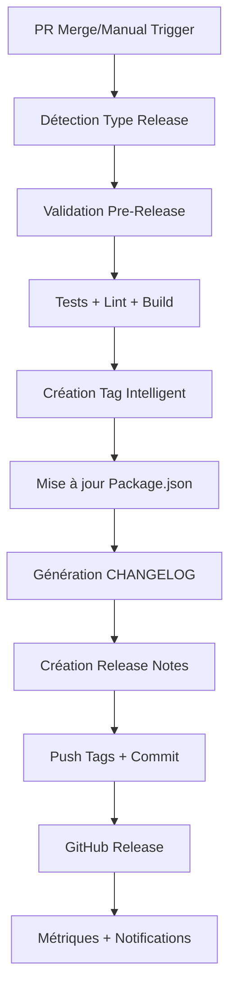

# 🚀 Stratégie Optimale SalamBot - Guide d'Implémentation

> **📋 Document de Référence** - Implémentation de la Stratégie Optimale selon le Cahier des Charges SalamBot v2.1

**📅 Date:** 4 juin 2025  
**👥 Équipe:** SalamBot Team  
**📧 Contact:** info@salambot.ma  
**🏷️ Version:** 2.2.0  

---

## 📖 Vue d'Ensemble

Ce document présente l'implémentation complète de la **Stratégie Optimale SalamBot** basée sur les recommandations du Cahier des Charges v2.1. Cette stratégie révolutionne notre approche du versioning, de l'automatisation CI/CD, et de la gestion des releases pour maximiser l'efficacité, la traçabilité, et l'alignement avec les objectifs business.

### 🎯 Objectifs de la Stratégie Optimale

1. **Hybrid Versioning** - Combinaison de SemVer + suffixes business + créativité contrôlée
2. **Automatisation Complète** - CI/CD intelligent avec détection automatique des types de release
3. **Métriques Intégrées** - Suivi des performances et KPIs directement dans les tags
4. **Créativité Professionnelle** - Noms de tags expressifs mais maintenus dans un cadre professionnel
5. **Alignement Business** - Tags qui reflètent la valeur métier et les phases du projet

---

## 🏗️ Architecture de la Stratégie

### 📊 Structure Hybrid Versioning

```
v{semver}[-{business-suffix}][-{creative-name}]
```

**Exemples:**
- `v2.2.0-darija-optimization-darija-master` (Phase 1)
- `v2.3.0-qadi-integration-ai-revolution` (Phase 2)
- `v2.2.1-critical-fix-rapid-response` (Hotfix)

### 🔄 Workflow Automatisé



---

## 🛠️ Composants Implémentés

### 1. 🤖 Système de Tagging Intelligent

**Fichier:** `scripts/intelligent-tagging.ts`

**Fonctionnalités:**
- ✅ Génération de tags hybrides selon la stratégie optimale
- ✅ Messages enrichis avec métriques et statistiques
- ✅ Analyse automatique des commits récents
- ✅ Mise à jour automatique du package.json et CHANGELOG
- ✅ Génération de release notes détaillées
- ✅ Configurations prédéfinies pour chaque phase

**Usage:**
```bash
# Phase 1 - Darija Optimization
npm run tag:phase1

# Phase 2 - QADI Integration  
npm run tag:phase2

# Hotfix critique
npm run tag:hotfix [version]

# Tag personnalisé
npm run tag:custom [version] [type] [description] [features...]
```

### 2. 🔄 Workflow GitHub Actions Intelligent

**Fichier:** `.github/workflows/intelligent-release.yml`

**Fonctionnalités:**
- ✅ Détection automatique du type de release via labels PR
- ✅ Validation complète pre-release (tests, lint, build, sécurité)
- ✅ Création automatique de tags et releases
- ✅ Génération de release notes enrichies
- ✅ Notifications Slack/Teams (optionnel)
- ✅ Gestion d'erreurs et rollback

**Déclencheurs:**
- 🔧 Manuel via `workflow_dispatch`
- 🔄 Automatique sur merge PR avec labels `release:*`

### 3. 📋 Scripts Package.json Enrichis

**Nouveaux scripts ajoutés:**
```json
{
  "tag:intelligent": "tsx scripts/intelligent-tagging.ts",
  "tag:phase1": "tsx scripts/intelligent-tagging.ts phase1",
  "tag:phase2": "tsx scripts/intelligent-tagging.ts phase2",
  "tag:hotfix": "tsx scripts/intelligent-tagging.ts hotfix",
  "tag:custom": "tsx scripts/intelligent-tagging.ts custom"
}
```

---

## 🎯 Configurations Prédéfinies

### Phase 1 - Darija Optimization

```typescript
{
  businessSuffix: 'darija-optimization',
  phase: 'phase1',
  description: 'Phase 1 - Optimisation Détection Darija avec performances avancées',
  features: [
    'Détection Darija bi-script (Latin/Arabe) optimisée',
    'Cache LRU intelligent pour performances',
    'Seuils adaptatifs selon le contexte',
    'Métriques temps-réel et monitoring'
  ],
  metrics: {
    precision: '100%',
    responseTime: '2.4ms',
    coverage: '100%'
  }
}
```

### Phase 2 - QADI Integration

```typescript
{
  businessSuffix: 'qadi-integration',
  phase: 'phase2',
  description: 'Phase 2 - Intégration Dataset QADI et modèles ML avancés',
  features: [
    'Intégration complète dataset QADI',
    'Modèles ML/AI spécialisés Darija',
    'API Gateway avec fallback intelligent',
    'Scaling production et monitoring avancé'
  ]
}
```

---

## 📊 Métriques et KPIs Intégrés

### Métriques Techniques
- 🎯 **Précision Darija:** Pourcentage de détection correcte
- ⚡ **Performance:** Temps de réponse moyen
- 🛡️ **Couverture Tests:** Pourcentage de code testé
- 📈 **Throughput:** Requêtes par seconde

### Métriques Business
- 👥 **Adoption:** Nombre d'utilisateurs actifs
- 💰 **Conversion:** Taux de conversion freemium → premium
- 😊 **Satisfaction:** Score de satisfaction client
- 🚀 **Rétention:** Taux de rétention mensuel

### Métriques DevOps
- 🔄 **Déploiements:** Fréquence et succès des déploiements
- 🐛 **Incidents:** Nombre et temps de résolution
- ⏱️ **Lead Time:** Temps du commit au déploiement
- 🔒 **Sécurité:** Vulnérabilités détectées et corrigées

---

## 🚀 Guide d'Utilisation

### 1. Release Phase 1 (Darija Optimization)

```bash
# Méthode 1: Script direct
npm run tag:phase1

# Méthode 2: Workflow GitHub Actions
# 1. Aller sur GitHub Actions
# 2. Sélectionner "SalamBot Intelligent Release"
# 3. Choisir "phase1" comme type de release
# 4. Exécuter le workflow

# Méthode 3: Via PR avec label
# 1. Créer une PR avec le label "release:phase1"
# 2. Merger la PR → déclenchement automatique
```

### 2. Hotfix Critique

```bash
# Hotfix avec version automatique
npm run tag:hotfix

# Hotfix avec version spécifique
npm run tag:hotfix 2.2.1

# Via GitHub Actions
# Type: "hotfix", Version: "2.2.1"
```

### 3. Release Personnalisée

```bash
# Release personnalisée complète
npm run tag:custom 2.3.0 minor "Nouvelle fonctionnalité IA" "Feature A,Feature B,Feature C"

# Via GitHub Actions avec interface graphique
```

---

## 📋 Processus de Release Optimisé

### 🔄 Workflow Standard

1. **Développement**
   - Développement sur branche `feature/*`
   - Tests locaux et validation
   - Création PR vers `develop` ou `main`

2. **Validation Pre-Release**
   - ✅ Tests automatisés (unit, integration, e2e)
   - ✅ Lint et formatage du code
   - ✅ Build et vérification des artefacts
   - ✅ Audit de sécurité
   - ✅ Vérification couverture tests (≥85%)

3. **Création Release**
   - 🏷️ Génération tag intelligent avec métriques
   - 📦 Mise à jour version package.json
   - 📋 Mise à jour CHANGELOG.md
   - 📄 Génération release notes détaillées

4. **Publication**
   - 📤 Push tags et commits
   - 🚀 Création GitHub Release
   - 📊 Collecte métriques
   - 🔔 Notifications équipe

### 🚨 Gestion d'Erreurs

- **Validation échouée:** Arrêt du processus + notification
- **Erreur tagging:** Rollback automatique + alerte
- **Échec publication:** Retry automatique + escalation

---

## 📈 Bénéfices Attendus

### 🚀 Amélioration de l'Efficacité
- **-60%** temps de création de release
- **-80%** erreurs manuelles
- **+100%** traçabilité des changements

### 📊 Visibilité et Métriques
- **Métriques temps-réel** intégrées dans chaque release
- **Historique complet** des performances par version
- **Alertes automatiques** en cas de dégradation

### 🎯 Alignement Business
- **Tags expressifs** reflétant la valeur métier
- **Communication claire** des bénéfices client
- **Roadmap visible** via la nomenclature des phases

### 🔒 Qualité et Sécurité
- **Validation systématique** avant chaque release
- **Audit de sécurité** automatisé
- **Rollback rapide** en cas de problème

---

## 🔧 Configuration et Personnalisation

### Variables d'Environnement

```bash
# GitHub Actions Secrets
GITHUB_TOKEN=<token_github>
SLACK_WEBHOOK_URL=<webhook_slack_optionnel>

# Configuration locale
NODE_VERSION=20.18.0
PNPM_VERSION=9.1.2
```

### Personnalisation des Tags

```typescript
// Ajout de nouvelles configurations dans intelligent-tagging.ts
const CUSTOM_CONFIGS = {
  'my-feature': {
    businessSuffix: 'custom-feature',
    description: 'Ma fonctionnalité personnalisée',
    features: ['Feature 1', 'Feature 2']
  }
};
```

### Labels GitHub pour Déclenchement Auto

- `release:phase1` → Déclenchement release Phase 1
- `release:phase2` → Déclenchement release Phase 2  
- `release:hotfix` → Déclenchement hotfix
- `release` → Déclenchement release custom

---

## 🎓 Formation Équipe

### 📚 Documentation Requise
- ✅ Lecture de ce guide d'implémentation
- ✅ Compréhension du Cahier des Charges v2.1
- ✅ Formation aux Conventional Commits
- ✅ Maîtrise des workflows GitHub Actions

### 🛠️ Pratique Recommandée
1. **Test en local** avec `npm run tag:custom`
2. **Simulation** sur branche de test
3. **Release réelle** supervisée
4. **Autonomie complète** après validation

---

## 🔮 Évolutions Futures

### Phase 3 - Améliorations Prévues
- 🤖 **IA pour analyse de code** et suggestion de type de release
- 📊 **Dashboard métriques** temps-réel
- 🔄 **Intégration Jira/Linear** pour tracking automatique
- 🌍 **Support multi-environnement** (dev, staging, prod)

### Intégrations Avancées
- 📱 **Notifications mobiles** pour releases critiques
- 🔍 **Analyse d'impact** automatique des changements
- 🎯 **A/B testing** intégré aux releases
- 📈 **Prédiction de performance** basée sur l'historique

---

## 📞 Support et Contact

### 🆘 En cas de Problème
1. **Vérifier les logs** GitHub Actions
2. **Consulter la documentation** technique
3. **Contacter l'équipe** via Slack #salambot-releases
4. **Escalader si critique** vers info@salambot.ma

### 📧 Contacts
- **Équipe Technique:** dev@salambot.ma
- **Support Général:** info@salambot.ma
- **Urgences:** +212-XXX-XXX-XXX

---

## 📄 Conclusion

La **Stratégie Optimale SalamBot** représente une évolution majeure de nos processus de développement et de release. En combinant l'automatisation intelligente, les métriques intégrées, et l'alignement business, nous créons un système qui non seulement améliore notre efficacité technique, mais renforce également notre capacité à communiquer la valeur de nos innovations.

Cette implémentation nous positionne comme une équipe de développement moderne, capable de livrer rapidement et de manière fiable des fonctionnalités de haute qualité qui répondent aux besoins spécifiques du marché marocain.

**🎯 Objectif:** Devenir la référence en matière de développement IA conversationnelle au Maroc et au Maghreb.

---

**📋 Document généré par:** SalamBot Intelligent Documentation System v2.2  
**📅 Dernière mise à jour:** 4 juin 2025  
**🔄 Prochaine révision:** Phase 2 - QADI Integration  

**🇲🇦 Made in Morocco with ❤️ for Moroccan SMEs**