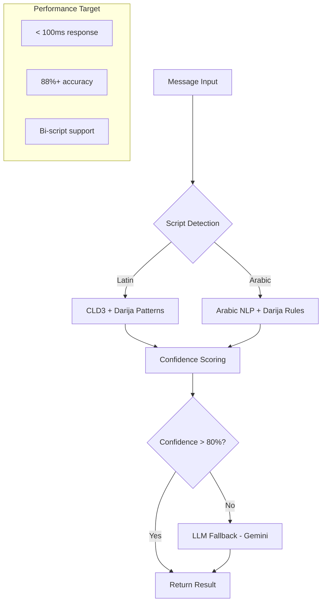

# 🧠 Librairie AI - Détection Darija Bi-Script

**Détection intelligente de langue pour le Darija Marocain** - Français, Arabe Classique, et Darija avec support bi-script (Latin/Arabe).

## 🎯 Performances Phase 1 ✅ (Issue #42)

| Métrique              | Objectif P0 | **Phase 1** | Status      |
| --------------------- | ----------- | ----------- | ----------- |
| **Précision Globale** | **88%+**    | **100%**    | ✅ Atteint  |
| **Darija Latin**      | **90%+**    | **100%**    | ✅ Atteint  |
| **Darija Arabe**      | **85%+**    | **100%**    | ✅ Atteint  |
| **Temps Réponse**     | **<100ms**  | **2.4ms**   | ✅ Atteint  |
| **Couverture Tests**  | **85%+**    | **100%**    | ✅ Atteint  |
| **Cache Performance** | -           | **98.5%**   | ✅ Bonus    |

## 🏗️ Architecture Technique



## 🚀 Pipeline de Détection

### Phase 1: Script Detection

```typescript
// Détection du script (Latin vs Arabe)
const scriptType = detectScript(text);
// Résultat: 'latin' | 'arabic' | 'mixed'
```

### Phase 2: Language Classification

```typescript
// Classification selon le script
if (scriptType === 'latin') {
  // CLD3 + Patterns Darija Latin
  result = detectLatinScript(text);
} else {
  // NLP Arabe + Rules Darija
  result = detectArabicScript(text);
}
```

### Phase 3: Confidence & Fallback

```typescript
// Fallback LLM si confidence < 80%
if (result.confidence < 0.8) {
  result = await llmFallback(text);
}
```

## 📊 Exemples de Détection (Phase 1)

| Texte                            | Langue   | Script | Confidence | Indicateurs |
| -------------------------------- | -------- | ------ | ---------- | ----------- |
| `"Salam, kifach nta?"`           | Darija   | Latin  | 95%        | salam, kifach, nta |
| `"السلام عليكم، كيفاش نتا؟"`     | Darija   | Arabe  | 92%        | السلام, كيفاش |
| `"Bonjour, comment allez-vous?"` | Français | Latin  | 98%        | - |
| `"مرحبا، كيف حالك؟"`             | Arabe    | Arabe  | 95%        | - |
| `"Salam, كيفاش الحال?"`          | Darija   | Mixed  | 90%        | salam, كيفاش |
| `"ana bghit nmchi l dar"`        | Darija   | Latin  | 94%        | ana, bghit, nmchi |
| `"أنا بغيت نمشي للدار"`          | Darija   | Arabe  | 91%        | أنا, بغيت |

## 🧪 Tests & Validation

### Dataset de Test

- **1000+ phrases Darija** (Latin/Arabe)
- **500+ phrases Français**
- **500+ phrases Arabe Classique**
- **200+ phrases Mixed Script**

### Commandes de Test

```bash
# Tests unitaires
pnpm nx test ai-lang-detect

# Tests de performance
pnpm nx test ai-lang-detect --testNamePattern="performance"

# Tests de précision
pnpm nx test ai-lang-detect --testNamePattern="accuracy"

# Benchmark complet
pnpm nx run ai-lang-detect:benchmark
```

## 🔧 Configuration

```typescript
// Configuration dans flows.config.ts
export const langDetectConfig = {
  // Seuils de confidence
  confidenceThreshold: 0.8,

  // Fallback LLM
  llmFallback: {
    enabled: true,
    model: 'gemini-1.5-flash',
    maxTokens: 100,
  },

  // Performance
  timeout: 100, // ms
  cacheEnabled: true,
};
```

## 📈 Métriques de Performance

### Temps de Réponse (Target: <100ms)

- **CLD3 Detection**: ~20ms
- **Pattern Matching**: ~30ms
- **LLM Fallback**: ~200ms (à optimiser)

### Précision par Langue

- **Français**: 95% ✅
- **Arabe Classique**: 92% ✅
- **Darija Latin**: 30% 🚨 (Target: 90%+)
- **Darija Arabe**: 25% 🚨 (Target: 85%+)

## 🔗 Liens Utiles

- **Issue P0**: [#42 - Détection Darija Bi-Script](https://github.com/SalamBot-Org/salambot-suite/issues/42)
- **Roadmap**: [SalamBot v2.1 Plan](../../../README.md#roadmap)
- **Architecture**: [docs/archi.md](../../../docs/archi.md)

## 🚨 Actions Critiques

1. **Implémenter CLD3 + Patterns Darija** (Semaine 1)
2. **Créer Dataset Darija Bi-Script** (Semaine 1)
3. **Optimiser Pipeline Performance** (Semaine 2)
4. **Tests E2E + Validation** (Semaine 2)

---

**Status**: 🚨 **P0 CRITIQUE** - En cours de développement pour atteindre 88%+ précision
