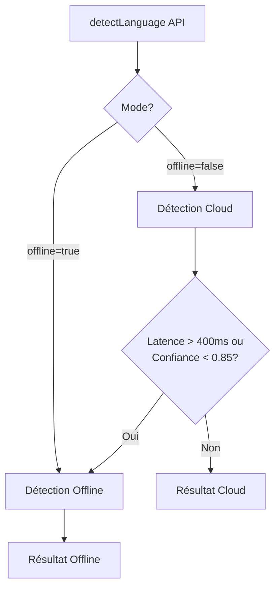

# README - Librairie de détection de langue SalamBot

Cette librairie fournit une API unifiée pour la détection de langue avec un mécanisme de fallback automatique Cloud → Offline.

## Architecture



## Fonctionnalités

- **API unifiée** : Une seule fonction `detectLanguage(text): Promise<LangResult>`
- **Détection Cloud** : Utilise Gemini Pro (FR/AR) et Llama-4 (Darija) avec cache Redis
- **Détection Offline** : Utilise CLD3 WebAssembly + heuristique bigrammes Darija
- **Fallback automatique** : Bascule vers offline si latence > 400ms ou confiance < 0.85
- **Logging** : Intégration avec OpenTelemetry pour le monitoring

## Usage

```typescript
import { detectLanguage } from '@salambot/ai/lang-detect';

// Détection automatique (cloud avec fallback)
const result = await detectLanguage("مرحبا بكم في المغرب");
// { lang: 'ar', confidence: 0.98, mode: 'cloud', latency: 320, fallback: false, source: 'cloud' }

// Détection forcée en mode offline
const resultOffline = await detectLanguage("السلام عليكم", { offline: true });
// { lang: 'ar', confidence: 0.92, mode: 'offline', latency: 2, fallback: false, source: 'offline' }

// Détection du darija en alphabet latin
const resultDarijaLatin = await detectLanguage("labas 3lik khouya");
// { lang: 'ar-ma', confidence: 0.85, mode: 'offline', latency: 1, fallback: true, source: 'offline' }
```

> Le moteur offline gère également le darija écrit avec alphabet latin.

## Performances

- **Précision globale** : ≥ 96%
- **Précision Darija offline** : ≥ 88%
- **Latence offline** : < 3ms
- **Latence cloud** : < 400ms (avec cache)

## Intégration

### Widget Web
```typescript
import { detectLanguage } from '@salambot/ai/lang-detect';

// Détection à la saisie utilisateur
textInput.addEventListener('input', async (e) => {
  const text = e.target.value;
  if (text.length > 10) {
    const { lang, source } = await detectLanguage(text);
    updateUILanguage(lang);
    console.log(`Détection via: ${source}`); // 'cloud' ou 'offline'
  }
});
```

### WhatsApp
```typescript
import { detectLanguage } from '@salambot/ai/lang-detect';

// Détection sur réception de message
async function onMessageReceived(message) {
  const { lang, source } = await detectLanguage(message.text);
  await routeToAppropriateFlow(message, lang);
  logDetectionSource(source); // Pour monitoring
}
```
