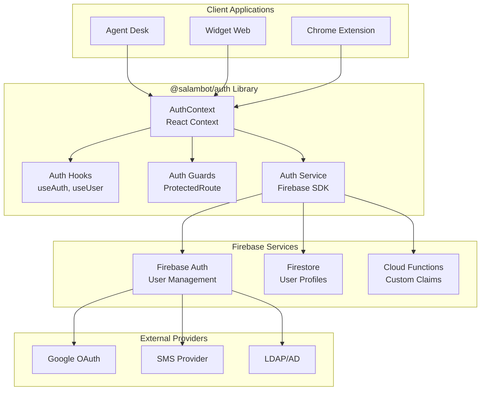

# 🔐 SalamBot Auth - Authentification Firebase

**Bibliothèque d'authentification sécurisée et hooks React pour l'écosystème SalamBot**

_Solution complète d'authentification avec Firebase Auth, gestion des rôles et sécurité enterprise pour applications multilingues._

[](https://firebase.google.com/)
[](https://reactjs.org/)
[](https://www.typescriptlang.org/)
[](https://firebase.google.com/docs/auth)
[](https://jwt.io/)

## 🌟 Fonctionnalités

### 🔑 **Authentification Multi-Méthodes**

- **Email/Password** : Authentification classique avec validation
- **Google OAuth** : Connexion rapide avec compte Google
- **Phone Auth** : SMS OTP pour utilisateurs marocains
- **Anonymous Auth** : Sessions temporaires pour visiteurs

### 👥 **Gestion des Rôles & Permissions**

- **RBAC** : Contrôle d'accès basé sur les rôles
- **Custom Claims** : Métadonnées utilisateur personnalisées
- **Multi-tenant** : Support des organisations multiples
- **Permissions granulaires** : Contrôle fin des accès

### 🛡️ **Sécurité Enterprise**

- **MFA** : Authentification multi-facteurs
- **Session Management** : Gestion avancée des sessions
- **Token Refresh** : Renouvellement automatique des tokens
- **Security Rules** : Règles Firestore intégrées

### 🌍 **Support Multilingue**

- **Localisation** : Messages d'erreur en FR/AR
- **RTL Support** : Interface adaptée à l'arabe
- **Cultural UX** : Expérience adaptée au Maroc

## 🏗️ Architecture



## 🚀 Installation & Configuration

### Installation

```bash
# Dans votre projet SalamBot
pnpm add @salambot/auth

# Peer dependencies
pnpm add firebase react react-dom
```

### Configuration Firebase

```typescript
// firebase.config.ts
import { initializeApp } from 'firebase/app';
import { getAuth } from 'firebase/auth';
import { getFirestore } from 'firebase/firestore';

const firebaseConfig = {
  apiKey: process.env.VITE_FIREBASE_API_KEY,
  authDomain: process.env.VITE_FIREBASE_AUTH_DOMAIN,
  projectId: process.env.VITE_FIREBASE_PROJECT_ID,
  storageBucket: process.env.VITE_FIREBASE_STORAGE_BUCKET,
  messagingSenderId: process.env.VITE_FIREBASE_MESSAGING_SENDER_ID,
  appId: process.env.VITE_FIREBASE_APP_ID,
};

export const app = initializeApp(firebaseConfig);
export const auth = getAuth(app);
export const db = getFirestore(app);
```

### Provider Setup

```typescript
// App.tsx
import { AuthProvider } from '@salambot/auth';
import { auth, db } from './firebase.config';

function App() {
  return (
    <AuthProvider
      auth={auth}
      firestore={db}
      config={{
        enablePersistence: true,
        multiFactorEnabled: true,
        locale: 'fr-MA',
      }}
    >
      <YourApp />
    </AuthProvider>
  );
}
```

## 🎯 Hooks & API

### useAuth - Hook Principal

```typescript
import { useAuth } from '@salambot/auth';

function LoginComponent() {
  const { user, loading, error, signIn, signOut, signUp, resetPassword, updateProfile } = useAuth();

  const handleLogin = async (email: string, password: string) => {
    try {
      await signIn(email, password);
      // Redirection automatique
    } catch (error) {
      console.error('Erreur de connexion:', error);
    }
  };

  if (loading) return <LoadingSpinner />;
  if (error) return <ErrorMessage error={error} />;

  return <LoginForm onSubmit={handleLogin} />;
}
```

### useUser - Profil Utilisateur

```typescript
import { useUser } from '@salambot/auth';

function UserProfile() {
  const { profile, permissions, organization, updateProfile, uploadAvatar } = useUser();

  return (
    <div>
      <Avatar src={profile?.photoURL} />
      <h2>{profile?.displayName}</h2>
      <p>Rôle: {profile?.role}</p>
      <p>Organisation: {organization?.name}</p>

      {permissions.canManageUsers && <AdminPanel />}
    </div>
  );
}
```

### usePermissions - Contrôle d'Accès

```typescript
import { usePermissions } from '@salambot/auth';

function AdminFeature() {
  const { hasPermission, hasRole } = usePermissions();

  if (!hasRole('admin', 'manager')) {
    return <AccessDenied />;
  }

  return (
    <div>
      {hasPermission('users.manage') && <UserManagement />}

      {hasPermission('analytics.view') && <Analytics />}
    </div>
  );
}
```

## 🛡️ Composants de Protection

### ProtectedRoute

```typescript
import { ProtectedRoute } from '@salambot/auth';

function App() {
  return (
    <Router>
      <Routes>
        <Route path="/login" element={<LoginPage />} />

        <Route
          path="/dashboard"
          element={
            <ProtectedRoute>
              <Dashboard />
            </ProtectedRoute>
          }
        />

        <Route
          path="/admin"
          element={
            <ProtectedRoute roles={['admin']} permissions={['admin.access']} fallback={<AccessDenied />}>
              <AdminPanel />
            </ProtectedRoute>
          }
        />
      </Routes>
    </Router>
  );
}
```

### AuthGuard

```typescript
import { AuthGuard } from '@salambot/auth';

function SensitiveFeature() {
  return (
    <AuthGuard
      permissions={['sensitive.access']}
      requireMFA={true}
      maxAge={3600} // Re-auth après 1h
    >
      <SensitiveContent />
    </AuthGuard>
  );
}
```

## 🔐 Méthodes d'Authentification

### Email/Password

```typescript
import { useAuth } from '@salambot/auth';

function EmailAuth() {
  const { signIn, signUp, resetPassword } = useAuth();

  // Connexion
  const handleSignIn = async (email: string, password: string) => {
    await signIn(email, password);
  };

  // Inscription
  const handleSignUp = async (email: string, password: string, profile: UserProfile) => {
    await signUp(email, password, {
      displayName: profile.name,
      phoneNumber: profile.phone,
      customClaims: {
        role: 'user',
        organization: profile.organizationId,
      },
    });
  };

  // Réinitialisation
  const handleReset = async (email: string) => {
    await resetPassword(email);
  };
}
```

### Google OAuth

```typescript
import { useAuth } from '@salambot/auth';

function GoogleAuth() {
  const { signInWithGoogle } = useAuth();

  const handleGoogleSignIn = async () => {
    try {
      await signInWithGoogle({
        prompt: 'select_account',
        customParameters: {
          hd: 'salambot.ma', // Domaine d'entreprise
        },
      });
    } catch (error) {
      console.error('Erreur Google Auth:', error);
    }
  };

  return (
    <button onClick={handleGoogleSignIn}>
      <GoogleIcon /> Se connecter avec Google
    </button>
  );
}
```

### Phone Authentication

```typescript
import { useAuth } from '@salambot/auth';

function PhoneAuth() {
  const { signInWithPhone, verifyPhoneCode } = useAuth();
  const [verificationId, setVerificationId] = useState('');

  const handleSendCode = async (phoneNumber: string) => {
    const verificationId = await signInWithPhone(phoneNumber, {
      size: 'invisible',
      callback: (response) => {
        // reCAPTCHA résolu
      },
    });
    setVerificationId(verificationId);
  };

  const handleVerifyCode = async (code: string) => {
    await verifyPhoneCode(verificationId, code);
  };
}
```

## 👥 Gestion des Rôles

### Définition des Rôles

```typescript
// types/auth.ts
export interface UserRole {
  id: string;
  name: string;
  permissions: Permission[];
  level: number;
}

export interface Permission {
  id: string;
  resource: string;
  action: string;
  conditions?: Record<string, any>;
}

// Configuration des rôles
export const ROLES: UserRole[] = [
  {
    id: 'super_admin',
    name: 'Super Administrateur',
    level: 100,
    permissions: ['*'], // Toutes les permissions
  },
  {
    id: 'admin',
    name: 'Administrateur',
    level: 80,
    permissions: ['users.manage', 'organizations.manage', 'analytics.view', 'settings.manage'],
  },
  {
    id: 'manager',
    name: 'Manager',
    level: 60,
    permissions: ['users.view', 'conversations.manage', 'analytics.view', 'reports.generate'],
  },
  {
    id: 'agent',
    name: 'Agent',
    level: 40,
    permissions: ['conversations.handle', 'customers.view', 'knowledge.access'],
  },
  {
    id: 'user',
    name: 'Utilisateur',
    level: 20,
    permissions: ['profile.view', 'profile.edit', 'conversations.create'],
  },
];
```

### Custom Claims

```typescript
// Cloud Function pour assigner des rôles
import { auth } from 'firebase-admin';

export const assignRole = functions.https.onCall(async (data, context) => {
  // Vérifier les permissions de l'appelant
  if (!context.auth?.token.admin) {
    throw new functions.https.HttpsError('permission-denied', 'Seuls les admins peuvent assigner des rôles');
  }

  const { userId, role, organizationId } = data;

  // Assigner les custom claims
  await auth().setCustomUserClaims(userId, {
    role,
    organizationId,
    permissions: ROLES.find((r) => r.id === role)?.permissions || [],
  });

  return { success: true };
});
```

## 🔒 Sécurité Avancée

### Multi-Factor Authentication

```typescript
import { useAuth } from '@salambot/auth';

function MFASetup() {
  const { enableMFA, disableMFA, verifyMFA } = useAuth();

  const handleEnableMFA = async () => {
    const secret = await enableMFA('totp');
    // Afficher le QR code pour l'app authenticator
    return secret;
  };

  const handleVerifyMFA = async (code: string) => {
    const isValid = await verifyMFA(code);
    if (isValid) {
      // MFA activé avec succès
    }
  };
}
```

### Session Management

```typescript
import { useSession } from '@salambot/auth';

function SessionManager() {
  const { sessions, currentSession, revokeSession, revokeAllSessions } = useSession();

  return (
    <div>
      <h3>Sessions actives</h3>
      {sessions.map((session) => (
        <div key={session.id}>
          <span>
            {session.device} - {session.location}
          </span>
          <button onClick={() => revokeSession(session.id)}>Révoquer</button>
        </div>
      ))}

      <button onClick={revokeAllSessions}>Révoquer toutes les sessions</button>
    </div>
  );
}
```

## 🧪 Tests

### Tests unitaires

```bash
# Lancer tous les tests
pnpm nx test auth

# Tests avec coverage
pnpm nx test auth --coverage

# Tests en mode watch
pnpm nx test auth --watch
```

### Tests d'intégration

```bash
# Tests avec Firebase Emulator
pnpm nx test:integration auth

# Tests de sécurité
pnpm nx test:security auth
```

### Exemple de test

```typescript
// auth.test.tsx
import { renderHook, act } from '@testing-library/react';
import { useAuth } from '@salambot/auth';
import { AuthProvider } from '@salambot/auth';

describe('useAuth', () => {
  it('should sign in user successfully', async () => {
    const { result } = renderHook(() => useAuth(), {
      wrapper: AuthProvider,
    });

    await act(async () => {
      await result.current.signIn('test@example.com', 'password123');
    });

    expect(result.current.user).toBeTruthy();
    expect(result.current.user?.email).toBe('test@example.com');
  });

  it('should handle authentication errors', async () => {
    const { result } = renderHook(() => useAuth(), {
      wrapper: AuthProvider,
    });

    await act(async () => {
      try {
        await result.current.signIn('invalid@example.com', 'wrongpassword');
      } catch (error) {
        expect(error.code).toBe('auth/invalid-credential');
      }
    });
  });
});
```

## 🌍 Internationalisation

### Messages d'erreur localisés

```typescript
// i18n/auth.ts
export const authMessages = {
  'fr-MA': {
    'auth/user-not-found': 'Utilisateur introuvable',
    'auth/wrong-password': 'Mot de passe incorrect',
    'auth/email-already-in-use': 'Cette adresse email est déjà utilisée',
    'auth/weak-password': 'Le mot de passe doit contenir au moins 6 caractères',
  },
  'ar-MA': {
    'auth/user-not-found': 'المستخدم غير موجود',
    'auth/wrong-password': 'كلمة المرور غير صحيحة',
    'auth/email-already-in-use': 'هذا البريد الإلكتروني مستخدم بالفعل',
    'auth/weak-password': 'يجب أن تحتوي كلمة المرور على 6 أحرف على الأقل',
  },
};
```

## 📚 Ressources

- **Firebase Auth** : [Documentation officielle](https://firebase.google.com/docs/auth)
- **Security Rules** : [Guide Firestore](https://firebase.google.com/docs/firestore/security/get-started)
- **Custom Claims** : [Guide avancé](https://firebase.google.com/docs/auth/admin/custom-claims)
- **Architecture** : [SalamBot Security](../../../docs/security.md)

## 🤝 Support

- **Issues** : [GitHub Issues](https://github.com/SalamBot-Org/salambot-suite/issues)
- **Discord** : [#auth-security](https://discord.gg/salambot)
- **Email** : security@salambot.ma
