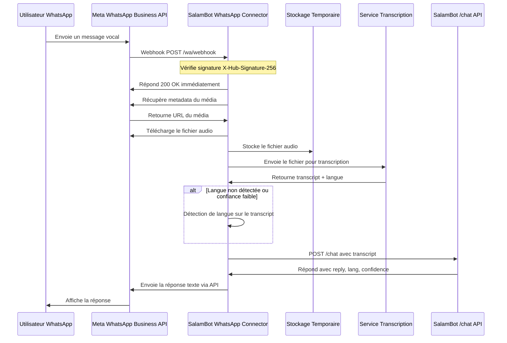

/**
 * @file        Documentation du pipeline de transcription audio WhatsApp pour SalamBot.
 * @author      SalamBot Team (contact: info@salambot.ma)
 * @created     2025-05-22
 * @updated     2025-05-22
 * @project     SalamBot - AI CRM for Moroccan SMEs
 */

# Transcription Audio WhatsApp pour SalamBot

Ce module étend le connecteur WhatsApp Business API de SalamBot pour gérer les messages vocaux, en les transcrivant en texte avant de les envoyer à l'API `/chat`.

## Fonctionnalités

- ✅ Téléchargement des médias audio WhatsApp via l'API Meta
- ✅ Stockage temporaire des fichiers audio (local ou simulation S3)
- ✅ Transcription audio via Whisper (stub pour cette PR)
- ✅ Détection de langue sur le texte transcrit
- ✅ Relai du transcript vers l'API `/chat`
- ✅ Réponse textuelle à l'utilisateur WhatsApp
- ✅ Journalisation OpenTelemetry complète

## Diagramme de séquence



## Pipeline de traitement

1. **Réception du message vocal**
   - Webhook WhatsApp reçoit un message de type `audio`
   - Extraction de l'ID audio et des métadonnées

2. **Téléchargement du média**
   - Récupération des métadonnées via l'API Meta
   - Téléchargement du fichier audio avec authentification
   - Stockage temporaire dans `/tmp/wa-audio/` ou simulation S3

3. **Transcription audio**
   - Envoi du fichier au service de transcription (stub Whisper)
   - Récupération du texte transcrit et de la langue détectée
   - Vérification de la confiance de détection de langue

4. **Relai vers `/chat`**
   - Construction de la requête avec transcript et métadonnées
   - Envoi à l'API `/chat` pour traitement
   - Réception de la réponse

5. **Réponse à l'utilisateur**
   - Envoi de la réponse textuelle via l'API WhatsApp
   - Préparation pour future intégration TTS (PR ultérieure)

## Configuration

Ajoutez ces variables d'environnement en plus de celles du connecteur WhatsApp :

```
# Stockage audio
WA_AUDIO_STORAGE_DIR=/tmp/wa-audio
ENABLE_S3_UPLOAD=false

# Service de transcription (pour intégration future)
WHISPER_API_URL=http://localhost:3020/transcribe
```

## Utilisation

Le module est intégré automatiquement au connecteur WhatsApp et ne nécessite pas d'appel spécifique. Tout message vocal reçu sera traité par le pipeline de transcription.

## Tests

```bash
# Exécuter les tests unitaires
npm test

# Exécuter les tests spécifiques à l'audio
npm test -- -t "WhatsApp Audio Processing"
```

## Prochaines étapes

- Intégration avec un vrai service Whisper via Genkit
- Support de la synthèse vocale (TTS) pour les réponses
- Stockage permanent des fichiers audio dans un bucket S3
- Optimisation de la détection de langue pour le darija
