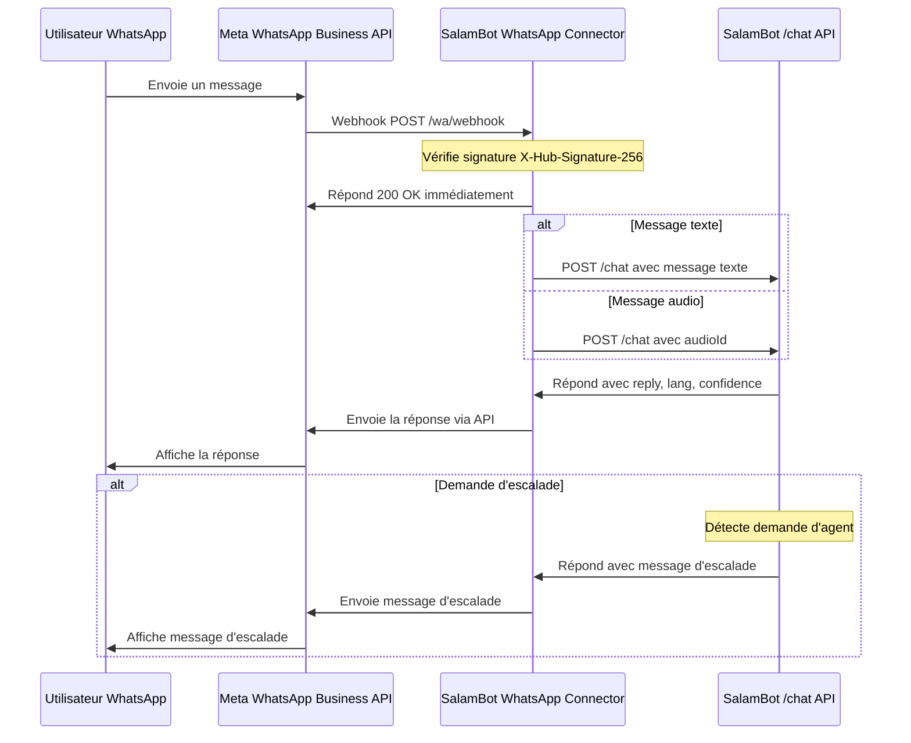

/**
 * @file        Documentation du connecteur WhatsApp pour SalamBot.
 * @author      SalamBot Team (contact: info@salambot.ma)
 * @created     2025-05-22
 * @updated     2025-05-22
 * @project     SalamBot - AI CRM for Moroccan SMEs
 */

# Connecteur WhatsApp Business API pour SalamBot

Ce module permet d'intégrer SalamBot avec l'API WhatsApp Business, en gérant la réception des webhooks Meta, la vérification des signatures, le relai des messages vers l'endpoint `/chat`, et l'envoi des réponses aux utilisateurs.

## Fonctionnalités

- ✅ Vérification du webhook WhatsApp (challenge GET)
- ✅ Vérification de signature HMAC SHA256 pour les requêtes entrantes
- ✅ Traitement des messages texte
- ✅ Support préliminaire des messages vocaux (stockage de l'ID audio)
- ✅ Relai des messages vers l'API `/chat`
- ✅ Envoi des réponses via l'API WhatsApp Business
- ✅ Journalisation OpenTelemetry complète

## Diagramme de séquence



## Installation

```bash
# Dans le monorepo SalamBot
cd libs/connectors/whatsapp
npm install
```

## Configuration

Créez un fichier `.env` avec les variables suivantes :

```
WA_VERIFY_TOKEN=your_verify_token
WA_PHONE_ID=your_phone_id
WA_ACCESS_TOKEN=your_access_token
APP_SECRET=your_app_secret
CHAT_API_URL=http://localhost:3010/chat
```

## Utilisation

### Intégration dans une application Express

```typescript
import express from 'express';
import { createWhatsAppConnector } from '@salambot/connectors-whatsapp';

const app = express();
app.use(express.json());

// Intégrer le connecteur WhatsApp
app.use(createWhatsAppConnector());

app.listen(3000, () => {
  console.log('Serveur démarré sur le port 3000');
});
```

### Test local avec ngrok

Pour tester le connecteur avec un webhook public :

```bash
# Démarrer le serveur local
npm run dev

# Dans un autre terminal, créer un tunnel ngrok
npm run tunnel:wa
```

Configurez ensuite l'URL du webhook dans le tableau de bord Meta for Developers :
`https://salambot-wa.ngrok.io/wa/webhook`

## Tests

```bash
# Exécuter les tests unitaires
npm test

# Exécuter les tests en mode watch
npm run test:watch
```

## Prochaines étapes

- Transcription des messages vocaux (PR #9)
- Support des médias (images, documents)
- Gestion des templates WhatsApp riches
- Intégration avec le système de CRM
