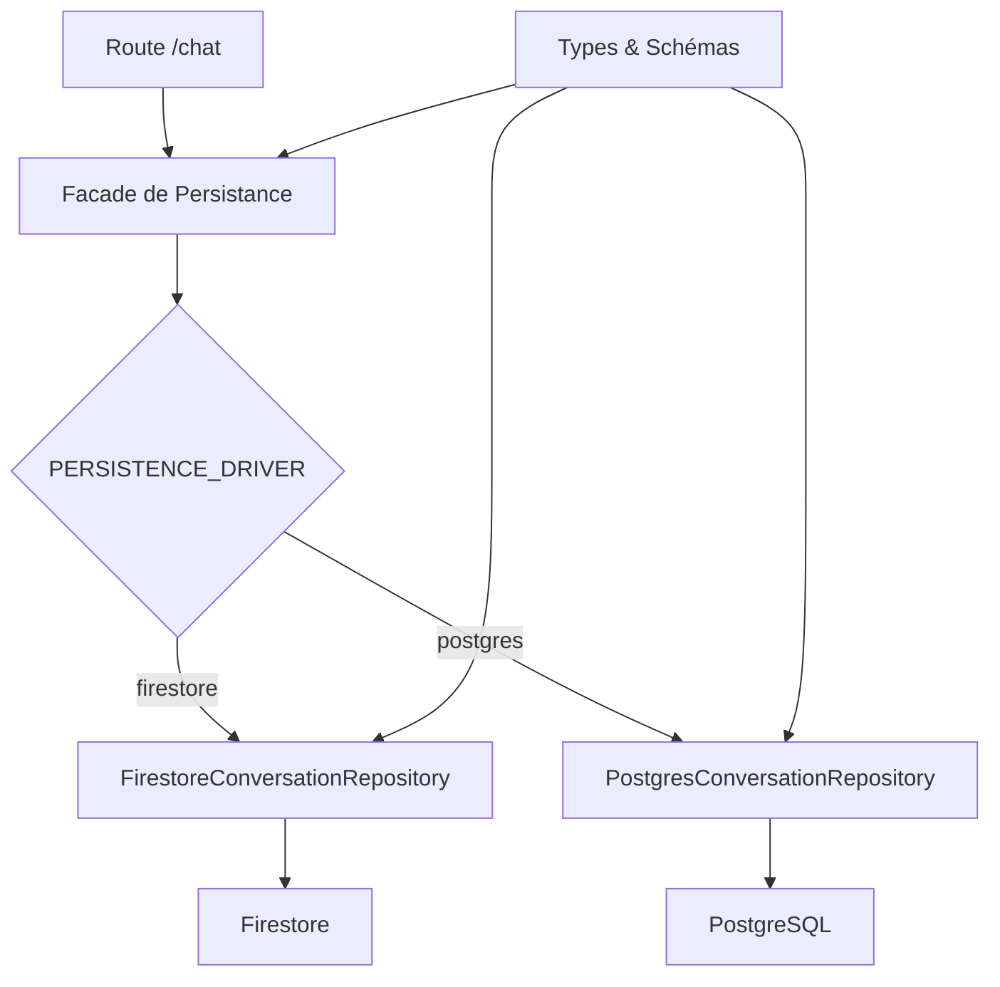

# Module de Persistance des Conversations SalamBot

Ce module implémente un système de persistance des conversations et des messages pour SalamBot, compatible avec Firestore (mode par défaut) et préparé pour PostgreSQL (mode souverain).

## Architecture

Le module est conçu avec une architecture en couches permettant de changer facilement le système de stockage sous-jacent :



## Fonctionnalités

- Création et gestion des conversations
- Ajout de messages avec différents rôles (utilisateur, bot, agent)
- Suivi du statut des conversations (active, escaladée, résolue, etc.)
- Support multilingue (français, arabe, darija)
- Traçabilité OpenTelemetry pour toutes les opérations
- Compatibilité avec différents canaux (web, WhatsApp, voix)

## Structure des données

### Conversation

```typescript
interface Conversation {
  id: string;                  // ID unique de la conversation
  userId?: string;             // ID de l'utilisateur (si authentifié)
  channel: Channel;            // Canal de communication
  lang: string;                // Langue principale détectée
  status: ConversationStatus;  // Statut actuel
  startedAt: Date;             // Date de début
  lastMessageAt: Date;         // Date du dernier message
  agentId?: string;            // ID de l'agent assigné (si escaladé)
  metadata?: {                 // Métadonnées additionnelles
    userInfo?: {               // Informations sur l'utilisateur
      name?: string;           // Nom de l'utilisateur
      email?: string;          // Email de l'utilisateur
      phone?: string;          // Téléphone de l'utilisateur
    };
    tags?: string[];           // Tags pour catégorisation
    priority?: 'low' | 'medium' | 'high' | 'urgent'; // Priorité
  };
}
```

### Message

```typescript
interface Message {
  id: string;                  // ID unique du message
  conversationId: string;      // ID de la conversation parente
  role: MessageRole;           // Rôle de l'émetteur (user, bot, agent, system)
  content: string;             // Contenu du message
  lang: string;                // Langue du message (fr, ar, ar-ma)
  timestamp: Date;             // Horodatage du message
  source: MessageSource;       // Source du message (chat, audio, etc.)
  metadata?: MessageMetadata;  // Métadonnées additionnelles
}
```

## Utilisation

### Configuration

Le module utilise la variable d'environnement `PERSISTENCE_DRIVER` pour déterminer le système de stockage à utiliser :

```
PERSISTENCE_DRIVER=firestore  # Mode par défaut
PERSISTENCE_DRIVER=postgres   # Mode souverain (à venir)
```

### Exemple d'utilisation

```typescript
import { 
  conversationRepository, 
  ConversationStatus, 
  Channel, 
  MessageRole, 
  MessageSource 
} from '@salambot/persistence/conversation';

// Créer une nouvelle conversation
const conversation = await conversationRepository.createConversation({
  userId: 'user123',
  channel: Channel.WEB,
  lang: 'fr',
  status: ConversationStatus.ACTIVE,
  startedAt: new Date(),
  lastMessageAt: new Date()
});

// Ajouter un message utilisateur
await conversationRepository.addMessage({
  conversationId: conversation.id,
  role: MessageRole.USER,
  content: 'Bonjour, comment puis-je réserver un billet ?',
  lang: 'fr',
  timestamp: new Date(),
  source: MessageSource.CHAT
});

// Ajouter une réponse du bot
await conversationRepository.addMessage({
  conversationId: conversation.id,
  role: MessageRole.BOT,
  content: 'Bonjour ! Pour réserver un billet, tu peux...',
  lang: 'fr',
  timestamp: new Date(),
  source: MessageSource.CHAT,
  metadata: {
    modelUsed: 'gemini-pro'
  }
});

// Escalader la conversation
await conversationRepository.updateConversationStatus(
  conversation.id, 
  ConversationStatus.ESCALATED
);

// Récupérer l'historique des messages
const messages = await conversationRepository.getMessages(conversation.id);
```

## Intégration avec la route /chat

Le module est intégré à la route `/chat` pour :

1. Créer une conversation au premier message
2. Ajouter chaque message utilisateur et réponse bot
3. Mettre à jour le statut en cas d'escalade
4. Retourner l'ID de conversation dans la réponse API

## Traces OpenTelemetry

Le module génère les traces suivantes :

- `chat.persist.conversation.created` - Création d'une nouvelle conversation
- `chat.persist.conversation.get` - Récupération d'une conversation
- `chat.persist.conversation.update_status` - Mise à jour du statut
- `chat.persist.message` - Ajout d'un message
- `chat.persist.messages.get` - Récupération des messages
- `chat.persist.fail` - Échec d'une opération de persistance

## Implémentation PostgreSQL

L'implémentation PostgreSQL sera ajoutée dans une PR future. Le schéma est déjà défini dans `schema.ts` et l'interface est prête dans `types.ts`.

## Tests

Les tests unitaires utilisent Vitest avec des mocks Firestore pour valider :

- La création et récupération de conversations
- L'ajout et la récupération de messages
- La mise à jour du statut des conversations
- La gestion des erreurs

Pour exécuter les tests :

```bash
nx test libs/persistence/conversation
```
